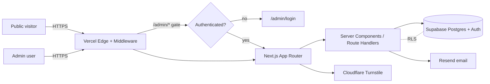

<div align="center">

# Shivam Portfolio · Career CRM

A production Next.js portfolio and blog with a private, authenticated admin that
is evolving into a source-agnostic **Career CRM** for tracking a job search
end-to-end.

[](https://nextjs.org/)
[](https://react.dev/)
[](https://www.typescriptlang.org/)
[](https://tailwindcss.com/)
[](https://supabase.com/)
[](https://vercel.com/)
[]()
[]()

**Production:** [www.shivamchaturvedi.com](https://www.shivamchaturvedi.com)

</div>

---

## Overview

This repository powers two products in one codebase:

1. **Public portfolio & blog** — a marketing site with a spam-protected contact
   funnel that captures leads into a Supabase-backed inquiry system.
2. **Admin / Career CRM** — a private, authenticated back office. Phase 0
   shipped inquiry management; Phase 1 laid the additive database and navigation
   foundation for a full Career CRM (companies, contacts, opportunities,
   messages, tasks) designed for future email + AI integrations.

Everything is additive and convention-driven: the CRM reuses the portfolio's
authentication, middleware, and Supabase patterns without modifying them.

---

## Architecture



- **App Router (Next.js 14)** with React Server Components and route handlers.
- **Middleware** (`middleware.ts`) refreshes the Supabase session and gates
  every `/admin/:path*` route.
- **Supabase** provides Postgres, Auth, and Row Level Security. Three client
  flavors: browser, server (SSR), and service-role (server-only, RLS-bypassing).
- Details: [`docs/architecture/SYSTEM_ARCHITECTURE.md`](docs/architecture/SYSTEM_ARCHITECTURE.md).

---

## Technology stack

| Layer | Technology |
|-------|------------|
| Framework | Next.js 14.2 (App Router), React 18 |
| Language | TypeScript 5 |
| Styling | Tailwind CSS 3.4, `clsx`, `tailwind-merge` |
| Animation | Framer Motion |
| Icons | lucide-react |
| Theming | next-themes |
| Data / Auth | Supabase (`@supabase/ssr`, `@supabase/supabase-js`), Postgres + RLS |
| Email | Resend |
| Bot protection | Cloudflare Turnstile (`@marsidev/react-turnstile`) |
| Hosting / CI | Vercel |
| Linting | ESLint (`eslint-config-next`) |

---

## Folder structure

```
.
├── app/
│   ├── (marketing)/           # Public site + blog
│   ├── admin/
│   │   ├── (dashboard)/       # Authenticated CRM shell (sidebar layout)
│   │   │   ├── page.tsx       # Inquiries dashboard
│   │   │   ├── inquiries/     # Inquiry detail
│   │   │   └── {companies,contacts,messages,tasks,
│   │   │       calendar,analytics,settings,applications}/  # Phase 2 placeholders
│   │   ├── login/  signup/  reset-password/
│   │   └── layout.tsx         # Admin root (noindex, theme)
│   ├── api/                   # Route handlers (inquiries, auth, contact)
│   └── auth/                  # OAuth callback / verified
├── components/                # admin · auth · layout · sections · ui
├── lib/
│   ├── admin/navigation.ts    # Single source of truth for the sidebar
│   ├── auth/                  # Admin allowlist
│   ├── supabase/              # client · server · service · middleware
│   └── inquiries.ts · rateLimit.ts · tokens.ts · motion.ts
├── supabase/
│   ├── schema.sql             # Baseline (inquiry system)
│   └── migrations/            # Additive migrations (Career CRM foundation)
├── docs/
│   ├── roadmap/               # PROJECT_ROADMAP · PHASE_1_COMPLETION
│   ├── architecture/          # SYSTEM_ARCHITECTURE
│   └── database/              # DATABASE_GUIDE
├── middleware.ts              # Auth gate for /admin/:path*
├── types/  constants/  public/
```

---

## Features

### Completed features

- **Public portfolio & blog** with responsive, theme-aware UI.
- **Contact funnel** → Supabase inquiries, protected by Turnstile, with Resend email.
- **Admin authentication** — Supabase Auth, allowlist-gated signup, recovery &
  verification flows, middleware-gated routes.
- **Inquiry management** — list, search, date filters, status & lead-source
  workflow, internal notes, activity timeline, CSV export.
- **Config-driven admin navigation** — the entire sidebar renders from
  `lib/admin/navigation.ts`; future modules appear as disabled "Coming Soon"
  items with placeholder routes.
- **Career CRM database foundation** — 10 additive tables, 10 enums, 60 indexes,
  full-text search, and RLS on every table (see below).

### In progress / upcoming

See the [roadmap](#roadmap). Phase 2 builds the CRUD + UI on top of the Phase 1 schema.

---

## Roadmap

| Phase | Name | Status |
|-------|------|--------|
| 0 | Portfolio Website | ✅ Complete |
| 1 | Career CRM Foundation | ✅ Complete |
| 2 | CRM Application (CRUD + UI) | ⬜ Not started |
| 3 | Gmail Integration | ⬜ Not started |
| 4 | AI Layer | ⬜ Not started |
| 5 | Reporting | ⬜ Not started |
| 6 | Production Hardening | ⬜ Not started |

**Current progress:** Phase 1 complete and deployed. Full detail in
[`docs/roadmap/PROJECT_ROADMAP.md`](docs/roadmap/PROJECT_ROADMAP.md).

---

## Development workflow

**Prerequisites:** Node.js ≥ 20, a Supabase project, and the environment
variables below.

```bash
# 1. Install
npm install

# 2. Configure — create .env.local
#    NEXT_PUBLIC_SUPABASE_URL=...
#    NEXT_PUBLIC_SUPABASE_ANON_KEY=...
#    SUPABASE_SERVICE_ROLE_KEY=...      # server-only, never exposed to the client
#    (+ Resend / Turnstile keys as used by the contact + auth flows)

# 3. Run
npm run dev        # http://localhost:3000

# 4. Quality gates (run before every commit)
npm run lint       # ESLint (next lint)
npx tsc --noEmit   # TypeScript typecheck (no dedicated npm script)
npm run build      # Production build
```

> **Note:** there is no `typecheck` npm script; use `npx tsc --noEmit`.

---

## Deployment workflow

- **Hosting:** Vercel, connected to `main`. Every push to `main` triggers a
  production build and deploy; the `www.shivamchaturvedi.com` alias points at the
  latest Ready production deployment.
- **App vs. database:** Vercel builds and deploys the **application only**. It
  does **not** run Supabase migrations. Schema changes are applied separately to
  Supabase (SQL Editor or the Supabase CLI) and are safe to apply before/after a
  deploy because migrations are additive and idempotent.
- **Release checklist:** lint → typecheck → build → commit → push → verify the
  Vercel deployment is Ready → smoke-test production.

---

## Database architecture summary

Postgres on Supabase, RLS-first.

- **Baseline (`supabase/schema.sql`):** the inquiry system — `inquiries`,
  `inquiry_notes`, `inquiry_activity`, `inquiry_attachments`, plus the
  `search_inquiries` RPC and a shared `set_updated_at()` trigger.
- **Career CRM foundation (`supabase/migrations/`):** 10 additive tables —
  `companies`, `contacts`, `integration_accounts`, `opportunities`,
  `opportunity_contacts`, `messages`, `message_attachments`,
  `opportunity_events`, `opportunity_notes`, `tasks`.
- **Conventions:** `uuid` PKs (`gen_random_uuid()`), `timestamptz` audit columns,
  a shared `updated_at` trigger, nullable `owner_id → auth.users` everywhere
  (multi-user-ready), `external_ids jsonb` + typed `external_*_id` for
  source-agnostic integrations, `ai_*` provenance columns for the AI layer, and
  generated `tsvector` full-text search.
- **Security:** RLS enabled on every table with an
  `"Authenticated admin full access"` policy; the anon key can never read or
  write. The public contact form writes via the service role (server-only).

Full detail — ER diagram, table/enum/index/RLS/trigger docs, and conventions —
in [`docs/database/DATABASE_GUIDE.md`](docs/database/DATABASE_GUIDE.md).

---

## Future roadmap

- **Phase 2 — CRM Application:** CRUD + UI for all entities; pipeline board;
  split Dashboard from Inquiries.
- **Phase 3 — Gmail Integration:** OAuth, incremental message/attachment sync,
  background jobs, encrypted token storage.
- **Phase 4 — AI Layer:** resume parsing, AI notes/summaries/timeline, copilot.
- **Phase 5 — Reporting:** response/interview/offer rates, pipeline & funnel KPIs.
- **Phase 6 — Production Hardening:** audit logs, monitoring, testing,
  performance, per-user security.

---

## Documentation

| Document | Purpose |
|----------|---------|
| [`docs/roadmap/PROJECT_ROADMAP.md`](docs/roadmap/PROJECT_ROADMAP.md) | Master roadmap, all phases |
| [`docs/roadmap/PHASE_1_COMPLETION.md`](docs/roadmap/PHASE_1_COMPLETION.md) | Phase 1 report + lessons/decisions |
| [`docs/architecture/SYSTEM_ARCHITECTURE.md`](docs/architecture/SYSTEM_ARCHITECTURE.md) | System architecture + diagrams |
| [`docs/database/DATABASE_GUIDE.md`](docs/database/DATABASE_GUIDE.md) | Database guide + ER diagram |

---

<div align="center">
<sub>Built with Next.js, Supabase, and Vercel · Phase 1 complete, Phase 2 pending.</sub>
</div>
