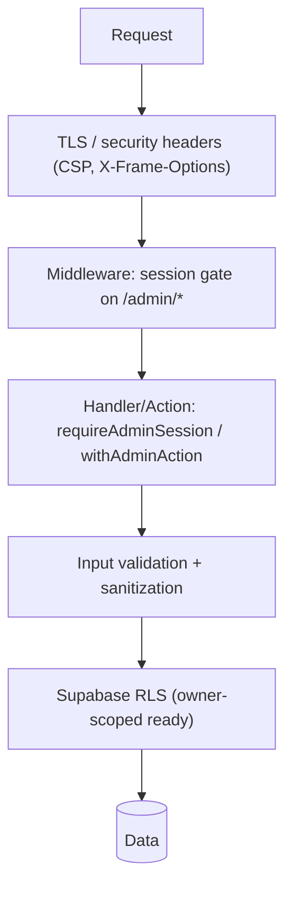

# Security Reference

The canonical security reference for the Career CRM. It describes the security
model **as implemented at v1.0.0** and clearly separates **planned (Phase 3)** and
**future** enhancements. Nothing here is aspirational unless tagged 🟡/⚪.

**Related:** [Phase 3 Architecture](./architecture/PHASE_3_ARCHITECTURE.md) ·
[Implementation Guide](./architecture/PHASE_3_IMPLEMENTATION_GUIDE.md) ·
[Runbook](./operations/RUNBOOK.md) · [Events](./architecture/EVENTS.md) ·
[API Reference](./architecture/API_REFERENCE.md) ·
[Schema Reference](./database/SCHEMA_REFERENCE.md) ·
[Design System](./design/DESIGN_SYSTEM.md) ·
[ADRs](./architecture/decisions/README.md)

> **Status legend:** 🟢 **Existing** (implemented at v1.0.0) · 🟡 **Planned
> (Phase 3)** · ⚪ **Future / recommendation** (not yet designed in detail).
> Baseline: **v1.0.0** (`c2b5dc3`).

---

## 1. Executive Summary 🟢

The CRM is a **single-admin, authenticated back-office** over Supabase, deployed
on Vercel. Its security rests on four implemented pillars: **Supabase Auth**
(session cookies) + **middleware/route gating**, **Row Level Security** as the
data authorization boundary, **server-only secrets** (the service-role key never
reaches the client and is used only by two public endpoints), and **defensive
input/output handling** (validation, HTML sanitization, a real Content-Security-
Policy and security headers, and email rate-limiting on the public form).

Phase 3 adds the higher-risk surfaces — OAuth token custody, background jobs, and
an AI/automation layer — each designed **secure-by-default and human-in-the-loop**
(approval-gated, audited, encrypted). This document is the source of truth for
both.

---

## 2. Security Principles

- **Least privilege** 🟢 — anon key can do nothing (RLS denies); the RLS-bypassing
  service-role key is server-only and used by exactly two public routes; least
  scopes for future OAuth 🟡.
- **Defense in depth** 🟢 — middleware gate **and** per-handler auth **and** RLS
  **and** validation **and** CSP/sanitization — no single control is load-bearing.
- **Zero trust** 🟢/🟡 — every request re-checks auth server-side (no trust in the
  client); Phase 3 system endpoints (cron/webhooks) authenticate by shared
  secret/signature, never a session 🟡.
- **Secure by default** 🟢 — new tables enable RLS with the admin policy; new admin
  routes inherit the auth gate; secrets default to server-only.
- **Human-in-the-loop approval** 🟡 — every external/high-impact AI or automation
  action is approval-gated ([ADR-006](./architecture/decisions/ADR-006-ai-approval.md)).
- **Fail closed** 🟢 — unauthenticated `/admin/*` → redirect to login; unauthenticated
  API → `401`; missing/invalid cron secret → `401` 🟡; on error, deny (never
  fall through to data).

---

## 3. Authentication

- **Supabase Authentication** 🟢 — email/password via `@supabase/ssr`; identities
  in `auth.users` ([Schema §3](./database/SCHEMA_REFERENCE.md#3-authentication-tables)).
- **Session lifecycle** 🟢 — the middleware calls `updateSupabaseSession` on every
  `/admin/:path*` request, refreshing the session so Server Components see a fresh
  user; expiry/refresh handled by Supabase.
- **Session cookies** 🟢 — httpOnly Supabase auth cookies (SSR); tokens are never
  exposed to app JS.
- **Code exchange** 🟢 — `GET /auth/callback` exchanges an auth code for a session
  (email confirm / recovery), then redirects.
- **PKCE** 🟡 — the mechanism for the **planned Google OAuth** flow
  ([ADR-004](./architecture/decisions/ADR-004-oauth.md)); the current email-auth
  flow relies on Supabase's SSR cookie/code-exchange.
- **Login flow** 🟢 — `/admin/login`; the middleware redirects already-authenticated
  users away from login/signup to `/admin`.
- **Logout flow** 🟢 — `SignOutButton` → `supabase.auth.signOut()` → redirect to
  `/admin/login` + `router.refresh()`.
- **Signup** 🟢 — `POST /api/auth/signup`, **allowlist-gated** (`isAdminEmail`),
  email format + password policy (≥8, letter + number), then service-role
  `createUser`. See [API §2.2](./architecture/API_REFERENCE.md#22-post-apiauthsignup--public-allowlist-gated).
- **Password reset** 🟢 — `/admin/reset-password` (reachable without a prior
  session; the recovery session is established client-side from the URL fragment,
  which is why the middleware allow-lists that path).
- **Future Google OAuth** 🟡 — Authorization Code + PKCE + `state`, least scopes,
  encrypted token storage (§10, ADR-004).

---

## 4. Authorization

- **`requireAdminSession()`** 🟢 (`lib/supabase/server.ts`) — resolves the session
  client; returns a `401 { error }` `Response` when unauthenticated. Used by the
  inquiry API routes.
- **Server Actions protection** 🟢 — `getAdminActionContext()` / `withAdminAction`
  (`lib/actions.ts`) require a session and provide the `userId`; unauthenticated →
  `{ ok:false, formError }`. All CRM mutations run under the caller's RLS.
- **Middleware** 🟢 (`middleware.ts`, matcher `"/admin/:path*"`) — redirects
  unauthenticated page requests to `/admin/login`; login/signup/reset-password are
  allow-listed. **Not modified by any Phase 3 milestone.**
- **Route protection** 🟢 — admin **pages** are gated by middleware; admin **API
  routes** are **not** in the matcher and therefore **self-guard** via
  `requireAdminSession()`. Public routes (`/api/contact`, `/api/auth/signup`,
  `/api/auth/role`, `/auth/callback`) are intentionally reachable with their own
  protections.
- **API protection** 🟢 — see above; system endpoints (cron/webhook) will use a
  shared secret/signature 🟡.
- **Admin-only architecture & role model** 🟢 — single-admin: any authenticated
  user is treated as admin (RLS `auth.role() = 'authenticated'`). The **allowlist**
  is the real membership boundary (gates signup). There is **no finer role system**.
- **Future RBAC** ⚪ — multi-user/teams tighten RLS to `owner_id = auth.uid()` and
  introduce roles ([ADR-008](./architecture/decisions/ADR-008-additive-schema-and-rls.md),
  Phase 6). `owner_id` already exists on every table to enable this without a redesign.

---

## 5. Database Security

Cross-ref: [Schema Reference](./database/SCHEMA_REFERENCE.md) ·
[ADR-002](./architecture/decisions/ADR-002-supabase-backend.md) ·
[ADR-008](./architecture/decisions/ADR-008-additive-schema-and-rls.md).

- **RLS** 🟢 — enabled on **every** table; the anon key can never read/write.
- **Policies** 🟢 — one policy per table, `"Authenticated admin full access"`
  (`auth.role() = 'authenticated'`, `USING` + `WITH CHECK`).
- **Service-role usage** 🟢 — `lib/supabase/service.ts` (`import "server-only"`)
  bypasses RLS and is imported by **only** `/api/contact` (insert inquiry + log
  activity) and `/api/auth/signup` (`createUser`). It is **never** used in the
  admin/CRM path.
- **Foreign keys** 🟢 — cascade rules protect history: children `CASCADE`, cross-refs
  `SET NULL` (e.g. deleting a company nulls, never destroys, its opportunities).
- **Constraints** 🟢 — partial unique indexes for dedup/idempotent ingest (domain,
  owner+email, provider message id, …); enum-bounded status columns; CHECK lists on
  inquiry tables.
- **Audit columns** 🟢 — `created_at`/`updated_at` on all tables; `updated_at`
  maintained by the shared `set_updated_at()` trigger.
- **Soft delete** 🟢 — `archived_at` on entity tables (hide, don't destroy);
  join/append-only tables omit it.
- **Event integrity** 🟢 — `opportunity_events` is append-only with
  `actor_type ∈ {user, agent, system}`, giving a tamper-evident, attributable audit
  trail (§11).

---

## 6. Secret Management

Cross-ref: [Runbook §4 Secret Rotation](./operations/RUNBOOK.md#4-secret-rotation).

- **Environment variables** 🟢 — held in Vercel (Production + Preview). Secrets are
  read **only** in server-only code / route handlers. `NEXT_PUBLIC_*` are
  client-exposed by design (only the Supabase **URL** + **anon key**, both public).
- **Supabase keys** 🟢 — `NEXT_PUBLIC_SUPABASE_ANON_KEY` (public, RLS-bound),
  `SUPABASE_SERVICE_ROLE_KEY` (secret, server-only, RLS-bypassing).
- **Resend key** 🟢 — `RESEND_API_KEY` (secret, contact-form email).
- **Turnstile secret** 🟢 — `CLOUDFLARE_TURNSTILE_SECRET_KEY` (secret, contact-form
  verification).
- **Encryption key** 🟡 — `TOKEN_ENCRYPTION_KEY` (or Supabase Vault/pgsodium) for
  OAuth token custody; rotation requires re-encrypting stored tokens (dual-key
  backfill — see Runbook §4 warning).
- **Future OAuth secrets** 🟡 — `GOOGLE_OAUTH_CLIENT_ID/SECRET/REDIRECT_URI`,
  `CRON_SECRET`, `AI_PROVIDER_API_KEY`.
- **Secret rotation** 🟢/🟡 — rotate at source → update in Vercel → redeploy →
  revoke old (Runbook §4).
- **Secret ownership** 🟢 — maintainer owns Vercel/Supabase/Google/Resend consoles;
  keep a **names-only** inventory (never values).

> **Hygiene rule** 🟢: no secret in client bundles, logs, tickets, or chat; error
> responses are generic and details stay server-side.

---

## 7. API Security

Cross-ref: [API Reference](./architecture/API_REFERENCE.md) ·
[ADR-010](./architecture/decisions/ADR-010-action-result-pattern.md) ·
[ADR-011](./architecture/decisions/ADR-011-html-sanitization.md).

- **Input validation** 🟢 — Server Actions validate via `lib/validation` (schema +
  validators); API routes validate against const arrays / regex (inquiry
  `status`/`lead_source`; signup email + password policy; contact fields).
- **Output validation** 🟢 — typed data layers + `ActionResult`; errors are
  structured (`fieldErrors`/`formError`), never raw.
- **Sanitization** 🟢 — the contact intake trims + **HTML-escapes** all fields
  before storage/email.
- **HTML sanitization** 🟢 — `messages.body_html` is sanitized **server-side** with
  `sanitize-html` (strict allowlist; no `script`/`style`/`iframe`/handlers; safe
  schemes; links `rel=noopener noreferrer nofollow target=_blank`) before the only
  `dangerouslySetInnerHTML` in the app ([ADR-011](./architecture/decisions/ADR-011-html-sanitization.md)).
- **XSS protection** 🟢 — React auto-escaping everywhere + the server-side sanitizer
  for the one HTML-render path + a **Content-Security-Policy** (§13).
- **Rate limiting** 🟢 — the public **contact form** is rate-limited by submitter
  email (`isRateLimited`, Supabase-backed). Admin routes are session-bounded;
  per-action limits + AI token budgets are 🟡.
- **CSRF considerations** 🟢/🟡 — Next.js Server Actions include origin/CSRF
  protections; the contact form additionally requires a **Cloudflare Turnstile**
  token; OAuth CSRF via `state`+PKCE is 🟡.
- **SQL injection protection** 🟢 — all DB access is through the Supabase client
  (PostgREST parameterization); **no raw SQL string concatenation**. FTS uses
  `.textSearch()` (parameterized); the task/message `ilike` search **sanitizes**
  user input (`[%,()]` stripped) before building the filter.
- **ActionResult contract** 🟢 — one typed result shape for every mutation; guards
  narrowing across the server/client boundary; no leakage of internals.

---

## 8. File Security

- **Uploads / Downloads / Storage / Blob security** ⚪ — **not implemented at
  v1.0.0.** There is no file-upload path in the CRM; `inquiry_attachments` and
  `message_attachments` are **schema-prepared but unused** (no storage wired). The
  message detail links an attachment `file_url` (external, `target=_blank
  rel=noreferrer`) but no attachment data exists yet.
- **Future attachment handling** ⚪/🟡 — when Gmail sync (Phase 3) or uploads land,
  use **Supabase Storage** with RLS/signed URLs, MIME/size validation, and
  scanning; **attachment encryption** and access-scoping are future work. No
  claims of file security should be made until then.

---

## 9. AI Security 🟡 (Phase 3 — not implemented at v1.0.0)

Design in [AI Architecture](./ai/AI_ARCHITECTURE.md) ·
[Phase 3 Architecture §13](./architecture/PHASE_3_ARCHITECTURE.md#13-ai-request-flow) ·
[ADR-006](./architecture/decisions/ADR-006-ai-approval.md).

- **Prompt injection** 🟡 — treat all CRM/email content as untrusted; system-prompt
  separation, tool-arg validation, output schema-constraints; never let retrieved
  content escalate tool scope.
- **Context isolation** 🟡 — retrieval is **RLS-scoped by `owner_id`**; a user's AI
  only ever sees their own data; tools run under the session's RLS.
- **Token limits** 🟡 — per-owner token/cost budgets in the gateway; refuse/downgrade
  when exceeded (a `429`).
- **Approval workflow / human review** 🟡 — every external/high-impact action is
  gated in `ai_approvals`; nothing sends/acts without `approval_granted`
  ([ADR-006](./architecture/decisions/ADR-006-ai-approval.md)).
- **Data-leakage prevention** 🟡 — the gateway redacts secrets/PII, bounds context,
  and never sends tokens; provider key is server-only; no training on customer data.
- **Future model abstraction** 🟡/⚪ — a pluggable provider gateway isolates the LLM;
  model routing + eval/guardrail harness.

---

## 10. Integration Security 🟡 (Phase 3 — not implemented at v1.0.0)

Design in [Phase 3 Architecture §10–§12](./architecture/PHASE_3_ARCHITECTURE.md#10-oauth-flow) ·
[ADR-004](./architecture/decisions/ADR-004-oauth.md) ·
[ADR-007](./architecture/decisions/ADR-007-provider-abstraction.md).

- **Google OAuth** 🟡 — Authorization Code + **PKCE + `state`** (CSRF); allow-listed
  `redirect_uri`; **least-privilege scopes** per capability.
- **Gmail / Calendar** 🟡 — server-side API calls only; sync jobs run under the
  account owner; idempotent, quota-aware.
- **Encrypted tokens** 🟡 — access/refresh tokens stored **encrypted**
  (`integration_accounts.*_encrypted`, Vault/pgsodium); decrypted only in one
  server-only module; never logged.
- **Refresh tokens** 🟡 — auto-refresh on expiry; on refresh failure → account
  `status='error'` + reconnect ([Runbook §5](./operations/RUNBOOK.md#5-oauth-recovery-phase-3)).
- **Webhook validation** 🟡 — future Gmail push (Pub/Sub) verifies provider
  signature/token; debounced/idempotent.
- **Future providers** ⚪ — same OAuth/adapter pattern (ADR-007); no schema redesign.

---

## 11. Event Security

Cross-ref: [Events](./architecture/EVENTS.md) ·
[ADR-003](./architecture/decisions/ADR-003-event-architecture.md).

- **Audit trail** 🟢 — `opportunity_events` (append-only, `actor_type`) is the
  attributable timeline/audit for opportunities today; inquiry actions log to
  `inquiry_activity`. Phase 3 adds `ai_audit_log` / `automation_runs` 🟡.
- **Idempotency** 🟢/🟡 — persisted events dedupe on natural keys (message/attachment
  provider ids are the strongest); the Phase 3 event bus keys each event with an
  `idempotency_key` and every consumer is idempotent.
- **Replay protection** 🟡 — at-least-once delivery + idempotency keys mean a replayed
  event is a no-op; provider webhooks verify signatures and coalesce.
- **Dead-letter strategy** 🟡 — failed deliveries retry with backoff, then move to a
  dead-letter state surfaced in Settings ([Runbook §8](./operations/RUNBOOK.md#8-queue-failures-phase-3)).
- **Event validation** 🟢/🟡 — event types are enum-constrained in `opportunity_events`
  today; the bus validates `type`/payload shape before dispatch.

---

## 12. Background Jobs Security 🟡 (Phase 3)

Cross-ref: [Runbook §6–§8](./operations/RUNBOOK.md#6-background-jobs-phase-3) ·
[ADR-005](./architecture/decisions/ADR-005-background-jobs.md).

- **Cron validation** 🟡 — `POST /api/jobs/run` requires the `CRON_SECRET`
  (constant-time compare); **no user session**; a rotated secret without config
  update fails closed (`401`).
- **Retry** 🟡 — exponential backoff + jitter, capped `max_attempts`; idempotent
  handlers make re-runs safe.
- **Poison jobs** 🟡 — repeatedly-failing jobs dead-letter (quarantine) rather than
  loop; surfaced for manual review.
- **Job ownership** 🟡 — `jobs.owner_id` scopes user jobs; system jobs are
  owner-null and only enqueued/executed server-side.
- **Failure recovery** 🟡 — lease timeout returns crashed jobs to `pending`
  (`SKIP LOCKED` prevents double-processing); manual requeue after fixing root cause.

---

## 13. Infrastructure Security 🟢

- **Vercel** 🟢 — hosting/build/deploy; functions run server-side; secrets are
  Vercel env vars.
- **Supabase** 🟢 — managed Postgres + Auth + RLS; backups/PITR per plan
  ([Runbook §12–§13](./operations/RUNBOOK.md#12-backups)).
- **HTTPS / TLS** 🟢 — enforced by Vercel at the edge for the custom domain (HSTS
  provided by the platform).
- **Security headers** 🟢 — configured in `next.config.js` for all routes:
  **Content-Security-Policy** (`default-src 'self'`; images `self data: https:`;
  scripts `self` + Cloudflare Turnstile; connect `self` + Turnstile + `*.supabase.co`;
  `frame-ancestors 'none'`; `base-uri 'self'`; `form-action 'self'`), plus
  **X-Frame-Options: DENY**, **X-Content-Type-Options: nosniff**,
  **Referrer-Policy: strict-origin-when-cross-origin**, and a restrictive
  **Permissions-Policy**.
  - ⚪ **Hardening note:** the CSP `script-src` includes `'unsafe-inline'`
    /`'unsafe-eval'` (a Next.js requirement) — a known relaxation; a nonce/hash-based
    CSP is a future improvement. Admin pages are additionally `noindex` via metadata.
- **Secrets** 🟢 — server-only (§6). **Build pipeline** 🟢 — lint → `tsc --noEmit` →
  build gates before deploy. **Rollback** 🟢 — promote last-good deployment / `v1.0.0`
  ([Runbook §3/§17](./operations/RUNBOOK.md#3-rollback)).

---

## 14. Monitoring

- **Security logging** 🟢 — `console.error` in route `error.tsx`, the action wrapper,
  and API handlers → **Vercel logs**; no secrets/PII logged, generic client errors.
- **Audit logs** 🟢 — `opportunity_events` + `inquiry_activity`; Phase 3 adds
  `ai_audit_log` / `automation_runs` / `jobs.last_error` 🟡.
- **Failed logins** 🟢 — surfaced in Supabase Auth logs (platform).
- **Rate limits** 🟢 — the contact-form limiter blocks abusive submitters.
- **Alerts / SIEM** ⚪ — **not configured today.** Recommended: an external uptime
  monitor + error-tracking/APM with alerting, and (future) SIEM/log export — see
  [Runbook §14 action items](./operations/RUNBOOK.md#14-monitoring--).

---

## 15. Incident Response 🟢

Full procedures in [Runbook §1, §4, §9–§11, §17](./operations/RUNBOOK.md#11-production-incident-process).

| Incident | First actions |
|----------|---------------|
| **Credential compromise** | Rotate all secrets (Runbook §4) → redeploy → revoke old → audit access |
| **Database leak / RLS bug** | Re-apply the table policy; verify anon denied; assess exposure; rotate keys if warranted; PITR if data corrupted |
| **Token compromise** 🟡 | Revoke Google grant + disconnect account; rotate encryption key (dual-key backfill); force reconnect |
| **API abuse** | Tighten/enable rate limits; block at Vercel/WAF; investigate logs |
| **Bad release** | Roll back (flip flag / promote previous deployment / `v1.0.0`) → root-cause forward |
| **Recovery** | Verify (Runbook §16); confirm `v1.0.0` intact; postmortem |

Process: **detect → declare severity → mitigate first → communicate → preserve
evidence → fix forward → verify → postmortem** ([Runbook §11](./operations/RUNBOOK.md#11-production-incident-process)).

---

## 16. Threat Model

Mitigations reference implemented (🟢) or planned (🟡) controls; residual risk is
after mitigation.

| Threat | Risk area | Likelihood | Impact | Mitigation | Residual risk |
|--------|-----------|:----------:|:------:|-----------|---------------|
| **XSS** | Message HTML, user input | Low | High | React escaping; server-side `sanitize-html`; CSP 🟢 | Low — CSP `unsafe-inline` relaxation (⚪ nonce CSP) |
| **CSRF** | State-changing requests | Low | Med | Server-Action origin checks; Turnstile on contact; OAuth `state` 🟡 | Low |
| **SQL injection** | DB queries | Very low | High | PostgREST parameterization; no raw SQL; `ilike` input sanitized 🟢 | Very low |
| **Broken authentication** | Login/session | Low | High | Supabase Auth; httpOnly cookies; middleware refresh; allowlist signup 🟢 | Low |
| **Broken access control** | RLS/route gating | Low | High | RLS everywhere; middleware + per-handler auth; anon denied 🟢 | Med until per-user RLS (⚪ RBAC) — single-admin today |
| **Prompt injection** | AI (Phase 3) | Med | Med/High | System-prompt separation; RLS-scoped tools; approval gating 🟡 | Med — inherent to LLMs; bounded by approval |
| **Credential theft** | Sessions/secrets | Low | High | Server-only secrets; httpOnly cookies; no secrets in bundle/logs 🟢 | Low |
| **Secrets leakage** | Env/logs | Low | Critical | Vercel env; server-only reads; generic errors; names-only inventory 🟢 | Low |
| **Replay attack** | Events/webhooks (P3) | Low | Med | Idempotency keys; dedupe indexes; signature verification 🟡 | Low |
| **Webhook forgery** | Gmail push (P3) | Low | Med | Provider signature/token verification; cron secret 🟡 | Low |
| **Privilege escalation** | Auth model | Low | High | Single-admin RLS; allowlist boundary; service-role server-only 🟢 | Med — coarse model until RBAC (⚪) |
| **Race conditions** | Concurrent writes / jobs | Low | Med | DB constraints/unique indexes; `SKIP LOCKED` job leasing 🟡; optimistic UI with rollback 🟢 | Low |
| **Sensitive data exposure** | PII, tokens | Low | High | RLS; encrypted tokens 🟡; sanitized rendering; no PII in `role` endpoint/logs 🟢 | Low |

---

## 17. Security Checklists

### Developer 🟢
- [ ] Reads via `server-only` data layers; mutations via `withAdminAction` (never trust the client).
- [ ] New table → RLS on + admin policy + `owner_id`; new admin route → inherits the gate.
- [ ] Validate every input (`lib/validation` / const arrays); return `ActionResult`.
- [ ] No secret imported into a client component; no `NEXT_PUBLIC_` on a secret.
- [ ] Any HTML render goes through `sanitizeMessageHtml`; no other `dangerouslySetInnerHTML`.
- [ ] No raw SQL; no unsanitized user input in `ilike`/`or` filters.
- [ ] ESLint clean; no stray `console.log`; no PII/secret logging.

### Deployment 🟢
- [ ] `npm run lint` · `npx tsc --noEmit` · `npm run build` green.
- [ ] Additive migration applied + RLS verified **before** dependent code (§5).
- [ ] Required env vars set in Vercel (Prod + Preview); new features flag-off.
- [ ] Smoke: `/` 200, `/admin/*` `307 → login` (auth gate intact).

### Production 🟢
- [ ] `v1.0.0` (`c2b5dc3`) remains a valid rollback point.
- [ ] Security headers/CSP present (spot-check response headers).
- [ ] Anon key cannot read admin data; service-role only on `/api/contact` + `/api/auth/signup`.
- [ ] Rate limit active on the contact form.

### Quarterly Audit 🟢/⚪
- [ ] Review admin **allowlist** and console access (Vercel/Supabase/Google/Resend).
- [ ] Rotate secrets on schedule (§6, Runbook §4).
- [ ] Confirm Supabase backup/PITR window (Runbook §12 action item).
- [ ] Review dependency advisories; re-run gates.
- [ ] Revisit CSP relaxations, add external monitoring/alerting (⚪), dead-letter review (🟡).
- [ ] (When applicable) pen-test before enabling AI/integration features.

---

## 18. Future Security Roadmap

- **Phase 3** 🟡 — OAuth token custody (encryption/rotation), cron/webhook secret &
  signature auth, job ownership/dead-letter, AI approval gating + budgets +
  RLS-scoped retrieval, notification/automation auditing.
- **Phase 4** 🟡/⚪ — AI hardening: prompt-injection defenses, eval/guardrail harness,
  agent action scoping, per-agent budgets, PII redaction review.
- **Future enterprise** ⚪ — per-user/team **RLS + RBAC** (activate `owner_id`
  scoping), nonce/hash-based **CSP**, **SIEM**/log export + alerting, external error
  tracking/APM, secret management via a KMS/Vault, periodic **penetration testing**,
  SSO, attachment encryption + malware scanning, and a formal vulnerability-disclosure
  process.

---

## Document Control

- **Version:** 1.0
- **Owner:** Repository maintainer / security contact (Shivam Chaturvedi)
- **Last Updated:** 2026-07-28
- **Status:** 🟢 items reflect the implemented v1.0.0 model (verified against
  `next.config.js`, `middleware.ts`, `lib/supabase/*`, `lib/actions.ts`,
  `lib/validation.ts`, `lib/messages.ts`, the API routes, and the schema); 🟡/⚪
  items are the approved Phase 3 / future roadmap. Baseline `v1.0.0` (`c2b5dc3`).
- **Related:** [Runbook](./operations/RUNBOOK.md) · [Schema Reference](./database/SCHEMA_REFERENCE.md) · [API Reference](./architecture/API_REFERENCE.md) · [Events](./architecture/EVENTS.md) · [ADRs](./architecture/decisions/README.md)
