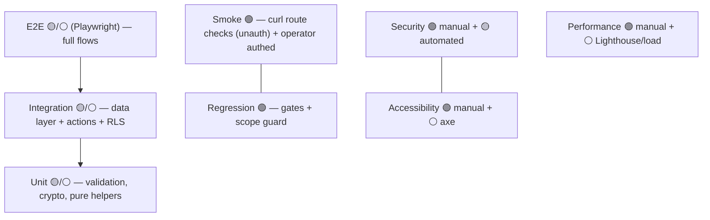

# Testing Guide

The canonical testing handbook for the Career CRM — how every current feature and
every planned Phase 3 feature is verified. Grounded in the actual codebase.

**Related:** [System Architecture](./architecture/SYSTEM_ARCHITECTURE.md) ·
[Data Flow](./architecture/DATA_FLOW.md) · [Security](./SECURITY.md) ·
[API Reference](./architecture/API_REFERENCE.md) ·
[Schema Reference](./database/SCHEMA_REFERENCE.md) ·
[Events](./architecture/EVENTS.md) · [Runbook](./operations/RUNBOOK.md) ·
[Phase 3 Implementation Guide](./architecture/PHASE_3_IMPLEMENTATION_GUIDE.md) ·
[ADRs](./architecture/decisions/README.md)

> **Status legend:** 🟢 **Existing** (practiced at v1.0.0) · 🟡 **Planned
> (Phase 3)** · ⚪ **Future / recommended.** Baseline `v1.0.0` (`c2b5dc3`).

> **Honest baseline:** there is **no automated test suite or test runner** in the
> repository at v1.0.0 (no `jest`/`vitest`/`playwright`, no `*.test.*` files, and
> only `dev`/`build`/`start`/`lint` npm scripts). Current testing is **manual-first
> plus deterministic health gates** (`lint` → `tsc --noEmit` → `build`), **curl
> smoke tests**, and **git scope guards** — the exact process used to ship every
> milestone. Automated suites are ⚪ (recommended) and become 🟡 required per Phase 3
> milestone.

---

## 1. Executive Summary 🟢

**Philosophy:** ship small, additive, reversible slices and prove each one before
enabling it. Testing exists to (a) prevent regressions to the frozen Inquiry system
and the shipped CRM, and (b) give production confidence for a single maintainer.

- **Manual-first** 🟢 — the operator exercises authenticated flows; unauthenticated
  behavior is checked automatically (curl smoke).
- **Regression prevention** 🟢 — every change runs the health gates + a **git scope
  guard** (no changes to `inquir*`, auth, middleware, schema, or prior modules) +
  route smoke.
- **Production confidence** 🟢 — deploy is verified (Vercel Ready + smoke); `v1.0.0`
  (`c2b5dc3`) is always the rollback point.
- **Toward automation** ⚪ — adopt unit/integration/E2E suites; Phase 3 milestones
  ship with tests (§20).

---

## 2. Testing Pyramid



| Layer | Status | Today | Target |
|-------|:------:|-------|--------|
| **Unit** | ⚪ | — | `lib/validation`, `lib/messages.sanitizeMessageHtml`, formatters, badge mappers, job runner backoff |
| **Integration** | ⚪/🟡 | — | data layers + Server Actions against a test Supabase; RLS + idempotency |
| **UI (component)** | ⚪ | — | M0 kit (DataTable/EntityPicker/Dialog) with Testing Library |
| **E2E** | ⚪/🟡 | — | Playwright: login → CRUD → board → archive |
| **Smoke** | 🟢 | curl unauth checks + operator authed | keep; add authed synthetic |
| **Regression** | 🟢 | gates + scope guard + route smoke | keep; add integration coverage |
| **Security** | 🟢/🟡 | manual (RLS/headers/rate limit) | automated RLS + header assertions |
| **Performance** | 🟢/⚪ | manual + build output | Lighthouse/Core Web Vitals, query timing |
| **Accessibility** | 🟢/⚪ | manual (keyboard/ARIA) | axe-core + screen-reader pass |

---

## 3. Local Testing Workflow 🟢

**Prerequisites:** Node.js ≥ 20, a Supabase project, and `.env.local`.

**Required env variables** (names; never commit values):

| Variable | Purpose |
|----------|---------|
| `NEXT_PUBLIC_SUPABASE_URL` | Supabase project URL (public) |
| `NEXT_PUBLIC_SUPABASE_ANON_KEY` | anon key (public, RLS-bound) |
| `SUPABASE_SERVICE_ROLE_KEY` | server-only, RLS-bypass (contact + signup) |
| `ADMIN_SIGNUP_ALLOWLIST` | comma-list of allowed admin emails (`isAdminEmail`) |
| `RESEND_API_KEY` · `FROM_EMAIL` · `CONTACT_RECIPIENT_EMAIL` | contact-form email |
| `CLOUDFLARE_TURNSTILE_SECRET_KEY` · `NEXT_PUBLIC_CLOUDFLARE_TURNSTILE_SITE_KEY` | contact-form bot protection |

**Commands**
```
npm install
npm run lint        # ESLint (next lint)
npx tsc --noEmit    # typecheck — NOTE: there is no `npm run typecheck` script
npm run build       # production build
npm run dev         # http://localhost:3000
```
> ⚪ **Recommendation:** add a `"typecheck": "tsc --noEmit"` npm script for parity.

---

## 4. Health Gates 🟢

Every change must pass, in order:

- [ ] **Lint** — `npm run lint` clean.
- [ ] **Typecheck** — `npx tsc --noEmit` exit 0.
- [ ] **Build** — `npm run build` succeeds (all routes emit).
- [ ] **Git clean / scope** — only intended files changed; scope guard passes (§18).
- [ ] **Production deployment** — Vercel deployment reaches **Ready**; smoke passes (§5/§19).
- [ ] **Release tag** — `v1.0.0` (`c2b5dc3`) unchanged; a new tag only for a new release.
- [ ] **Rollback readiness** — previous deployment promotable; flag-off path known ([Runbook §3/§17](./operations/RUNBOOK.md)).

---

## 5. Manual Smoke Tests 🟢

**Method:** unauthenticated HTTP (automatable) confirms the auth gate + no
regression; the operator then performs authenticated UI checks behind login.

```
curl -s -o /dev/null -w "%{http_code}\n" https://www.shivamchaturvedi.com/           # 200
for p in /admin /admin/dashboard /admin/companies /admin/contacts /admin/opportunities \
         /admin/tasks /admin/messages /admin/analytics /admin/settings; do
  curl -s -o /dev/null -w "$p %{http_code}\n" "https://www.shivamchaturvedi.com$p"; done  # each 307 -> login
```

| Feature | Purpose | Expected result | Failure symptoms |
|---------|---------|-----------------|------------------|
| **Authentication** 🟢 | Gate admin | `/admin/*` → `307 /admin/login` unauth; login → `/admin` | 200 on `/admin` unauth (gate broken); login loops |
| **Dashboard** 🟢 | Operational overview | `/admin/dashboard` renders stats/pipeline/activity | error boundary; wrong counts; empty feed with data present |
| **Companies** 🟢 | CRUD | list/search/filter/sort/paginate; create→detail; edit; archive/restore | dup-domain not caught; archive not hidden; 500 |
| **Contacts** 🟢 | CRUD + link | create; **company `EntityPicker`** shows active only; dup email caught | picker empty/errors; dup email allowed |
| **Opportunities** 🟢 | Pipeline | table + **Kanban**; drag or keyboard `<select>` moves stage; timeline shows `stage_changed`; notes; link contacts | move not persisted / no rollback; no timeline event |
| **Tasks** 🟢 | Execution | create; status board; complete sets completed; overdue red | overdue mislabeled; completion not set |
| **Messages** 🟢 | Viewer | inbox renders; detail shows sanitized HTML/text toggle; mark read/archive/link | raw HTML rendered (XSS!); empty state missing |
| **Analytics** 🟢 | Reporting | funnel/rates/trends render; range/company filters change numbers | N+1 slowness; wrong totals |
| **Settings** 🟢 | Config | profile/integrations/system render; placeholders disabled | fake controls appear active; user data missing |
| **Public Contact Form** 🟢 | Lead intake | valid submit → success + email + inquiry row; Turnstile enforced; rate-limited | spam passes; no email; 500 |

---

## 6. CRUD Testing 🟢

Verify the standard lifecycle ([Data Flow §4](./architecture/DATA_FLOW.md)) for each CRM entity:

- **Create** — required fields enforced; `owner_id` stamped; redirect to detail.
- **Read** — list (search/filter/sort/pagination) + detail (relations) render under RLS.
- **Update** — edits persist; dedupe re-checked (domain / owner+email / source+job).
- **Delete/Archive** — soft delete via `archived_at`; archived hidden by default; restore works.
- **Validation** — invalid input → `fieldErrors` under fields; business errors → `formError`.
- **Permissions** — unauthenticated action → `{ ok:false, formError }`; RLS blocks cross access.
- **Events** — Opportunities/Tasks stage/status/link mutations write `opportunity_events` (verify timeline).
- **UI refresh** — `revalidatePath` + `router.refresh` reflect the change without a hard reload.

---

## 7. API Testing 🟢

Every current route ([API Reference](./architecture/API_REFERENCE.md)). Test auth,
input, validation, response, failure cases, rate limits.

| Route | Method | Auth | Input | Validation | Response | Failure cases | Rate limit |
|-------|:------:|------|-------|------------|----------|---------------|:----------:|
| `/api/contact` | POST | public | `{name,email,organization?,message,token}` | required + Turnstile + sanitize | `200` | `400` invalid/Turnstile · `429` · `500` | ✅ by email |
| `/api/auth/signup` | POST | public (allowlist) | `{email,password}` | email regex · pw≥8+letter+digit · `isAdminEmail` | `200` | `400`·`403` not allowlisted·`409` exists·`500` | — |
| `/api/auth/role` | GET | session (optional) | — | — | `200 {isAdmin}` | `500` | — |
| `/auth/callback` | GET | code | `?code` | code validity | `302` redirect | invalid code → login | — |
| `/api/admin/inquiries/[id]` | DELETE | `requireAdminSession` | path id | — | `200 {success}` | `401`·`500` | — |
| `/api/admin/inquiries/[id]/status` | PATCH | session | `{status}` | ∈ `INQUIRY_STATUSES` | `200 {inquiry}` | `400`·`401`·`500` | — |
| `/api/admin/inquiries/[id]/lead-source` | PATCH | session | `{lead_source}` | ∈ `LEAD_SOURCES` | `200 {inquiry}` | `400`·`401`·`500` | — |
| `/api/admin/inquiries/[id]/notes` | POST | session | `{body}` | non-empty | `200 {note}` | `400`·`401`·`500` | — |
| `/api/admin/inquiries/export` | GET | session | filters | — | `200 text/csv` | `401`·`500` | — |

**Key negative tests:** admin route without a session → `401`; signup with a
non-allowlisted email → `403`; contact with a bad Turnstile token → `400`; repeated
contact submits from one email → `429`.

---

## 8. Server Action Testing 🟢

All CRM mutations are Server Actions ([API §3](./architecture/API_REFERENCE.md#3-server-actions-api--current--the-crm-mutation-surface)).
**Shared contract to test for every action:** unauthenticated → `{ ok:false,
formError }`; invalid input → `{ ok:false, fieldErrors }`; success → `{ ok:true,
data }` + `revalidatePath`; runs under RLS; `owner_id` on create.

| Module | Actions | Focus cases |
|--------|---------|-------------|
| Companies | create/update/archive/restore | dup-domain → `fieldErrors.domain`; archive hides |
| Contacts | create/update/archive/restore, searchCompanies | owner+email dup; picker returns **active** companies only |
| Opportunities | create/update/**changeStage**/archive/restore/addNote/add+removeContact, search* | stage change writes event + optimistic rollback on failure; edit excludes stage |
| Tasks | create/update/**changeStatus**/archive/restore, search* | `done` sets `completed_at`; overdue computed |
| Messages | markRead/archive/restore/link, search* | link targets valid; sanitized render unaffected |

**How to test (today, manual/inspection):** drive from the UI + verify DB rows +
`opportunity_events`. **⚪ future:** integration tests calling the actions with a
mocked/session'd Supabase client + `isActionError` assertions.

---

## 9. Security Testing 🟢 / 🟡

Cross-link: [Security](./SECURITY.md).

- **Authentication** 🟢 — `/admin/*` gate; API `401` without session; signup allowlist.
- **Authorization / RLS** 🟢 — anon key returns no admin data; cross-owner access blocked (verify once multi-user).
- **Validation** 🟢 — server-side rejects invalid input regardless of client.
- **Rate limiting** 🟢 — contact form blocks repeat submitters (`429`).
- **XSS** 🟢 — a message with `<script>`/`onerror` HTML renders **sanitized** (no execution); the only `dangerouslySetInnerHTML` consumes server-sanitized output.
- **CSRF** 🟢 — Server Actions origin-checked; contact requires Turnstile; OAuth `state`/PKCE 🟡.
- **Headers** 🟢 — response includes **CSP**, `X-Frame-Options: DENY`, `X-Content-Type-Options: nosniff`, `Referrer-Policy`, `Permissions-Policy` (spot-check with `curl -I`).
- **Sanitization** 🟢 — contact fields HTML-escaped; message HTML allowlisted.
- **Secrets** 🟢 — service-role/keys never in client bundle or logs (grep the built client chunks; inspect network).
- **🟡 planned:** encrypted-token round-trip, cron-secret rejection, approval-gating enforcement (§12–§14).

---

## 10. Database Testing 🟢

Cross-link: [Schema Reference](./database/SCHEMA_REFERENCE.md) · [ADR-008](./architecture/decisions/ADR-008-additive-schema-and-rls.md).

- **CRUD** 🟢 — inserts/updates/soft-deletes respect columns/defaults.
- **Indexes** 🟢 — unique/partial dedupe (domain, owner+email, provider message id) reject duplicates; FTS/GIN back search.
- **Triggers** 🟢 — `set_updated_at()` bumps `updated_at` on UPDATE.
- **RLS** 🟢 — policies enabled on every table; anon denied.
- **Integrity** 🟢 — FK cascade/`SET NULL` behave (delete a company → opportunities nulled, not deleted; delete an opportunity → notes/events/contacts cascade).
- **Relationships** 🟢 — joins resolve (contact→company, opp→company/primary_contact, message→attachments).
- **Verify objects** (SQL editor): counts of tables/enums/indexes/triggers/policies (see [Phase 1 Completion](./roadmap/PHASE_1_COMPLETION.md) verification query).

---

## 11. Event Testing 🟢 / 🟡

Cross-link: [Events](./architecture/EVENTS.md).

- **Events produced** 🟢 — after each opportunity mutation, a matching
  `opportunity_events` row exists with the right `event_type`, `actor_type=user`,
  `owner_id`, and `detail`/`metadata` (e.g. `stage_changed` → `{from,to}`).
- **Consumers** 🟢 — the row appears in the Opportunity timeline, the Dashboard
  recent-activity feed, and Analytics `stage_changed` counts.
- **Audit trail** 🟢 — append-only; a stage change that's a no-op (`from==to`) emits
  no event.
- **🟡 planned:** idempotency (replay → no dupes), at-least-once consumer safety,
  dead-letter, event-envelope validation (§14).

---

## 12. AI Testing 🟡 (Phase 3 · M6–M9)

Cross-link: [AI Architecture](./ai/AI_ARCHITECTURE.md) · [ADR-006](./architecture/decisions/ADR-006-ai-approval.md) · [Data Flow §10](./architecture/DATA_FLOW.md#10-ai-flow--phase-3--m6m9).

- **Approval flow** 🟡 — an external/high-impact action creates an `ai_approvals`
  (pending); **no execution until `approval_granted`**; reject → no side effect.
- **Prompt storage** 🟡 — turns persist to `ai_messages`; each AI write stamps
  `ai_model`/`ai_prompt_version`/`ai_confidence`/`ai_processed_at`.
- **Provider errors** 🟡 — provider `429`/`5xx` handled (backoff/circuit-breaker);
  token-budget exceeded → refuse/downgrade (`429`).
- **Audit** 🟡 — `ai_audit_log` + `opportunity_events` (`actor_type=agent`) record actions.
- **Streaming** 🟡 — `/api/ai/chat` streams tokens (first byte fast); partial failure surfaces gracefully.
- **Context isolation** 🟡 — retrieval RLS-scoped to `owner_id` (a user's AI never sees others' data).

---

## 13. OAuth Testing 🟡 (Phase 3 · M2)

Cross-link: [ADR-004](./architecture/decisions/ADR-004-oauth.md) · [Runbook §5](./operations/RUNBOOK.md).

- **Google login** 🟡 — connect → consent → callback stores an **encrypted** token; Settings shows Connected.
- **Refresh tokens** 🟡 — near-expiry access token auto-refreshes; sync continues.
- **Expired tokens** 🟡 — refresh failure → account `status='error'` + reconnect prompt.
- **Revocation** 🟡 — disconnect revokes at Google + soft-deletes the account.
- **Reconnect** 🟡 — re-running connect restores sync; existing synced data preserved.
- **Negative:** callback with a bad `state` → rejected (CSRF).

---

## 14. Background Job Testing 🟡 (Phase 3 · M1)

Cross-link: [ADR-005](./architecture/decisions/ADR-005-background-jobs.md) · [Runbook §6–§8](./operations/RUNBOOK.md).

- **Queue** 🟡 — enqueue → `pending`; claim via `SKIP LOCKED`; `done` on success.
- **Retry** 🟡 — transient failure → `attempts++`, backoff, re-run; idempotent (no dupes on replay).
- **Dead letter** 🟡 — past `max_attempts` → `failed`, surfaced in Settings; no infinite loop.
- **Cron** 🟡 — `POST /api/jobs/run` **rejects without `CRON_SECRET`** (`401`); accepts with it.
- **Worker** 🟡 — bounded batch per tick; long jobs chunked (no timeout).

---

## 15. Notification Testing 🟡 (Phase 3 · M5)

Cross-link: [Events §10](./architecture/EVENTS.md).

- **Email** 🟡 — a triggering event dispatches a Resend email (mock in test); keyed on `notification_id` (no duplicates).
- **Toast / in-app** 🟡 — bell shows unread; mark read/all read works.
- **Queue** 🟡 — dispatch via `notification_dispatch` job (retry on transient error).
- **Failures** 🟡 — email failure retried; preference gating respected.

---

## 16. Performance Testing 🟢 / ⚪

- **Load time** 🟢/⚪ — RSC pages render fast; ⚪ track Core Web Vitals/Lighthouse.
- **Bundle** 🟢 — check `npm run build` route sizes; no regression on unrelated pages; the M0 kit stays foundation-light.
- **Caching** 🟢 — `revalidatePath` invalidates after mutations; stale data not shown.
- **Streaming** 🟡 — AI chat first-token latency.
- **Database queries** 🟢 — Dashboard/Analytics use parallel exact counts + one embedded count (**no N+1**); verify via Supabase query logs; ⚪ add timing assertions.
- **Server Components** 🟢 — reads server-side; minimal client JS.

---

## 17. Accessibility Testing 🟢 / ⚪

Cross-link: [Design System](./design/DESIGN_SYSTEM.md#accessibility) · [ADR-012](./architecture/decisions/ADR-012-accessible-drag-and-drop.md).

- **Keyboard** 🟢 — full operability: tab order, `Enter`/`Space`, arrow keys in combobox/menus; **board stage/status change via the per-card `<select>`** (DnD alternative); disabled pagination skipped (`tabIndex=-1`).
- **Focus** 🟢 — visible focus rings everywhere; **table rows show `focus-within`**; dialogs/drawers trap + restore focus.
- **ARIA** 🟢 — labelled forms (`FormField` wires `aria-invalid`/`describedby`); `aria-sort` on tables; `role="switch"`/`aria-checked` on settings toggles; icon-only buttons have `aria-label`; `aria-live` toasts.
- **Screen readers** ⚪ — full VoiceOver/NVDA pass (recommended).
- **Contrast** 🟢/⚪ — verify slate-on-`#0B0E14`; `text-slate-600` only for non-essential; ⚪ automated axe run.

---

## 18. Regression Checklist 🟢 (before merge)

- [ ] `npm run lint` ✔ · `npx tsc --noEmit` ✔ · `npm run build` ✔.
- [ ] **Scope guard:** no changes to `inquir*`, `/auth/`, `lib/auth`, `middleware`, `supabase/schema|migrations`, or any **prior module's** logic (only additive files + intended nav/flag).
- [ ] Existing tables unchanged; only additive migration applied (if any); RLS verified.
- [ ] Prior modules still gated + healthy in build output and route smoke.
- [ ] Auth/middleware behavior identical (all `/admin/*` still `307 → login` unauth).
- [ ] No unused imports/dead code; no stray `console.log`.
- [ ] `v1.0.0` (`c2b5dc3`) still the rollback baseline.

---

## 19. Production Deployment Checklist 🟢

**Before deploy**
- [ ] Gates green (§4); env vars set in Vercel (Prod + Preview); new features flag-off.
- [ ] Additive migration applied in Supabase + RLS verified **before** dependent code.

**After deploy**
- [ ] Vercel deployment **Ready**; capture deployment id + commit SHA.
- [ ] Smoke (§5) unauth + operator authed; regression (§18).
- [ ] Enable the feature flag only after acceptance.

**Rollback verification**
- [ ] Previous deployment promotable (Instant Rollback) / `v1.0.0` deployable.
- [ ] After any rollback: prior routes healthy; `git rev-list -n1 v1.0.0` = `c2b5dc3`.
- [ ] Full procedures: [Runbook §14–§17](./operations/RUNBOOK.md).

---

## 20. Phase 3 Testing Roadmap 🟡

Per milestone (aligns with [Implementation Guide §11/§16/§17](./architecture/PHASE_3_IMPLEMENTATION_GUIDE.md#11-smoke-tests-methodology--per-milestone-anchors)).
Each milestone must pass: Lint → Typecheck → Build → **Smoke** → **Regression** →
Deploy, plus its acceptance criteria.

| M | Manual tests | Regression | Security | Smoke | Acceptance |
|---|--------------|-----------|----------|-------|------------|
| **M1 Jobs & Secrets** | enqueue→drain; retry/backoff; dead-letter | jobs table inert when off | crypto round-trip; cron `401` without secret | `/api/jobs/run` rejects unauth | queue drains idempotently |
| **M2 Google OAuth** | connect→consent→callback; disconnect | no change to Messages/Settings behavior | encrypted token; `state`/PKCE; revoke | Settings shows status; callback CSRF | account connects/refreshes/revokes |
| **M3 Gmail Sync** | initial + incremental sync; attachments | replay → **0 duplicates** | token decrypt server-only; sanitized render | Messages populated | idempotent ingest + auto-link |
| **M4 Calendar** | event sync; create interview | `calendar_events` dedupe | scope least-privilege | `/admin/calendar` gated | events sync + `interview_scheduled` |
| **M5 Notifications** | trigger→bell→email | prior modules untouched | preference gating | bell renders | in-app + email + read state |
| **M6 AI Foundation** | gateway (mock provider) | inert if not called | provider key server-only; tool RLS | no public route | structured output + accounting |
| **M7 AI Summaries** ✅ | eligibility, summarize-once, forced refresh, rollup bounds, backfill | conditional claim proven; prior milestones byte-unchanged | budget refusal enforced on unattended paths; config failures surfaced | summary + backlog counts | **manual review of >=20 summaries** (no eval harness — descoped, see below) |

> **M7 eval descope.** `quality eval` above is satisfied by a **documented manual
> review of at least 20 real summaries**, recorded in the milestone notes. No
> automated eval harness exists in this repository and none was built for M7;
> Phase 5 owns that work. M7 supplies its first corpus and confidence
> distribution. Automated coverage for M7 is 55 unit tests in
> `test/ai/summarize.test.ts`.

| **M8 AI Assistant** | stream; tool call; RAG | embeddings inert if off | RLS-scoped retrieval; guardrails | `/api/ai/chat` gated | answers over own data |
| **M9 Email Drafting** | draft→approve→send | drafts unsent by default | **no send without approval**; idempotent send | approval queue | approval-gated send + audit |
| **M10 Automation** | rule fires; action executes | disable stops it; loop guard | actions via `lib/*` (RLS); approval-gated | automations gated | trigger→condition→action→run recorded |

---

## Document Control

- **Version:** 1.0
- **Owner:** Repository maintainer / QA (Shivam Chaturvedi)
- **Last Updated:** 2026-07-28
- **Status:** 🟢 sections reflect the practiced v1.0.0 process (manual + gates +
  smoke + scope guard; **no automated suite exists yet**); 🟡 items are Phase 3
  requirements; ⚪ items are recommended future automation. Baseline `v1.0.0`
  (`c2b5dc3`).
- **Related:** [Runbook](./operations/RUNBOOK.md) · [Security](./SECURITY.md) · [API Reference](./architecture/API_REFERENCE.md) · [Schema Reference](./database/SCHEMA_REFERENCE.md) · [Events](./architecture/EVENTS.md) · [Data Flow](./architecture/DATA_FLOW.md) · [Implementation Guide](./architecture/PHASE_3_IMPLEMENTATION_GUIDE.md) · [ADRs](./architecture/decisions/README.md)
