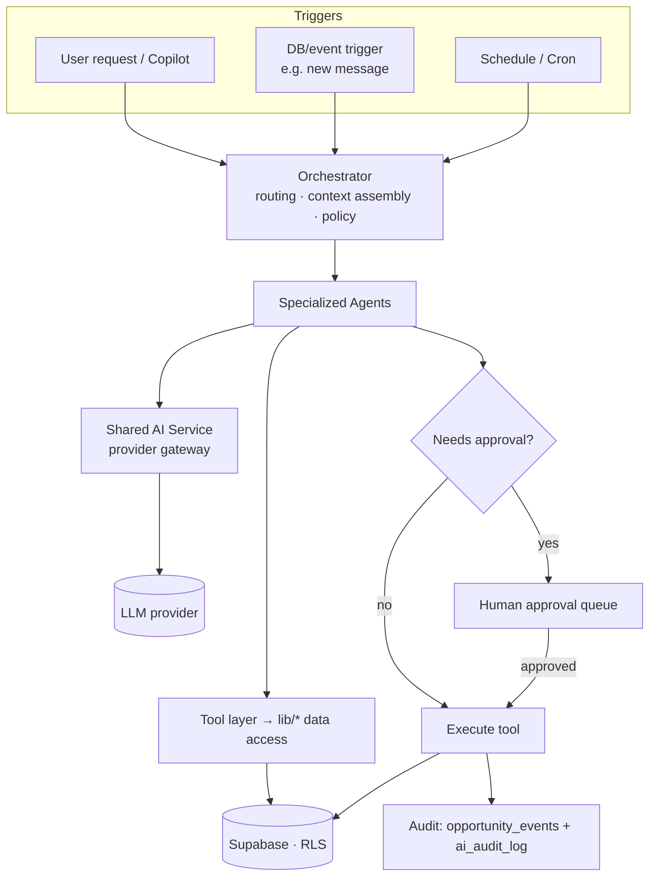
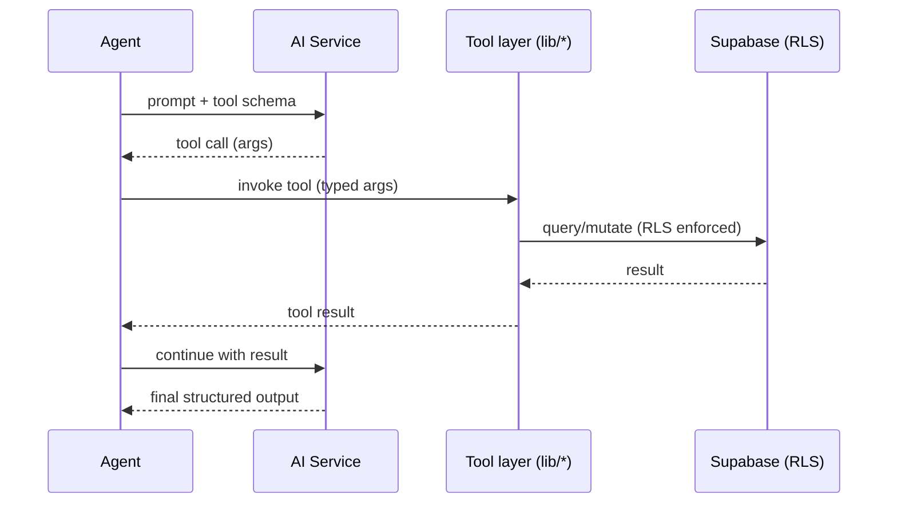
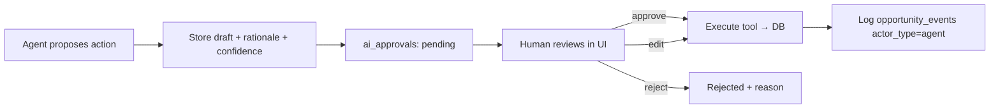

# AI Architecture (Design)

Design for the Career CRM's AI layer, realized in **Phase 3 (M6–M10)**. This is a
**blueprint only** — no implementation, no migrations. Its central claim: the
Phase 1 schema was built so the AI layer bolts on **additively** and requires
**no redesign** of existing tables.

**Related:** [README](../../README.md) · [Project Roadmap](../roadmap/PROJECT_ROADMAP.md) ·
[System Architecture](../architecture/SYSTEM_ARCHITECTURE.md) ·
[Database Guide](../database/DATABASE_GUIDE.md)

> **Provider-agnostic.** The design assumes a pluggable LLM provider (e.g. Claude)
> behind a gateway; no specific model ids or pricing are asserted here — those are
> chosen at build time against current provider docs.

---

## Vision

Give the operator a team of specialized, auditable assistants that read CRM data,
propose and (with approval) take actions, and keep an explainable trail — turning
the CRM from a system of record into a system of *action*. Every AI output is
provenance-tagged, every consequential action is human-gated, and nothing about
the existing data model has to change to get there.

**Principles**
- **Additive-only:** reuse existing `ai_*` columns, `metadata jsonb`, and
  `opportunity_events`; new needs arrive as *new* tables, never as edits to
  shipped ones.
- **Human-in-the-loop by default:** agents *draft and propose*; humans *approve*
  before anything external happens (sending mail, changing stages).
- **Auditable:** agent actions are logged as first-class events.
- **Bounded:** tokens, cost, and tool scope are budgeted and enforced.

---

## Agent architecture

- **Orchestrator** — selects the agent(s), assembles context (entity records +
  retrieved snippets), enforces policy/budgets, and records the run.
- **Specialized agents** — narrow-scope prompt+tool bundles (the nine below).
- **Shared AI Service** — the only path to a provider (below).
- **Tool layer** — agents never touch SQL directly; they call the same
  `server-only` `lib/<entity>.ts` functions the UI uses, so **RLS and validation
  apply identically** to human and agent writes.

---

## Shared AI service

A single internal gateway (`lib/ai/*`, Phase 3) that every agent calls:

- **Provider abstraction** — pluggable (Claude/other); model routing by
  task class (cheap-fast vs deep-reasoning).
- **Prompt rendering** — resolves a versioned template + variables (see below).
- **Structured output** — schema-constrained responses (JSON/tool args) validated
  before use.
- **Guardrails** — input/output filtering, PII handling, refusal handling.
- **Resilience** — retries, timeouts, fallbacks, idempotency keys.
- **Accounting** — token/cost capture per call (feeds Token management).
- **Caching** — prompt/result caching keyed on template version + input hash.

Every write it produces stamps the existing provenance columns:
`ai_model`, `ai_prompt_version`, `ai_confidence`, `ai_processed_at`
(+ `ai_summary` where applicable).

---

## Prompt templates

- **Versioned, content-addressed.** Each template has an id + semantic version;
  the version that produced any row is stored in that row's `ai_prompt_version`,
  making every AI field reproducible and auditable.
- **Storage.** Templates live in-repo (`lib/ai/prompts/*`) for review/diffing;
  optionally mirrored to an additive `prompt_templates` table for runtime edits
  and A/B testing — additive, no existing-table change.
- **Composition.** System role + task instructions + retrieved context +
  structured-output contract. No secrets in templates.

---

## Conversation storage

Copilot and multi-turn agent runs need history the current schema doesn't hold →
**additive tables** (Phase 3 · M6 migration), never edits to existing ones:

- `ai_conversations` — `id`, `owner_id`, optional `subject`, entity linkage
  (`entity_type`, `entity_id`), timestamps.
- `ai_messages` — `conversation_id`, `role` (user/assistant/tool/system),
  `content`, `tool_calls jsonb`, token counts, `ai_model`, `ai_prompt_version`.

Entity linkage is polymorphic (`entity_type` + `entity_id`) — the same pattern
already used by `opportunity_events.actor_id`. Opportunity-scoped turns *also*
drop a summary event into `opportunity_events`.

---

## Summaries

- **Where they live:** the existing `ai_summary` columns on `messages` and
  `opportunities` (and `metadata` on notes) — **no new columns needed**.
- **How they're made:** the Inbox/Opportunity agents generate summaries on
  ingest or on demand; each write sets `ai_summary` + the `ai_*` provenance quad.
- **Rollups:** an opportunity summary is synthesized from its messages, notes,
  and events; refreshed by a background job when material changes occur.

---

## Embeddings

- **Extension:** `pgvector` (Supabase-supported), enabled additively.
- **Table (future, additive):** `ai_embeddings` — `entity_type`, `entity_id`,
  `chunk`, `embedding vector`, `ai_model`, `created_at`. Existing tables are
  untouched; embeddings reference them by (type, id).
- **What's embedded:** company/contact profiles, opportunity descriptions,
  message bodies, notes — the same content already in `search_vector`, now also
  vectorized for semantic recall.

---

## Vector search

- **Complements, doesn't replace, FTS.** Keyword precision stays with the
  generated `tsvector` + GIN indexes; **semantic** recall comes from
  `ai_embeddings` (cosine/IP via an IVFFlat/HNSW index).
- **Hybrid retrieval:** the orchestrator blends FTS hits + vector neighbors to
  assemble agent context (retrieval-augmented), scoped by `owner_id`/RLS.

---

## Tool calling

- **Registry.** A typed catalogue of tools (e.g. `getOpportunity`,
  `createTask`, `draftMessage`, `linkContact`, `searchCompanies`) — each a thin
  wrapper over the existing `lib/<entity>.ts` layer.
- **Same guardrails as the UI.** Tools run under the session's RLS; writes pass
  the same validation as human server actions.
- **Consequence classing.** Tools are tagged `read` · `write` · `external`.
  `external`/high-impact `write` tools cannot execute without approval (below).

---

## Background jobs

AI async work runs on the **shared durable `jobs` queue** — the single
Postgres-backed queue drained by Vercel Cron
([ADR-005](../architecture/decisions/ADR-005-background-jobs.md)) — **not** a
separate AI-only table.

- **Queue:** the unified `jobs` table (`type`, `payload jsonb`, `status`,
  `attempts`, `max_attempts`, `run_after`, `locked_at`, `idempotency_key`,
  `owner_id`). AI work is enqueued as AI **job types** — `ai_summarize`, `ai_embed`.
- **Workers:** Vercel Cron / the queue runner drains `jobs`; long agent runs are
  async so requests stay fast. Retries with backoff; idempotency keys prevent
  double-execution. Per-call token/cost is recorded in `ai_audit_log` / `ai_messages`.
- **Uses:** message summarization on ingest, nightly follow-up scans, enrichment,
  embedding backfills.

---

## Event triggers

Agents are driven by three sources (see the topology diagram):

1. **User** — Copilot or an explicit "summarize/enrich/draft" action.
2. **Data events** — e.g. a new `messages` row (from Phase 3 Gmail sync) enqueues
   an Inbox-Agent job; a `stage_changed` event enqueues a follow-up check.
   Implemented as app-level emits and/or Postgres triggers that enqueue a `jobs`
   row (an AI job type).
3. **Schedule** — cron scans (stale opportunities, overdue `next_action_at`).

`opportunity_events` is both a **trigger source** and an **output sink** — the
timeline the agents read *and* write.

---

## Human approval workflow

- **Table (future, additive):** `ai_approvals` — `id`, `agent`, `action_type`,
  `proposed_payload jsonb`, `rationale`, `ai_confidence`, `status`
  (pending/approved/rejected/edited), `decided_by`, `decided_at`, entity linkage.
- **Policy:** anything `external` (send email) or high-impact (advance stage,
  archive) requires approval; low-risk reads/drafts do not. Drafts (e.g. a reply)
  are stored, **not sent**, until approved.

---

## Audit logging

- **Opportunity-scoped actions** → `opportunity_events` with
  `actor_type='agent'`, `actor_id` = agent id, `metadata` carrying model /
  prompt version / confidence / job id. **This already exists** — no change.
- **Cross-cutting actions** (enrichment, embeddings, approvals) →
  `ai_audit_log` (future, additive): `actor` (agent id), `action`, `entity_type`,
  `entity_id`, `input_ref`, `output_ref`, `ai_model`, `ai_prompt_version`,
  `tokens`, `cost`, `created_at`.
- Together these give a complete, queryable "who/what/why/how-confident" trail.

---

## Token management

- **Per-call accounting** captured by the AI Service into `ai_messages` /
  `ai_audit_log` (prompt/completion tokens, cost, model).
- **Budgets** per owner/agent/day; the orchestrator refuses or downgrades when a
  budget is exceeded.
- **Cost control levers:** model routing (cheap model for classification/summaries,
  strong model for reasoning), prompt/result caching, retrieval trimming, and
  truncation/summarization of long context.
- **Observability:** token/cost surfaced in Analytics/Settings for transparency.

---

## Future agents

Each agent is a prompt + tool bundle. The **Schema integration** line proves it
needs **no redesign** — it reuses existing columns/tables (and, where noted, only
*additive* AI tables shared by all agents: `ai_conversations`, `ai_messages`,
`ai_embeddings`, `ai_approvals`, `ai_audit_log` — with async work running on the
shared `jobs` queue).

### Recruiter Agent
- **Role.** Nurture recruiter/contact relationships; draft personalized outreach.
- **Reads.** `contacts`, `opportunity_contacts`, `companies`, message history.
- **Writes.** drafts → `ai_approvals`; on approval → `messages` (outbound),
  `tasks`, `opportunity_events`. Enrichment → `contacts.ai_*`.
- **Schema integration.** Reuses contacts/opportunity_contacts + `ai_*`; approvals via additive table. **No redesign.**

### Opportunity Agent
- **Role.** Keep each opportunity healthy; suggest stage moves and next actions.
- **Reads.** `opportunities`, `opportunity_events`, linked messages/tasks.
- **Writes.** `opportunities.ai_summary` + `ai_*`, proposes `stage`/`next_action_at`
  changes (approval-gated), logs `opportunity_events` (`actor_type='agent'`).
- **Schema integration.** Pure reuse of `ai_*`, `stage`, `next_action_at`, events. **No redesign.**

### Inbox Agent
- **Role.** Triage synced mail: classify, summarize, and link to the right records.
- **Reads.** `messages` (from Phase 3 Gmail sync via `integration_accounts`).
- **Writes.** `messages.ai_summary` + `ai_*`, sets `opportunity_id`/`contact_id`/
  `company_id` links, emits `message_received` events.
- **Schema integration.** Reuses messages linkage + `ai_*`; embeddings additive. **No redesign.**

### Resume Agent
- **Role.** Parse a resume into structured profile/skills to power matching.
- **Reads.** uploaded resume (blob).
- **Writes.** structured profile to an additive `ai_profiles`/`ai_embeddings`
  store and/or `metadata`; never mutates core tables' shape.
- **Schema integration.** New content lives in additive tables + `metadata jsonb`. **No redesign.**

### Interview Agent
- **Role.** Prep and schedule interviews; generate question sets and briefs.
- **Reads.** `opportunities`, `opportunity_contacts`, `companies`, notes.
- **Writes.** `tasks` (type interview, `due_at`), `opportunity_events`
  (`interview_scheduled`), briefs → `opportunity_notes` (+`metadata` provenance).
- **Schema integration.** Reuses tasks/events/notes. **No redesign.**

### Research Agent
- **Role.** Enrich companies/contacts from web + LLM knowledge.
- **Reads.** `companies`, `contacts`, `external_ids`.
- **Writes.** company/contact fields + `ai_*` + `external_ids` (cross-source
  matching), with `ai_confidence` on inferred data.
- **Schema integration.** Reuses enrichment columns + `external_ids`. **No redesign.**

### Analytics Agent
- **Role.** Narrate metrics and surface insights ("offer rate dipped; why").
- **Reads.** aggregates over `opportunities`, `opportunity_events`, `messages`.
- **Writes.** read-mostly; optional insight snapshots to an additive store.
- **Schema integration.** Read-only over existing data; nothing to change. **No redesign.**

### Follow-up Agent
- **Role.** Detect stale opportunities / unanswered threads and act.
- **Reads.** `opportunities.next_action_at`, message `direction` gaps, events.
- **Writes.** `tasks` (follow-ups), draft `messages` (approval-gated), events.
- **Schema integration.** Reuses `next_action_at`, tasks, messages, events. **No redesign.**

### Meeting Agent
- **Role.** Capture meeting notes and produce summaries + action items.
- **Reads.** transcript/notes input, related opportunity/contacts.
- **Writes.** `opportunity_notes` (+`metadata`), `tasks` (action items),
  `opportunity_events`, `ai_summary`.
- **Schema integration.** Reuses notes/tasks/events + `ai_*`. **No redesign.**

---

## Schema integration summary — no redesign required

| Capability | Existing hook (no migration) | Additive object (Phase 3) |
|-----------|------------------------------|----------------------------------|
| Provenance on AI output | `ai_model` · `ai_prompt_version` · `ai_confidence` · `ai_processed_at` | — |
| Summaries | `messages.ai_summary` · `opportunities.ai_summary` | — |
| Agent actions & audit (opportunity) | `opportunity_events` (`actor_type='agent'`, `actor_id`, `metadata`) | — |
| Flexible AI metadata | `metadata jsonb` on all tables | — |
| Inbox source | `messages` · `integration_accounts` | — |
| Cross-source identity | `external_ids jsonb` | — |
| Conversations / Copilot | — | `ai_conversations`, `ai_messages` |
| Semantic search | (complements `search_vector`) | `pgvector` + `ai_embeddings` |
| Async processing | — | shared `jobs` queue (ADR-005) — AI job types `ai_summarize` / `ai_embed` |
| Approval workflow | — | `ai_approvals` |
| Cross-cutting audit | — | `ai_audit_log` |
| Editable prompts / A-B | in-repo templates | `prompt_templates` (optional) |

**Every additive object references existing rows by id (or polymorphic
`entity_type`+`entity_id`) and changes nothing about shipped tables** — satisfying
the "no redesign" constraint the Phase 1 schema was designed to guarantee.

---

*Design only. Implementation is Phase 3 (M6–M10) in the
[Project Roadmap](../roadmap/PROJECT_ROADMAP.md); it must land as additive
migrations following the
[Database Guide](../database/DATABASE_GUIDE.md#migration-conventions).*
