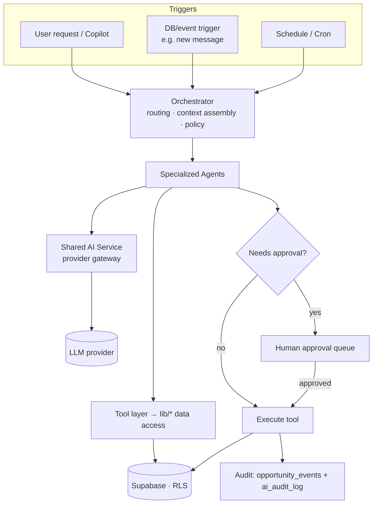
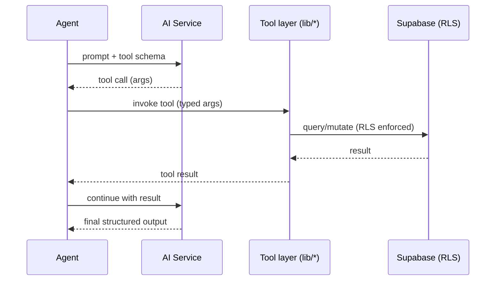
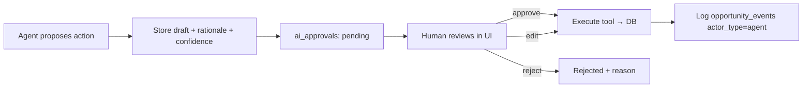

# AI Architecture

Design for the Career CRM's AI layer, realized in **Phase 3 (M6–M10)**. Its
central claim: the Phase 1 schema was built so the AI layer bolts on
**additively** and requires **no redesign** of existing tables.

**Related:** [README](../../README.md) · [Project Roadmap](../roadmap/PROJECT_ROADMAP.md) ·
[System Architecture](../architecture/SYSTEM_ARCHITECTURE.md) ·
[Database Guide](../database/DATABASE_GUIDE.md) ·
[Schema Reference §7](../database/SCHEMA_REFERENCE.md) ·
[Security §9](../SECURITY.md)

> **Status.** **M6 (AI Foundation) and M7 (AI Summaries) are implemented** — see
> [§ M6 as-built](#m6-as-built) and [§ M7 as-built](#m7-as-built) for what
> actually shipped, which is the authoritative description of the gateway,
> tools, prompts, accounting and summaries. M8–M10 below remain **design only**:
> no implementation, no migrations.

> **Vendor neutrality is a binding invariant, not an aspiration.** No provider
> SDK type, enum, stop reason, or request/response field may escape
> `lib/ai/providers/**`. Everything above that line depends only on internal
> contracts, so Anthropic can be replaced by OpenAI, Gemini, OpenRouter, Azure
> OpenAI, Ollama, vLLM or anything else **without changing the gateway, business
> logic, database layer, tools, prompts, or consumers**. Enforcement is
> mechanical — see [§ M6 as-built](#m6-as-built).

---

## Vision

Give the operator a team of specialized, auditable assistants that read CRM data,
propose and (with approval) take actions, and keep an explainable trail — turning
the CRM from a system of record into a system of *action*. Every AI output is
provenance-tagged, every consequential action is human-gated, and nothing about
the existing data model has to change to get there.

**Principles**
- **Additive-only:** reuse existing `ai_*` columns, `metadata jsonb`, and
  `opportunity_events`; new needs arrive as *new* tables, never as edits to
  shipped ones.
- **Human-in-the-loop by default:** agents *draft and propose*; humans *approve*
  before anything external happens (sending mail, changing stages).
- **Auditable:** agent actions are logged as first-class events.
- **Bounded:** tokens, cost, and tool scope are budgeted and enforced.

---

## M6 as-built

What shipped on `feat/phase3-m6-ai-foundation` (commit `829f275`), behind
`FEATURE_AI`, with no public route and nothing user-facing. This section
describes the code; everything after it describes the still-unbuilt design.

### Layering

```
Callers (M7 job handler · M8 route · Settings self-test action)
                  │
          ┌───────▼───────┐
          │   AiGateway   │  policy lives here, not in callers
          └───────┬───────┘
   ┌──────┬───────┼────────┬──────────────┬─────────────┐
   ▼      ▼       ▼        ▼              ▼             ▼
Prompt  Budget  Audit  ToolRegistry   Redaction    AiProvider ◄── interface
registry (atomic)                                        │
                                                  AnthropicProvider
                                                         │
                                                 AiCompletionMapper ◄── DTO boundary
                                                         │
                                                   vendor SDK
```

`AiGateway` imports the `AiProvider` **interface** and never a concrete adapter —
the same inversion `CalendarSyncEngine` uses against `CalendarProvider` in M4.
The entire gateway test suite runs against a stub provider that imports no SDK.

### The neutral contract (`types/ai.ts`)

Providers spell the same concepts differently; each adapter maps its own
vocabulary onto ours, and consumers only ever see ours.

| Concept | Neutral form | Vendor spellings it absorbs |
|---|---|---|
| Stop reason | `completed` · `tool_call` · `truncated` · `refused` | `end_turn`/`stop`/`STOP`, `tool_use`/`tool_calls`, `max_tokens`/`length`, `refusal`/`content_filter`/`SAFETY` |
| Request intent | `taskClass`, `reasoningDepth`, `cachePolicy`, `responseSchema`, `maxOutputTokens` | `output_config.effort`, `thinking`, `cache_control`, native schema constraints |
| Usage | `inputTokens`, `outputTokens`, `cachedInputTokens` | per-vendor usage blocks |
| Errors | `AiTransientError` · `AiPermanentError` · `AiBudgetExceededError` · `AiApprovalRequiredError` · `AiInvalidOutputError` · `AiDisabledError` · `AiUnconfiguredError` · `AiUnknownTemplateError` · `AiUnknownToolError` | vendor SDK error classes |

`model` and `provider` cross the boundary as **opaque provenance strings** —
recorded for audit, never branched on.

### Capability negotiation

Not every provider supports everything, so `AiCapabilities` declares
`structuredOutput`, `toolCalling`, `tokenCounting`, `prefixCaching` and
`reasoningControl`, and the gateway degrades deliberately rather than assuming:

- **No native structured output** → the JSON contract moves into the prompt.
  Validation is unchanged, because our own validator (`lib/ai/schema.ts`) was
  always the real guarantee; the provider feature is an optimisation that makes
  it pass more often.
- **No token-counting endpoint** → a conservative character-based estimate
  (~3 chars/token) that **over**-reserves budget. Under-reserving would let a
  call slip past the ceiling.
- **No tool calling** → tools are simply not offered.

### Enforcement of the invariant

1. **ESLint** `no-restricted-imports` bans the vendor SDK outside
   `lib/ai/providers/**` (verified to fire).
2. **`test/ai/neutrality.test.ts`** scans `lib/`, `app/`, `components/`, `types/`
   for vendor names, model ids and wire-format fields (`anthropic`, `claude-*`,
   `openai`, `gpt-*`, `gemini`, `stop_reason`, `finish_reason`, `output_config`,
   `cache_control`, `tool_use`). It caught a real leak on its first run.
3. **The gateway suite compiles only against the interface.**

**Adding a provider** = one new directory under `lib/ai/providers/` implementing
`AiProvider`, plus one `case` in the factory and one env var. If a swap ever
requires editing anything above the adapter line, that is a defect in the
boundary — not a normal migration.

### Request lifecycle

```
featureEnabled("FEATURE_AI")   → false ⇒ AiDisabledError (fail-closed)
prompt registry render          → unknown template throws before any call
redact                          → secrets stripped from prompt text
provider.countTokens | estimate
budget.reserve (atomic)         → over budget ⇒ AiBudgetExceededError
provider.complete               → adapter maps vendor payload → AiCompletion
[bounded tool rounds ≤ 3]       → read tools only; write/external refuse
guard stopReason                → refused / truncated are non-throwing outcomes
validate structured output      → invalid ⇒ AiPermanentError
audit → ai_audit_log
budget.commit                   → reconcile estimate to actual (always, incl. errors)
```

### Tools

`AiTool` carries a consequence class — `read` · `write` · `external` — enforced
**in the registry**, so a future tool cannot opt itself out by forgetting to
check. M6 registers **read tools only** (`get_opportunity`,
`search_opportunities`); `write` and `external` raise
`AiApprovalRequiredError` because the approval queue is M9.

Tools receive an `AiToolContext` carrying the Supabase client, `ownerId` and
actor. **Dual execution context (H5):** interactive callers pass the session
client (RLS applies); job callers pass the service-role client (RLS bypassed), so
tools **assert ownership in application code** rather than assuming the client
enforces it.

### Accounting

Two-phase, backed by `ai_usage_counters` and two SQL functions — see
[Schema Reference §7a](../database/SCHEMA_REFERENCE.md). Reserve an estimate
before the call, reconcile to actual after. A lost commit over-counts, so the
budget can under-spend but never over-spend.

### Deliberately not built in M6

Streaming · public routes · embeddings/pgvector/retrieval · `ai_approvals` and
its UI · summarisation · email drafting · automation · any write or external
tool · prompt-injection hardening (Phase 5) · vendor-specific server-side
refusal fallback (failover belongs at the neutral layer once a second adapter
exists).

### Known limitations

- `ai_conversations` / `ai_messages` and `prompt_templates` ship **uncalled**;
  M8 is their consumer. `lib/ai/conversations.ts` has no unit tests.
- Tool-round calls reserve budget **once, before the first round**, so a
  multi-round call can overshoot the daily ceiling by a bounded amount before the
  reconcile lands. Revisit in M8, the first real tool consumer.
- `search_opportunities` filters by owner **after** the query, because the
  Phase-2 data layer takes no owner filter and is frozen. Equivalent under the
  single-operator model; a multi-owner deployment must push the predicate into
  the query so paging stays exact.

---

## M7 as-built

What shipped on `feat/phase3-m7-ai-summaries`, behind `FEATURE_AI_SUMMARIES`,
with **no migration** — M7 writes only to the `ai_summary` + `ai_*` columns
Phase 1 already provided on `messages` and `opportunities`.

### The four paths

| Path | Trigger | Execution | Entity |
|---|---|---|---|
| Automatic | Gmail ingest of a new eligible message | `ai_summarize` job → cron drainer | message |
| Manual | *Summarize* on detail | inline, in the request | message · opportunity |
| Backfill | *Summarize backlog* in Settings | enqueues one bounded batch | message |

`lib/ai/summarize.ts` is the only module that decides whether a summary happens.
The job handler and all three Server Actions are thin callers, so eligibility,
bounding, provenance and the write have exactly one implementation.

### Eligibility, and why it is code rather than SQL

Inbound · not archived · body ≥ 400 characters · not `CATEGORY_PROMOTIONS` ·
`owner_id` present. The 400-character floor exists because the message list
already renders `snippet`: below it, a summary restates what the operator can
read faster. The label exclusion removes marketing mail, which defeats the
length filter and is the largest injection surface in an inbox.

The predicate is a function, not a WHERE clause, and the backfill calls the same
function. A second SQL copy would drift, and a backfill that summarized what the
live path refuses would quietly undo a cost decision.

### Idempotency: the write, not the read

`ai_processed_at` short-circuits before any spend, but the guarantee is the
conditional claim:

```
update … set ai_summary = … where id = $1 and owner_id = $2 and ai_processed_at is null
```

Zero rows back means another path won; that is an outcome, not an error. The
manual paths pass `force`, which drops the predicate — the only way to overwrite
a summary, and it is always operator-initiated.

### Outcomes

`refused` leaves `ai_processed_at` null and writes nothing: a refusal is
deterministic for the same content, so retrying it would only spend again.
`truncated` throws `AiPermanentError` for the same reason. Both are recorded in
`ai_audit_log` with their outcome.

The job handler absorbs non-retryable **runtime** failures so they do not burn
five paid retries, but deliberately surfaces **configuration** failures
(`disabled`, `unconfigured`) — those are raised before the gateway can write an
audit row, so absorbing them would leave no summaries and no trace anywhere.

### Cost controls

Per-call input is capped at 12 000 characters. Rollups read a fixed 10 messages
and 5 notes — a bounded join, not retrieval. Automatic enqueue and backfill both
**refuse to run when `AI_DAILY_TOKEN_BUDGET` is unset**, because an unset budget
means unlimited and those are the paths that spend without a human. `AI_MODEL_FAST`
has no such guard and defaults to the most expensive model; see
[Runbook §19.6](../operations/RUNBOOK.md).

The budget deliberately guards **unattended paths only**. The manual *Summarize*
actions are exempt: each is administrator-authenticated, flag-gated and
explicitly user-initiated, so the operator is the bound rather than the ledger.
Setting a budget will not stop a manual summary — `FEATURE_AI_SUMMARIES=false`
is the control that stops every path. The exemption is pinned by a test, so it
reads as a decision rather than an omission.

### `ai_summary` is untrusted-origin content

A summary is derived from attacker-authorable email. It is rendered as plain
text and is never used as an identifier, a filter, or an instruction. **Any
future consumer — in particular M8 retrieval feeding a tool-enabled agent —
must treat these fields as data, not instructions.** Containment today is
structural: no tools are offered on the summarize path, and output is
schema-validated before it is stored.

### Deliberately not built in M7

Automatic refresh of opportunity rollups (no change detection exists) ·
backfill for rollups · thread-level summaries (no thread entity in the schema) ·
an eval harness (Phase 5) · `ai_audit_log.job_id`, which the job handler cannot
populate because the runner passes only the payload.

---

## Agent architecture



- **Orchestrator** — selects the agent(s), assembles context (entity records +
  retrieved snippets), enforces policy/budgets, and records the run.
- **Specialized agents** — narrow-scope prompt+tool bundles (the nine below).
- **Shared AI Service** — the only path to a provider (below).
- **Tool layer** — agents never touch SQL directly; they call the same
  `server-only` `lib/<entity>.ts` functions the UI uses, so **RLS and validation
  apply identically** to human and agent writes.

---

## Shared AI service

A single internal gateway (`lib/ai/*`, Phase 3) that every agent calls:

- **Provider abstraction** — pluggable (Claude/other); model routing by
  task class (cheap-fast vs deep-reasoning).
- **Prompt rendering** — resolves a versioned template + variables (see below).
- **Structured output** — schema-constrained responses (JSON/tool args) validated
  before use.
- **Guardrails** — input/output filtering, PII handling, refusal handling.
- **Resilience** — retries, timeouts, fallbacks, idempotency keys.
- **Accounting** — token/cost capture per call (feeds Token management).
- **Caching** — prompt/result caching keyed on template version + input hash.

Every write it produces stamps the existing provenance columns:
`ai_model`, `ai_prompt_version`, `ai_confidence`, `ai_processed_at`
(+ `ai_summary` where applicable).

---

## Prompt templates

- **Versioned, content-addressed.** Each template has an id + semantic version;
  the version that produced any row is stored in that row's `ai_prompt_version`,
  making every AI field reproducible and auditable.
- **Storage.** Templates live in-repo (`lib/ai/prompts/*`) for review/diffing;
  optionally mirrored to an additive `prompt_templates` table for runtime edits
  and A/B testing — additive, no existing-table change.
- **Composition.** System role + task instructions + retrieved context +
  structured-output contract. No secrets in templates.

---

## Conversation storage

Copilot and multi-turn agent runs need history the current schema doesn't hold →
**additive tables** (Phase 3 · M6 migration), never edits to existing ones:

- `ai_conversations` — `id`, `owner_id`, optional `subject`, entity linkage
  (`entity_type`, `entity_id`), timestamps.
- `ai_messages` — `conversation_id`, `role` (user/assistant/tool/system),
  `content`, `tool_calls jsonb`, token counts, `ai_model`, `ai_prompt_version`.

Entity linkage is polymorphic (`entity_type` + `entity_id`) — the same pattern
already used by `opportunity_events.actor_id`. Opportunity-scoped turns *also*
drop a summary event into `opportunity_events`.

---

## Summaries

- **Where they live:** the existing `ai_summary` columns on `messages` and
  `opportunities` (and `metadata` on notes) — **no new columns needed**.
- **How they're made:** the Inbox/Opportunity agents generate summaries on
  ingest or on demand; each write sets `ai_summary` + the `ai_*` provenance quad.
- **Rollups:** an opportunity summary is synthesized from its messages, notes,
  and events; refreshed by a background job when material changes occur.

---

## Embeddings

- **Extension:** `pgvector` (Supabase-supported), enabled additively.
- **Table (future, additive):** `ai_embeddings` — `entity_type`, `entity_id`,
  `chunk`, `embedding vector`, `ai_model`, `created_at`. Existing tables are
  untouched; embeddings reference them by (type, id).
- **What's embedded:** company/contact profiles, opportunity descriptions,
  message bodies, notes — the same content already in `search_vector`, now also
  vectorized for semantic recall.

---

## Vector search

- **Complements, doesn't replace, FTS.** Keyword precision stays with the
  generated `tsvector` + GIN indexes; **semantic** recall comes from
  `ai_embeddings` (cosine/IP via an IVFFlat/HNSW index).
- **Hybrid retrieval:** the orchestrator blends FTS hits + vector neighbors to
  assemble agent context (retrieval-augmented), scoped by `owner_id`/RLS.

---

## Tool calling

- **Registry.** A typed catalogue of tools (e.g. `getOpportunity`,
  `createTask`, `draftMessage`, `linkContact`, `searchCompanies`) — each a thin
  wrapper over the existing `lib/<entity>.ts` layer.
- **Same guardrails as the UI.** Tools run under the session's RLS; writes pass
  the same validation as human server actions.
- **Consequence classing.** Tools are tagged `read` · `write` · `external`.
  `external`/high-impact `write` tools cannot execute without approval (below).



---

## Background jobs

AI async work runs on the **shared durable `jobs` queue** — the single
Postgres-backed queue drained by Vercel Cron
([ADR-005](../architecture/decisions/ADR-005-background-jobs.md)) — **not** a
separate AI-only table.

- **Queue:** the unified `jobs` table (`type`, `payload jsonb`, `status`,
  `attempts`, `max_attempts`, `run_after`, `locked_at`, `idempotency_key`,
  `owner_id`). AI work is enqueued as AI **job types** — `ai_summarize`, `ai_embed`.
- **Workers:** Vercel Cron / the queue runner drains `jobs`; long agent runs are
  async so requests stay fast. Retries with backoff; idempotency keys prevent
  double-execution. Per-call token/cost is recorded in `ai_audit_log` / `ai_messages`.
- **Uses:** message summarization on ingest, nightly follow-up scans, enrichment,
  embedding backfills.

---

## Event triggers

Agents are driven by three sources (see the topology diagram):

1. **User** — Copilot or an explicit "summarize/enrich/draft" action.
2. **Data events** — e.g. a new `messages` row (from Phase 3 Gmail sync) enqueues
   an Inbox-Agent job; a `stage_changed` event enqueues a follow-up check.
   Implemented as app-level emits and/or Postgres triggers that enqueue a `jobs`
   row (an AI job type).
3. **Schedule** — cron scans (stale opportunities, overdue `next_action_at`).

`opportunity_events` is both a **trigger source** and an **output sink** — the
timeline the agents read *and* write.

---

## Human approval workflow



- **Table (future, additive):** `ai_approvals` — `id`, `agent`, `action_type`,
  `proposed_payload jsonb`, `rationale`, `ai_confidence`, `status`
  (pending/approved/rejected/edited), `decided_by`, `decided_at`, entity linkage.
- **Policy:** anything `external` (send email) or high-impact (advance stage,
  archive) requires approval; low-risk reads/drafts do not. Drafts (e.g. a reply)
  are stored, **not sent**, until approved.

---

## Audit logging

- **Opportunity-scoped actions** → `opportunity_events` with
  `actor_type='agent'`, `actor_id` = agent id, `metadata` carrying model /
  prompt version / confidence / job id. **This already exists** — no change.
- **Cross-cutting actions** (enrichment, embeddings, approvals) →
  `ai_audit_log` (future, additive): `actor` (agent id), `action`, `entity_type`,
  `entity_id`, `input_ref`, `output_ref`, `ai_model`, `ai_prompt_version`,
  `tokens`, `cost`, `created_at`.
- Together these give a complete, queryable "who/what/why/how-confident" trail.

---

## Token management

- **Per-call accounting** captured by the AI Service into `ai_messages` /
  `ai_audit_log` (prompt/completion tokens, cost, model).
- **Budgets** per owner/agent/day; the orchestrator refuses or downgrades when a
  budget is exceeded.
- **Cost control levers:** model routing (cheap model for classification/summaries,
  strong model for reasoning), prompt/result caching, retrieval trimming, and
  truncation/summarization of long context.
- **Observability:** token/cost surfaced in Analytics/Settings for transparency.

---

## Future agents

Each agent is a prompt + tool bundle. The **Schema integration** line proves it
needs **no redesign** — it reuses existing columns/tables (and, where noted, only
*additive* AI tables shared by all agents: `ai_conversations`, `ai_messages`,
`ai_embeddings`, `ai_approvals`, `ai_audit_log` — with async work running on the
shared `jobs` queue).

### Recruiter Agent
- **Role.** Nurture recruiter/contact relationships; draft personalized outreach.
- **Reads.** `contacts`, `opportunity_contacts`, `companies`, message history.
- **Writes.** drafts → `ai_approvals`; on approval → `messages` (outbound),
  `tasks`, `opportunity_events`. Enrichment → `contacts.ai_*`.
- **Schema integration.** Reuses contacts/opportunity_contacts + `ai_*`; approvals via additive table. **No redesign.**

### Opportunity Agent
- **Role.** Keep each opportunity healthy; suggest stage moves and next actions.
- **Reads.** `opportunities`, `opportunity_events`, linked messages/tasks.
- **Writes.** `opportunities.ai_summary` + `ai_*`, proposes `stage`/`next_action_at`
  changes (approval-gated), logs `opportunity_events` (`actor_type='agent'`).
- **Schema integration.** Pure reuse of `ai_*`, `stage`, `next_action_at`, events. **No redesign.**

### Inbox Agent
- **Role.** Triage synced mail: classify, summarize, and link to the right records.
- **Reads.** `messages` (from Phase 3 Gmail sync via `integration_accounts`).
- **Writes.** `messages.ai_summary` + `ai_*`, sets `opportunity_id`/`contact_id`/
  `company_id` links, emits `message_received` events.
- **Schema integration.** Reuses messages linkage + `ai_*`; embeddings additive. **No redesign.**

### Resume Agent
- **Role.** Parse a resume into structured profile/skills to power matching.
- **Reads.** uploaded resume (blob).
- **Writes.** structured profile to an additive `ai_profiles`/`ai_embeddings`
  store and/or `metadata`; never mutates core tables' shape.
- **Schema integration.** New content lives in additive tables + `metadata jsonb`. **No redesign.**

### Interview Agent
- **Role.** Prep and schedule interviews; generate question sets and briefs.
- **Reads.** `opportunities`, `opportunity_contacts`, `companies`, notes.
- **Writes.** `tasks` (type interview, `due_at`), `opportunity_events`
  (`interview_scheduled`), briefs → `opportunity_notes` (+`metadata` provenance).
- **Schema integration.** Reuses tasks/events/notes. **No redesign.**

### Research Agent
- **Role.** Enrich companies/contacts from web + LLM knowledge.
- **Reads.** `companies`, `contacts`, `external_ids`.
- **Writes.** company/contact fields + `ai_*` + `external_ids` (cross-source
  matching), with `ai_confidence` on inferred data.
- **Schema integration.** Reuses enrichment columns + `external_ids`. **No redesign.**

### Analytics Agent
- **Role.** Narrate metrics and surface insights ("offer rate dipped; why").
- **Reads.** aggregates over `opportunities`, `opportunity_events`, `messages`.
- **Writes.** read-mostly; optional insight snapshots to an additive store.
- **Schema integration.** Read-only over existing data; nothing to change. **No redesign.**

### Follow-up Agent
- **Role.** Detect stale opportunities / unanswered threads and act.
- **Reads.** `opportunities.next_action_at`, message `direction` gaps, events.
- **Writes.** `tasks` (follow-ups), draft `messages` (approval-gated), events.
- **Schema integration.** Reuses `next_action_at`, tasks, messages, events. **No redesign.**

### Meeting Agent
- **Role.** Capture meeting notes and produce summaries + action items.
- **Reads.** transcript/notes input, related opportunity/contacts.
- **Writes.** `opportunity_notes` (+`metadata`), `tasks` (action items),
  `opportunity_events`, `ai_summary`.
- **Schema integration.** Reuses notes/tasks/events + `ai_*`. **No redesign.**

---

## Schema integration summary — no redesign required

| Capability | Existing hook (no migration) | Additive object (Phase 3) |
|-----------|------------------------------|----------------------------------|
| Provenance on AI output | `ai_model` · `ai_prompt_version` · `ai_confidence` · `ai_processed_at` | — |
| Summaries | `messages.ai_summary` · `opportunities.ai_summary` | — |
| Agent actions & audit (opportunity) | `opportunity_events` (`actor_type='agent'`, `actor_id`, `metadata`) | — |
| Flexible AI metadata | `metadata jsonb` on all tables | — |
| Inbox source | `messages` · `integration_accounts` | — |
| Cross-source identity | `external_ids jsonb` | — |
| Conversations / Copilot | — | `ai_conversations`, `ai_messages` |
| Semantic search | (complements `search_vector`) | `pgvector` + `ai_embeddings` |
| Async processing | — | shared `jobs` queue (ADR-005) — AI job types `ai_summarize` / `ai_embed` |
| Approval workflow | — | `ai_approvals` |
| Cross-cutting audit | — | `ai_audit_log` |
| Editable prompts / A-B | in-repo templates | `prompt_templates` (optional) |

**Every additive object references existing rows by id (or polymorphic
`entity_type`+`entity_id`) and changes nothing about shipped tables** — satisfying
the "no redesign" constraint the Phase 1 schema was designed to guarantee.

---

*M6 (AI Foundation) is implemented — see [§ M6 as-built](#m6-as-built), which is
authoritative where it differs from the design above. M7–M10 remain design only;
they must land as additive migrations following the
[Database Guide](../database/DATABASE_GUIDE.md#migration-conventions). Sequencing
in the [Project Roadmap](../roadmap/PROJECT_ROADMAP.md).*

---

## Document Control

- **Version:** 1.1
- **Last Updated:** 2026-07-31
- **v1.1:** added [§ M6 as-built](#m6-as-built) from
  `feat/phase3-m6-ai-foundation` (`829f275`); promoted vendor neutrality from an
  assumption to a binding, mechanically enforced invariant. M6 is implemented and
  **not deployed** — flag `FEATURE_AI` off, migration not applied.
