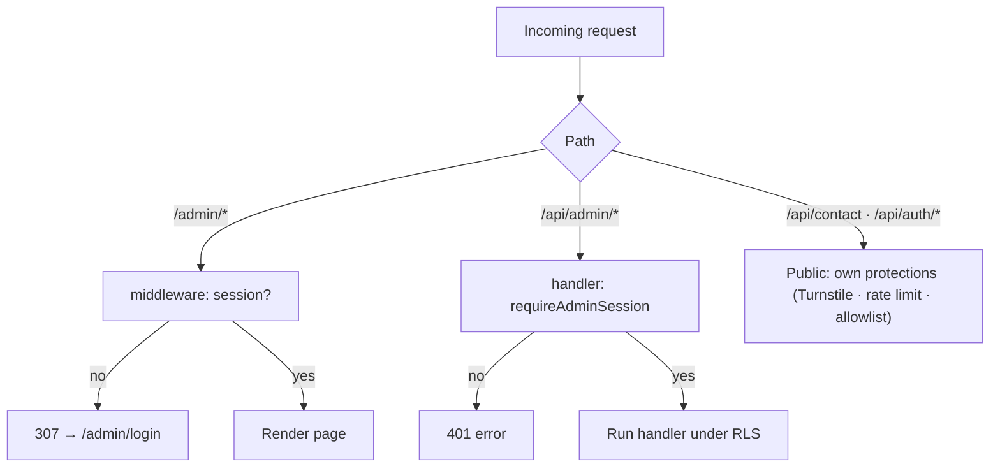

# API Reference

Every API surface of the Career CRM — HTTP route handlers, Server Actions (the
CRM's mutation API), and the planned Phase 3 endpoints. Status-tagged so current
behaviour (v1.0.0) is never confused with the Phase 3 contract.

**Related:** [System Architecture](./SYSTEM_ARCHITECTURE.md) ·
[Events](./EVENTS.md) · [Phase 3 Architecture](./PHASE_3_ARCHITECTURE.md) ·
[Phase 3 Implementation Guide](./PHASE_3_IMPLEMENTATION_GUIDE.md) ·
[Database Guide](../database/DATABASE_GUIDE.md)

> **Status legend:** ✅ **Current** (v1.0.0) · ⬜ **Planned** (Phase 3 — designed,
> not implemented).

---

## 1. Conventions

### Base URL & runtime
- Production: `https://www.shivamchaturvedi.com`
- Next.js App Router **route handlers** under `app/api/**` and `app/auth/**`;
  **Server Actions** co-located in each module's `actions.ts`.

### Authentication model
Supabase Auth session (httpOnly cookies). Three distinct enforcement points:

| Surface | Enforcement |
|--------|-------------|
| **Admin pages** (`/admin/*`) | `middleware.ts` matcher `"/admin/:path*"` → unauthenticated redirected `307 → /admin/login` |
| **Admin API routes** (`/api/admin/*`) | **Not** covered by the middleware matcher; each handler self-guards via `requireAdminSession()` → `401 { error }` if no session |
| **Server Actions** | Guarded server-side by `getAdminActionContext()` / `withAdminAction`; run under the caller's RLS; return `{ ok:false, formError }` if unauthenticated |
| **Public routes** | `/api/contact`, `/api/auth/signup`, `/api/auth/role`, `/auth/callback` — intentionally reachable without an admin session, each with its own protections |

### Permissions
**Single-admin model.** Any authenticated user is treated as admin (RLS policy
`auth.role() = 'authenticated'` on every table). The **allowlist**
(`lib/auth/adminEmail.ts`) is the real boundary — it gates who can sign up. There
is no finer-grained role system yet (multi-user is a future phase).

### Envelopes
- **Route handlers:** JSON. Success shapes vary (`{ inquiry }`, `{ note }`,
  `{ isAdmin }`, …). Errors are always `{ "error": "<human message>" }`.
- **Server Actions:** the `ActionResult<T>` discriminated union —
  `{ ok: true, data }` or `{ ok: false, formError?, fieldErrors? }` (see
  `lib/action-result.ts`).

### Content types
`application/json` for JSON APIs; `text/csv` for export; `text/event-stream`
(SSE) for the planned AI stream.

### Rate limiting (today)
Only **`POST /api/contact`** is rate-limited (`lib/rateLimit.ts`, per-IP).
Admin routes rely on the session gate; Server Actions have no explicit limiter
yet. Phase 3 adds provider-quota + token-budget + per-endpoint limits (§7).

---

## 2. HTTP Route Handlers — Current ✅

### 2.1 `POST /api/contact` ✅ (public)
- **Purpose:** public contact-form intake → inquiry + notification email.
- **Auth:** none (public). **Permissions:** anyone.
- **Input (JSON):** `{ name, email, organization?, message, token }` (`token` = Cloudflare Turnstile token).
- **Output:** `200 { success: true }` (or equivalent) on accept.
- **Errors:** `400` invalid/missing fields or failed Turnstile; `429` rate-limited; `500` email/store failure. Body `{ error }`.
- **Status codes:** `200 · 400 · 429 · 500`.
- **Rate limits:** ✅ per-IP via `isRateLimited` (`lib/rateLimit.ts`).
- **Side effects:** inserts `inquiries` (service role) + `inquiry_activity` (`created`); sends email via **Resend**.
- **Related events:** `inquiry.created` (inquiry_activity). *(Not part of the CRM `opportunity_events` stream — see [Events](./EVENTS.md).)*
- **Security:** Turnstile verification, rate limit, input sanitize/HTML-escape, service-role key server-only, no PII returned.

### 2.2 `POST /api/auth/signup` ✅ (public, allowlist-gated)
- **Purpose:** create the admin account for an allowlisted email.
- **Auth:** none; **allowlist is the boundary** (`isAdminEmail`). **Permissions:** allowlisted email only.
- **Input (JSON):** `{ email, password }` (password ≥ 8, must include a letter and a number).
- **Output:** `200` success (account created, unconfirmed) → client proceeds to verification/sign-in.
- **Errors:** `400` invalid email / weak password; `403` email not allowlisted; `409` email already exists; `500`.
- **Status codes:** `200 · 400 · 403 · 409 · 500`.
- **Rate limits:** none today (allowlist bounds abuse).
- **Side effects:** creates a Supabase Auth user (service role, `email_confirm:false`).
- **Related events:** none (auth system).
- **Security:** allowlist check *before* Supabase contact; service-role server-only; generic error messages; password policy enforced.

### 2.3 `GET /api/auth/role` ✅
- **Purpose:** tell the client whether the current session is an admin.
- **Auth:** session (optional). **Permissions:** any.
- **Input:** none.
- **Output:** `200 { isAdmin: boolean }` (`false` when unauthenticated / not allowlisted).
- **Errors:** none expected (`500` only on failure).
- **Status codes:** `200`.
- **Rate limits:** none. **Side effects:** none (read-only).
- **Related events:** none.
- **Security:** reveals only a boolean; no user data leaked.

### 2.4 `GET /auth/callback` ✅
- **Purpose:** Supabase auth callback — exchange `?code` for a session, then redirect.
- **Auth:** the OAuth/email code itself. **Input:** query `?code`, `?next?`.
- **Output:** `302/307` redirect into `/admin` (or `?next`).
- **Errors:** invalid/expired code → redirect to login with an error.
- **Status codes:** `302/307`.
- **Side effects:** establishes the session cookie.
- **Security:** code single-use; redirect target validated; part of Supabase SSR.

### 2.5 Inquiry admin routes ✅ (session-guarded)
All require `requireAdminSession()` → `401 { error: "Not authenticated." }` when
unauthenticated. All run under the admin session's RLS. Bodies are JSON; success
returns the affected record.

| Route | Method | Input | Output | Side effects | Related events |
|-------|:------:|-------|--------|--------------|----------------|
| `/api/admin/inquiries/[id]` | `DELETE` | — (path `id`) | `200 { success }` | Deletes `inquiries` row (cascades notes/activity) | `inquiry.deleted` |
| `/api/admin/inquiries/[id]/status` | `PATCH` | `{ status }` (∈ `INQUIRY_STATUSES`) | `200 { inquiry }` | Updates status; `inquiry_activity` `status_changed` | `inquiry.status_changed` |
| `/api/admin/inquiries/[id]/lead-source` | `PATCH` | `{ lead_source }` (∈ `LEAD_SOURCES`) | `200 { inquiry }` | Updates lead source; `inquiry_activity` `lead_source_changed` | `inquiry.lead_source_changed` |
| `/api/admin/inquiries/[id]/notes` | `POST` | `{ body }` | `200 { note }` | Inserts `inquiry_notes`; `inquiry_activity` `note_added` | `inquiry.note_added` |
| `/api/admin/inquiries/export` | `GET` | query filters (optional) | `200 text/csv` | none (read) | — |

- **Errors (all):** `400` invalid body/value; `401` unauthenticated; `500` server. Body `{ error }`.
- **Status codes:** `200 · 400 · 401 · 500`.
- **Rate limits:** none (session-bounded).
- **Security:** session-gated, RLS-enforced, input validated against const arrays, service role never used here.

> The Inquiry module is **frozen** (no changes across Phase 2/3). These endpoints
> predate the CRM's Server-Action pattern and remain as-is.

---

## 3. Server Actions API — Current ✅ (the CRM mutation surface)

The CRM modules (Companies, Contacts, Opportunities, Tasks, Messages) mutate via
**Next.js Server Actions**, not REST. They are RPC endpoints invoked by client
components; Next.js handles transport (a `POST` to the page with an action id).

**Shared contract (applies to every action below):**
- **Auth:** `withAdminAction` / `getAdminActionContext` → `{ ok:false, formError:"You must be signed in…" }` if unauthenticated. **Permissions:** authenticated admin (RLS).
- **Output:** `ActionResult<T>` (`{ ok:true, data }` | `{ ok:false, formError?, fieldErrors? }`).
- **Errors:** validation → `fieldErrors`; duplicate/business → `formError`; unexpected → logged server-side + generic `formError` (never leaked).
- **Status codes:** N/A at app level (HTTP `200` with an `ActionResult` body, or Next action error → `500`).
- **Rate limits:** none today. **Side effects:** DB writes under RLS + `revalidatePath`.
- **`owner_id`** stamped on create; **search actions** are read-only (return `{value,label,sublabel}[]` for `EntityPicker`).

| Module | Action | Input | Returns | Side effects | Related events (today / 🟡P3) |
|--------|--------|-------|---------|--------------|-------------------------------|
| **Companies** | `createCompanyAction` | `CompanyInput` | `{ id }` | insert `companies`; revalidate list | ⬜ `company.created` |
| | `updateCompanyAction` | `id, CompanyInput` | `{ id }` | update; dup-domain check; revalidate | ⬜ `company.updated` |
| | `archiveCompanyAction` / `restoreCompanyAction` | `id` | `{ id }` | set/clear `archived_at` | ⬜ `company.archived/restored` |
| **Contacts** | `createContactAction` | `ContactInput` | `{ id }` | insert; owner-scoped email dup check | ⬜ `contact.created` |
| | `updateContactAction` | `id, ContactInput` | `{ id }` | update; dup check | ⬜ `contact.updated` |
| | `archiveContactAction` / `restoreContactAction` | `id` | `{ id }` | archive toggle | ⬜ `contact.archived/restored` |
| | `searchCompaniesAction` | `query` | `Option[]` | none (active companies) | — |
| **Opportunities** | `createOpportunityAction` | `OpportunityInput` | `{ id }` | insert; **write `opportunity_events` `created`** | ✅ `opportunity.created` |
| | `updateOpportunityAction` | `id, input` | `{ id }` | update (stage excluded) | ⬜ `opportunity.updated` |
| | `changeStageAction` | `id, stage` | `{ id, stage }` | update stage; **event `stage_changed`** | ✅ `opportunity.stage_changed` |
| | `archiveOpportunityAction` / `restoreOpportunityAction` | `id` | `{ id }` | archive toggle; **event archived/restored** | ✅ |
| | `addNoteAction` | `id, body` | `{ id }` | insert note; **event `note_added`** | ✅ |
| | `addOpportunityContactAction` | `id, contactId, role?` | `{ id }` | link; **event `contact_linked`** | ✅ |
| | `removeOpportunityContactAction` | `id, contactId` | `{ id }` | unlink; **event `contact_unlinked`** | ✅ |
| | `searchCompaniesAction` / `searchContactsAction` | `query` | `Option[]` | none | — |
| **Tasks** | `createTaskAction` | `TaskInput` | `{ id }` | insert; assignee = self? | ⬜ `task.created` |
| | `updateTaskAction` | `id, TaskInput` | `{ id }` | update (status excluded) | ⬜ `task.updated` |
| | `changeStatusAction` | `id, status` | `{ id, status }` | update; set/clear `completed_at` | ⬜ `task.status_changed/completed` |
| | `archiveTaskAction` / `restoreTaskAction` | `id` | `{ id }` | archive toggle | ⬜ `task.archived/restored` |
| | `searchCompanies/Contacts/OpportunitiesAction` | `query` | `Option[]` | none | — |
| **Messages** | `markReadAction` | `id, read` | `{ id }` | update `is_read` | ⬜ `message.read` |
| | `archiveMessageAction` / `restoreMessageAction` | `id` | `{ id }` | archive toggle | ⬜ `message.archived` |
| | `linkMessageAction` | `id, { opportunity_id?, contact_id?, company_id? }` | `{ id }` | set links | ⬜ `message.linked` |
| | `searchCompanies/Contacts/OpportunitiesAction` | `query` | `Option[]` | none | — |

**Security (all actions):** session + RLS enforced server-side; validation via
`lib/validation`; `body_html` sanitized on render (Messages); no secrets in
client bundles; server-only data layers.

---

## 4. Planned Endpoints — Phase 3 ⬜

Designed in [Phase 3 Architecture](./PHASE_3_ARCHITECTURE.md) /
[Implementation Guide](./PHASE_3_IMPLEMENTATION_GUIDE.md). Not implemented at
v1.0.0. Each ships behind a feature flag.

### 4.1 `POST /api/jobs/run` ⬜ (M1)
- **Purpose:** cron-triggered drain of the durable `jobs` queue.
- **Auth:** **shared secret** (`CRON_SECRET`, constant-time compare) — **not** a user session. **Permissions:** system only.
- **Input:** none (or `{ maxBatch? }`); invoked by Vercel Cron.
- **Output:** `200 { processed, failed }`.
- **Errors:** `401` bad/missing secret; `500` runner error.
- **Status codes:** `200 · 401 · 500`. **Rate limits:** cron cadence + bounded batch (self-limited).
- **Side effects:** executes job handlers (sync, summarize, embed, dispatch, automation) → many downstream writes.
- **Related events:** dispatches all consumer events. **Security:** secret-authed, no session, idempotent handlers.

### 4.2 `GET /api/integrations/google/connect` ⬜ (M2)
- **Purpose:** start Google OAuth (redirect to consent).
- **Auth:** admin session. **Input:** none (server generates `state` + PKCE).
- **Output:** `302` redirect to Google consent (scopes, `state`).
- **Errors:** `401` unauthenticated; `500`. **Side effects:** stores `oauth_states`.
- **Security:** PKCE + state; least-privilege scopes; allow-listed redirect.

### 4.3 `GET /api/integrations/google/callback` ⬜ (M2)
- **Purpose:** OAuth callback — exchange code → **encrypted** tokens.
- **Auth:** OAuth `state` (CSRF) validation. **Input:** query `?code`, `?state`.
- **Output:** `302` redirect to Settings → Integrations (Connected).
- **Errors:** `400` state/CSRF mismatch; `401`/`403` denied; `500` exchange failure.
- **Status codes:** `302 · 400 · 401 · 403 · 500`.
- **Side effects:** upsert `integration_accounts` (encrypted tokens, `status='connected'`); enqueue initial `gmail_sync`.
- **Related events:** none direct; triggers first sync. **Security:** token encryption (Vault/pgsodium), state validated, redirect allow-listed.

### 4.4 `POST /api/ai/chat` ⬜ (M8)
- **Purpose:** streaming AI assistant responses over CRM data.
- **Auth:** admin session. **Permissions:** admin; retrieval + tools RLS-scoped.
- **Input (JSON):** `{ conversationId?, message }`.
- **Output:** `200 text/event-stream` (token stream); persists `ai_messages`.
- **Errors:** `401`; `429` token-budget exceeded; `503` provider unavailable; `500`.
- **Status codes:** `200 · 401 · 429 · 503 · 500`.
- **Rate limits:** per-owner token/cost budget + concurrency cap (gateway).
- **Side effects:** `ai_conversations`/`ai_messages`/`ai_audit_log`; tool calls (reads run; writes/external → `ai_approvals`).
- **Related events:** `ai.conversation_message`, `ai.approval_requested`. **Security:** provider key server-only, prompt redaction, approval gating, RLS retrieval.

### 4.5 `POST /api/webhooks/gmail` ⬜ (future, real-time)
- **Purpose:** Gmail push (Pub/Sub) → coalesce into a sync job.
- **Auth:** **provider signature / verification token** — not a session.
- **Input:** Pub/Sub message envelope.
- **Output:** `200` (ack). **Errors:** `401` bad signature; `500`.
- **Side effects:** enqueue `gmail_sync` for the account. **Security:** signature verification, debounce, idempotent.

### 4.6 Planned Server Actions ⬜
| Module | Actions (planned) | Related events |
|--------|-------------------|----------------|
| Integrations (M2) | `disconnectAccountAction` | — |
| Notifications (M5) | `markNotificationReadAction`, `markAllReadAction` | `notification.read` |
| Calendar (M4) | `createInterviewAction` | `calendar.event_created`, `opportunity.interview_scheduled` |
| AI Summaries (M7) | `summarizeAction` | `ai.summary_generated` |
| Email Drafting (M9) | `draftReplyAction`, `approveDraftAction`, `rejectDraftAction` | `ai.draft_created/approval_*`, `message.sent` |
| Automation (M10) | `createRuleAction`, `updateRuleAction`, `toggleRuleAction`, `testRuleAction` | `automation.*` |

Each inherits the shared Server-Action contract (§3): session-guarded,
`ActionResult`, RLS, approval-gating for external actions.

---

## 5. Status Codes (reference)

| Code | Meaning | Where |
|------|---------|-------|
| `200` | Success | most endpoints; `ActionResult` bodies |
| `302/307` | Redirect | auth/OAuth callbacks; page auth gate |
| `400` | Bad input / validation | contact, signup, inquiry mutations, OAuth state |
| `401` | Unauthenticated | admin API routes; jobs runner (bad secret); AI |
| `403` | Forbidden (not allowlisted) | signup |
| `404` | Not found | detail records (pages via `notFound`) |
| `409` | Conflict | signup (email exists) |
| `429` | Rate-limited / budget | contact (per-IP); AI (token budget) |
| `500` | Server error | any (generic `{ error }`, details logged server-side) |
| `503` | Upstream unavailable | AI provider (planned) |

---

## 6. Rate Limits (summary)

| Surface | Today ✅ | Phase 3 ⬜ |
|--------|---------|-----------|
| `POST /api/contact` | per-IP limiter | unchanged |
| Admin API / Server Actions | session-bounded (none explicit) | reuse `lib/rateLimit` on sensitive actions |
| `POST /api/ai/chat` | — | per-owner token/cost budget + concurrency cap |
| Provider calls (Gmail/Calendar) | — | quota-aware batching + exponential backoff |
| `POST /api/jobs/run` | — | bounded batch per cron tick |

---

## 7. Security Considerations (global)

- **Secrets are server-only** — service-role key, provider keys, encryption key,
  and `CRON_SECRET` live in env, read only in `server-only` code / handlers;
  never in client bundles or logs.
- **System endpoints** (cron/webhook) authenticate by **shared secret /
  signature**, never a user session.
- **Every mutation is RLS-enforced**; validation via `lib/validation`; the
  service-role client (RLS-bypassing) is used **only** by the public contact
  intake — nowhere in the interactive admin path.
- **OAuth (Phase 3):** PKCE + `state`, allow-listed redirect, least-privilege
  scopes, tokens encrypted at rest, revoke on disconnect.
- **AI/automation external actions are approval-gated** (`ai_approvals`) and
  audited (`ai_audit_log` / `opportunity_events` `actor_type='agent'` /
  `automation_runs`).
- **Input hygiene:** contact intake sanitizes + HTML-escapes; message `body_html`
  sanitized server-side before render (Phase 2).
- **Error hygiene:** clients get generic messages; stack/details logged
  server-side only. No PII in `GET /api/auth/role`.
- **No changes to `middleware.ts` or auth** are permitted by Phase 3 milestones.

---

## 8. Future Endpoints

- **Real-time Gmail** (`/api/webhooks/gmail`) replacing polling (§4.5).
- **Additional providers** (LinkedIn, ATS) via the same OAuth/adapter pattern —
  new `/api/integrations/<provider>/*` routes.
- **Outbound webhooks** for third-party subscribers (event delivery, §
  [Events](./EVENTS.md#14-future-subscribers-roadmap)).
- **Public/programmatic API** with API keys + per-key rate limiting (multi-user
  era) — currently there is no public data API; the CRM is admin-only.
- **Bulk/import endpoints** (CSV import of companies/contacts).

---

## Document Control

- **Version:** 1.0
- **Owner:** Repository maintainer (Shivam Chaturvedi)
- **Last Updated:** 2026-07-28
- **Status:** HTTP handlers + Server Actions documented as-built (v1.0.0); Phase 3
  endpoints are the approved contract (not yet implemented).

### Related Documents
- [Events](./EVENTS.md) — the events referenced by each endpoint's side effects
- [Phase 3 Architecture](./PHASE_3_ARCHITECTURE.md) · [Implementation Guide](./PHASE_3_IMPLEMENTATION_GUIDE.md) — planned endpoints
- [System Architecture](./SYSTEM_ARCHITECTURE.md) · [Database Guide](../database/DATABASE_GUIDE.md)

### Open Questions
1. Adopt explicit rate limiting on sensitive Server Actions (bulk/search) now, or
   defer to multi-user?
2. AI chat transport — SSE vs streamed `Response` body; Edge vs Node runtime.
3. Should inquiry admin routes migrate to the Server-Action pattern for
   consistency, or stay frozen?

### Verification
Markdown, formatting, Mermaid, and internal links verified at authoring time (see
the documentation report). Documentation only — no application code, schema, or
dependencies changed; production tag remains **v1.0.0** (`c2b5dc3`).
