# Data Flow Reference

The canonical end-to-end data-flow reference for the Career CRM — every current
production flow (v1.0.0) and every planned Phase 3 flow. Grounded in the codebase
and the companion docs; nothing invented.

**Related:** [System Architecture](./SYSTEM_ARCHITECTURE.md) ·
[Phase 3 Architecture](./PHASE_3_ARCHITECTURE.md) ·
[Implementation Guide](./PHASE_3_IMPLEMENTATION_GUIDE.md) ·
[Events](./EVENTS.md) · [API Reference](./API_REFERENCE.md) ·
[Schema Reference](../database/SCHEMA_REFERENCE.md) ·
[Runbook](../operations/RUNBOOK.md) · [Security](../SECURITY.md) ·
[ADRs](./decisions/README.md)

> **Status legend:** 🟢 **Existing** (v1.0.0) · 🟡 **Planned (Phase 3)** ·
> ⚪ **Future.** Baseline `v1.0.0` (`c2b5dc3`).

---

## 1. Executive Summary 🟢

Data moves through a small number of well-defined layers:

- **Browser → Vercel edge** — TLS + security headers/CSP applied ([Security §13](../SECURITY.md#13-infrastructure-security-)).
- **Middleware** 🟢 — `middleware.ts` (matcher `/admin/:path*`) refreshes the
  Supabase session and gates admin pages.
- **React UI** 🟢 — Server Components render on the server; client components
  (`"use client"`) handle interactivity (forms, boards, pickers, overlays).
- **Server Components (reads)** 🟢 — call `server-only` data layers (`lib/<entity>.ts`)
  which query Supabase under **RLS**.
- **Server Actions (mutations)** 🟢 — `withAdminAction` authorizes, `lib/validation`
  validates, the data layer writes, `revalidatePath` refreshes caches, and an
  `ActionResult` returns to the client.
- **API routes** 🟢 — inquiry mutations (session-guarded) + public intake
  (`/api/contact`, `/api/auth/signup`, `/api/auth/role`, `/auth/callback`).
- **Database** 🟢 — Supabase Postgres + Auth + RLS; the system of record.
- **Event bus** 🟢/🟡 — `opportunity_events` (persisted audit today) + a Phase 3
  domain-event bus over durable `jobs`.
- **Background jobs** 🟡 — Postgres queue drained by Vercel Cron (sync, AI,
  notifications, automation).
- **AI** 🟡 — a server-side gateway (RAG + tools + approvals).
- **External providers** 🟢/🟡 — Resend + Cloudflare Turnstile (today); Google
  (Gmail/Calendar) + an AI provider (Phase 3).

---

## 2. System Overview 🟢/🟡

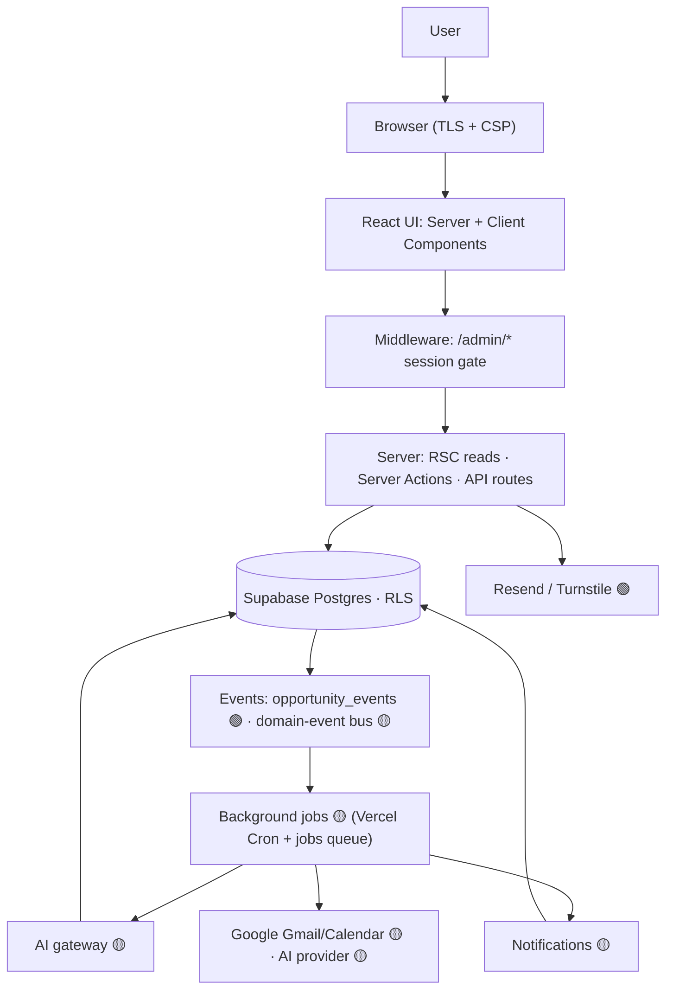

---

## 3. Current Production Flows (v1.0.0) 🟢

Shared contract (referenced below to avoid repetition): admin mutations use
**Server Actions** guarded by `withAdminAction` (401-equivalent
`{ ok:false, formError }` if unauthenticated), validated by `lib/validation`,
executed by a `server-only` data layer under **RLS**, returning an `ActionResult`;
the client shows a toast and `router.refresh()`; the server `revalidatePath`s.
See [CRUD pattern §4](#4-crud-flow-pattern), [API Reference](./API_REFERENCE.md#3-server-actions-api--current--the-crm-mutation-surface).

### 3.1 Authentication 🟢
- **Purpose:** admit only allowlisted admins. **Trigger:** login/signup/reset;
  every `/admin/*` request. **Input:** email/password; auth code (callback).
- **Validation:** email regex + password policy (signup). **Permissions:** allowlist
  (`isAdminEmail`) gates signup; middleware gates pages.
- **Business logic:** Supabase Auth; middleware refreshes session; callback exchanges
  code → session. **DB:** `auth.users` (managed). **Events:** none in-app.
- **Response:** redirect to `/admin` or login. **Errors:** `400/403/409` (signup),
  redirect on invalid session. **Status:** 🟢. Detail → [§5](#5-authentication-flow).

### 3.2 Contact Form (public) 🟢
- **Purpose:** capture public leads. **Trigger:** `POST /api/contact`. **Input:**
  `{ name, email, organization?, message, token }`.
- **Validation:** required fields; **Turnstile** verify; **sanitize + HTML-escape**.
  **Permissions:** public. **Rate limit:** by submitter email (`isRateLimited`).
- **Business logic:** insert via **service-role** (RLS-bypassing, server-only);
  send email via **Resend**. **DB:** insert `inquiries` + `inquiry_activity`
  (`created`). **Events produced:** `inquiry.created`. **Consumed:** none.
- **Response:** `200` success. **Errors:** `400` invalid/Turnstile, `429`
  rate-limited, `500`. **Status:** 🟢. Detail → [§6](#6-inquiry-flow).

### 3.3 Inquiry Management (admin) 🟢
- **Purpose:** work inbound leads. **Trigger:** admin API routes (`PATCH status`,
  `PATCH lead-source`, `POST notes`, `DELETE`, `GET export`). **Input:** JSON body.
- **Validation:** value ∈ const arrays; note body. **Permissions:**
  `requireAdminSession()` → `401` if none. **Business logic:** `lib/inquiries`
  mutations. **DB:** update `inquiries` / insert `inquiry_notes` / delete (cascade);
  write `inquiry_activity`. **Events:** `inquiry.status_changed/lead_source_changed/note_added/deleted`.
- **Response:** `{ inquiry|note }` / CSV. **Errors:** `400/401/500`. **Status:** 🟢
  (frozen — REST, not Server Actions). Refs [API §2.5](./API_REFERENCE.md#25-inquiry-admin-routes--session-guarded).

### 3.4 Companies · 3.5 Contacts · 3.6 Opportunities · 3.7 Tasks 🟢
- **Purpose:** CRM CRUD. **Trigger:** list/detail (RSC reads) + Server Actions
  (create/update/archive/restore; stage/status changes; notes; contact links).
- **Input:** typed `*Input`. **Validation:** `lib/validation` schema (name/title
  required, url/email format, dup checks). **Permissions:** shared contract (RLS).
- **Business logic:** `lib/<entity>.ts`; dedupe (domain / owner+email / source+job).
  **DB:** insert/update the entity; **Opportunities also write `opportunity_events`**.
- **Events produced:** Opportunities → `opportunity.created/stage_changed/archived/
  restored/note_added/contact_linked/unlinked` (🟢). Companies/Contacts/Tasks →
  `company.*`/`contact.*`/`task.*` (🟡 domain bus). **Consumed:** none today.
- **Response:** `ActionResult<{id}>` → redirect/toast/`revalidatePath`. **Errors:**
  `fieldErrors`/`formError`. **Status:** 🟢. Detail → [§7](#7-crm-module-flows).

### 3.8 Messages (read-only viewer) 🟢
- **Purpose:** unified message viewer. **Trigger:** list/detail RSC; actions
  (markRead/archive/link). **Input:** ids. **Validation:** link targets.
  **Permissions:** shared contract. **Business logic:** `lib/messages`;
  **`body_html` sanitized server-side** ([ADR-011](./decisions/ADR-011-html-sanitization.md)).
- **DB:** update `messages` (`is_read`/`archived_at`/links). **Events:** `message.read/archived/linked` (🟡).
- **Response:** `ActionResult`. **Errors:** standard. **Status:** 🟢 viewer
  (populated with data in Phase 3). Detail → [§7](#7-crm-module-flows).

### 3.9 Analytics · 3.10 Dashboard 🟢
- **Purpose:** reporting (Analytics) + operational overview (Dashboard).
  **Trigger:** RSC page load. **Input:** URL filters (range/company). **Validation:**
  whitelisted params. **Permissions:** session + RLS.
- **Business logic:** `lib/analytics` / `lib/dashboard` — **parallel exact head-count
  queries** + one embedded-count (no N+1). **DB:** read-only aggregates. **Events:**
  none. **Response:** rendered page (CSS bars / stat cards). **Errors:** `error.tsx`.
  **Status:** 🟢. Refs [Schema](../database/SCHEMA_REFERENCE.md).

### 3.11 Settings 🟢
- **Purpose:** configure CRM (read-only + placeholders). **Trigger:** RSC load.
  **Input:** none. **Permissions:** session. **Business logic:** `lib/settings` reads
  `auth.users` + `integration_accounts` + env. **DB:** read-only. **Events:** none.
  **Response:** rendered page. **Errors:** `error.tsx`. **Status:** 🟢 (no mutations;
  integrations connect is 🟡).

---

## 4. CRUD Flow Pattern 🟢

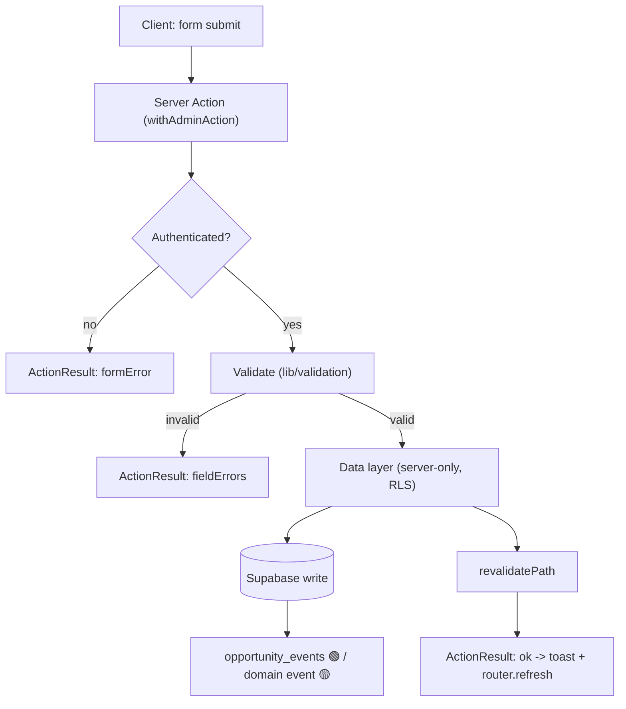

Every field of §3's flows maps onto this pattern; only the entity, validators, and
events differ. Reads bypass this (RSC → data layer → render).

---

## 5. Authentication Flow 🟢 / 🟡

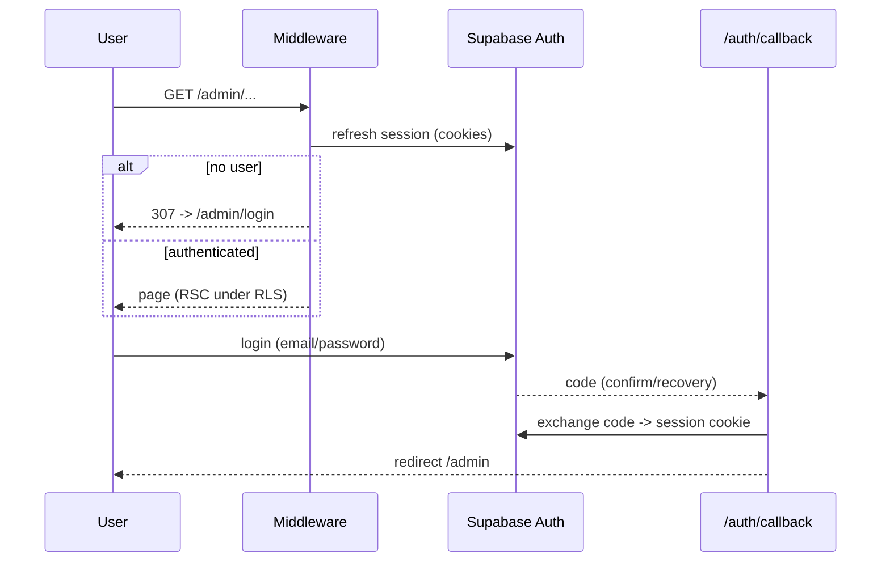

- **Login/Logout** 🟢 — `/admin/login`; `SignOutButton` → `signOut()` → `/admin/login`.
- **Session/Middleware/Protected routes** 🟢 — httpOnly cookies; middleware refresh +
  gate; admin API self-guards via `requireAdminSession`.
- **Server Actions** 🟢 — `withAdminAction` re-checks auth server-side.
- **Future OAuth** 🟡 — Google Authorization Code + PKCE + `state` → encrypted tokens
  ([§11](#11-gmail-flow--phase-3), [ADR-004](./decisions/ADR-004-oauth.md)).
- Security touchpoints → [Security §3–§4](../SECURITY.md#3-authentication).

---

## 6. Inquiry Flow 🟢 (public → admin)

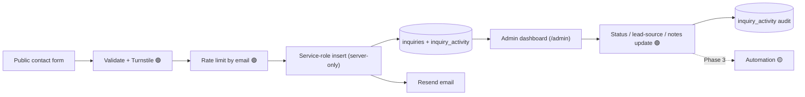

Public intake uses the **service-role** client (the only RLS-bypass in production,
alongside signup); admin management uses session-guarded routes. Detail:
[§3.2/§3.3](#32-contact-form-public-), [API §2](./API_REFERENCE.md#2-http-route-handlers--current-).

---

## 7. CRM Module Flows 🟢

Common shape (all modules): **Request → (read) RSC + data layer** *or* **(mutate)
Server Action → validate → data layer → DB → events → `revalidatePath` → UI
refresh**.

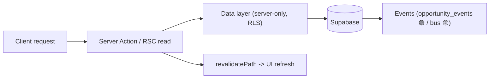

| Module | Reads | Mutations (Server Actions) | Events produced | Notes |
|--------|-------|----------------------------|-----------------|-------|
| **Companies** 🟢 | list (FTS+filters), detail | create/update/archive/restore | `company.*` 🟡 | domain dedupe |
| **Contacts** 🟢 | list (company join), detail | create/update/archive/restore | `contact.*` 🟡 | owner+email dedupe; company `EntityPicker` |
| **Opportunities** 🟢 | list + Kanban, detail (deep) | create/update/**changeStage**/archive/restore/addNote/link+unlink | `opportunity.*` **🟢** | writes `opportunity_events`; optimistic board |
| **Tasks** 🟢 | list + status board, detail | create/update/**changeStatus**/archive/restore | `task.*` 🟡 | overdue/completion; entity links |
| **Messages** 🟢 | inbox, detail (sanitized) | markRead/archive/link | `message.*` 🟡 | read-only; data lands in Phase 3 |
| **Settings** 🟢 | user + integrations + system | — (placeholders) | — | connect is 🟡 |
| **Dashboard** 🟢 | aggregates + activity feed | — | — | consumes `opportunity_events` |
| **Analytics** 🟢 | aggregates + funnel | — | — | parallel counts, no N+1 |

Opportunity/Task stage/status changes and links are the only current mutations that
emit persisted events (into `opportunity_events`). See [Events §4](./EVENTS.md#4-opportunity-events).

---

## 8. Event Flow 🟢 / 🟡

Cross-link: [Events](./EVENTS.md) · [ADR-003](./decisions/ADR-003-event-architecture.md).

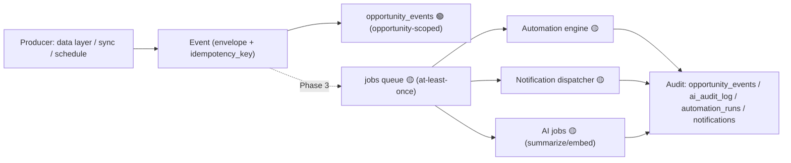

- **Today** 🟢: opportunity mutations synchronously append `opportunity_events`
  (timeline/dashboard/analytics consumers).
- **Phase 3** 🟡: data layers additionally `enqueue(event)` → durable jobs →
  idempotent consumers. Full catalogue + payloads in [Events](./EVENTS.md).

---

## 9. Background Job Flow 🟡 (Phase 3 · M1)

Cross-link: [Phase 3 §15](./PHASE_3_ARCHITECTURE.md#15-background-job-strategy) ·
[Runbook §6–§8](../operations/RUNBOOK.md) ·
[ADR-005](./decisions/ADR-005-background-jobs.md).

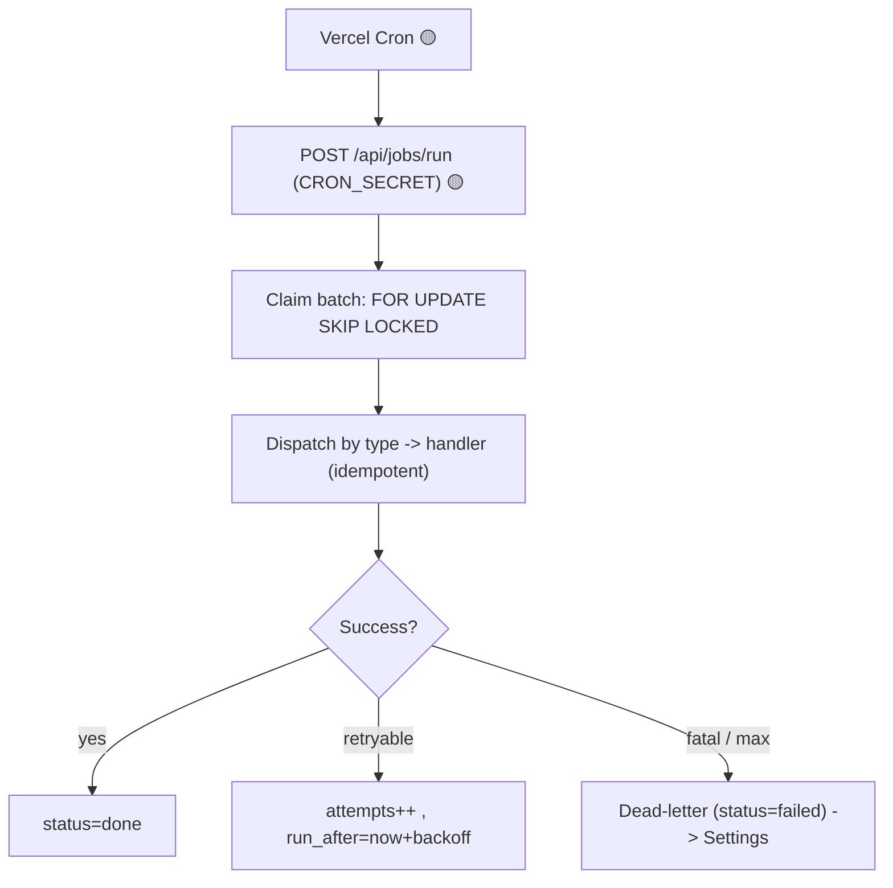

- **Cron validation** 🟡: shared `CRON_SECRET`, no session. **Retry** 🟡: backoff +
  `max_attempts`. **Dead-letter** 🟡: quarantine + surface. **Worker** 🟡: bounded
  batch, chunked long jobs. **Future scheduler** ⚪: swap to Inngest/WDK behind
  `lib/jobs`.

---

## 10. AI Flow 🟡 (Phase 3 · M6–M9)

Cross-link: [AI Architecture](../ai/AI_ARCHITECTURE.md) ·
[Phase 3 §13](./PHASE_3_ARCHITECTURE.md#13-ai-request-flow) ·
[ADR-006](./decisions/ADR-006-ai-approval.md) · [Security §9](../SECURITY.md#9-ai-security--phase-3--not-implemented-at-v100).

```mermaid
sequenceDiagram
  participant C as Client chat
  participant RH as /api/ai/chat 🟡
  participant GW as AI Gateway 🟡
  participant R as Retrieval FTS+vector RLS
  participant P as Provider Claude 🟡
  participant DB as Supabase
  C->>RH: message (conversationId)
  RH->>DB: persist user turn (ai_messages)
  RH->>R: assemble context (owner-scoped)
  RH->>GW: prompt + tools + context (token budget)
  GW->>P: request (stream)
  P-->>GW: tool call | tokens
  GW->>DB: tool read runs; write/external -> ai_approvals (approval-gated)
  GW-->>RH: stream
  RH->>DB: assistant turn + ai_audit_log (model, prompt_version, tokens)
```

- **🟢 existing hooks:** `ai_summary`/`ai_*` columns, `opportunity_events`
  (`actor_type='agent'`), `search_vector`. **🟡 planned:** gateway, conversations,
  embeddings (pgvector), approvals, audit. **⚪ future:** the nine agents.
- **Prompt → context → approval → provider → response → audit → storage** — all
  server-side; provider key never client-side; external actions approval-gated.

---

## 11. Gmail Flow 🟡 (Phase 3 · M2/M3)

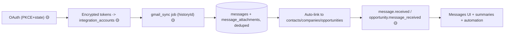

Idempotent on `(integration_account_id, external_message_id)`; incremental via
`sync_cursor` (historyId); tokens encrypted. Detail:
[Phase 3 §11](./PHASE_3_ARCHITECTURE.md#11-gmail-synchronization-flow).

---

## 12. Calendar Flow 🟡 (Phase 3 · M4)

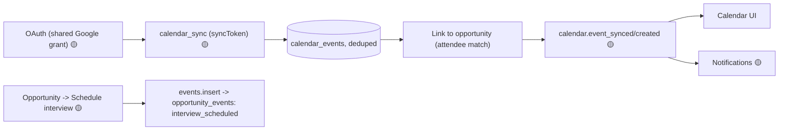

Idempotent on `external_event_id`; write path logs `interview_scheduled`. Detail:
[Phase 3 §12](./PHASE_3_ARCHITECTURE.md#12-calendar-synchronization-flow).

---

## 13. Notification Flow 🟡 (Phase 3 · M5)

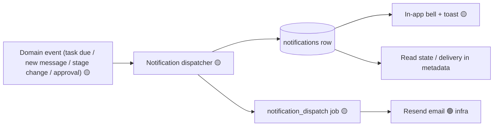

Deduped per `type:entity:owner[:day]`; email keyed on `notification_id`. Detail:
[Events §10](./EVENTS.md).

---

## 14. Automation Flow 🟡 (Phase 3 · M10)

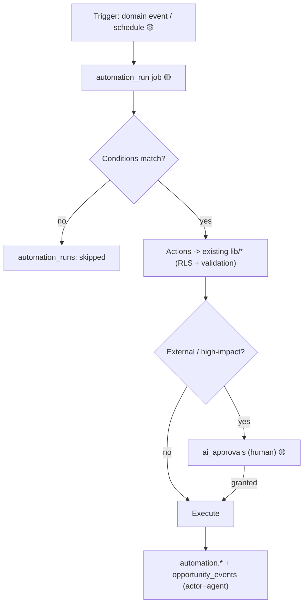

Actions reuse the same data layers as the UI (RLS/validation apply); external
actions are approval-gated; every run recorded; loop guards prevent cascades.
Detail: [Phase 3 §14](./PHASE_3_ARCHITECTURE.md#14-automation-engine),
[Events §11](./EVENTS.md).

---

## 15. External Integration Flow

| Provider | Status | Direction | Auth | Notes |
|----------|:------:|-----------|------|-------|
| **Supabase** | 🟢 | Postgres/Auth/RLS | anon (RLS) + service-role (server) | system of record |
| **Resend** | 🟢 | outbound email | `RESEND_API_KEY` (server) | contact form; Phase 3 notifications |
| **Cloudflare Turnstile** | 🟢 | inbound verify | `CLOUDFLARE_TURNSTILE_SECRET_KEY` (server) | contact-form bot protection |
| **Google Gmail/Calendar** | 🟡 | in/out sync | OAuth + encrypted tokens | Phase 3 (§11/§12) |
| **AI provider (Claude)** | 🟡 | request/stream | `AI_PROVIDER_API_KEY` (server) | via gateway, budgeted |
| **Future ATS / LinkedIn** | ⚪ | in sync | OAuth + adapter | via `ProviderAdapter` (ADR-007) |

**Provider-adapter abstraction** ([ADR-007](./decisions/ADR-007-provider-abstraction.md)):
rows carry `source`/`integration_account_id`/`external_ids`; a new provider is an
adapter + enum value — no schema redesign. All third-party calls are **server-side
only**.

---

## 16. Error Flow 🟢

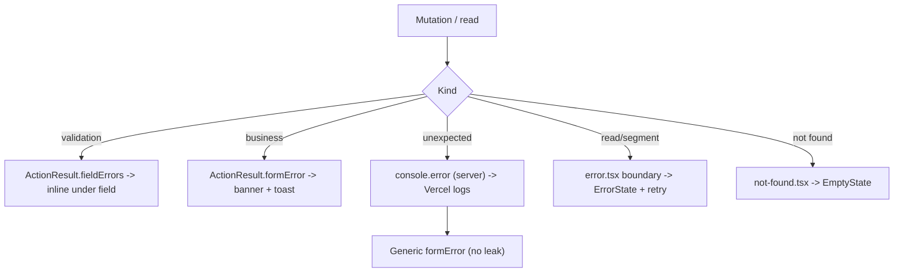

- Validation → `fieldErrors`; business → `formError`; unexpected → logged +
  generic; segment errors → `error.tsx`; missing detail → `not-found.tsx`.
- Recovery paths in [Runbook §11/§15](../operations/RUNBOOK.md).

---

## 17. Security Touchpoints 🟢

Cross-link: [Security](../SECURITY.md). Where each control sits in a flow:

| Control | Where it occurs |
|---------|-----------------|
| **TLS + CSP/headers** 🟢 | edge, all responses (`next.config.js`) |
| **Authentication** 🟢 | middleware (pages), `requireAdminSession` (API), `withAdminAction` (actions), allowlist (signup) |
| **Authorization** 🟢 | RLS on every query/write; single-admin policy |
| **Validation** 🟢 | `lib/validation` (actions); const-array/regex (API) |
| **Rate limits** 🟢 | contact form (by email); AI token budgets 🟡 |
| **Sanitization** 🟢 | contact escape; `sanitizeMessageHtml` (server, ADR-011) |
| **RLS** 🟢 | data layer ↔ Supabase boundary |
| **Encryption** 🟡 | OAuth tokens at rest (Vault/pgsodium) |
| **Approval gating** 🟡 | AI/automation external actions |

---

## 18. Performance Considerations 🟢 / 🟡

- **Server Components** 🟢 — reads render server-side; minimal client JS.
- **Caching** 🟢 — Next.js cache + `revalidatePath` after mutations; runtime AI
  cache 🟡.
- **Parallel queries** 🟢 — Dashboard/Analytics use `Promise.all` exact head-counts
  + one embedded-count (no N+1); detail pages fetch relations in parallel.
- **Streaming** 🟡 — AI chat streams tokens (fast first byte).
- **Eventual consistency** 🟡 — the domain-event bus is at-least-once/async; UI stays
  responsive; optimistic board moves with rollback 🟢.
- **Background processing** 🟡 — heavy work (sync/summarize/embed) offloaded to jobs;
  incremental sync avoids full scans; messages inbox uses offset pagination today
  (keyset a ⚪ optimization).

---

## 19. Future Phase 3 Flows 🟡 (summary)

| Flow | Milestone | Section |
|------|-----------|---------|
| Background jobs | M1 | [§9](#9-background-job-flow--phase-3--m1) |
| Gmail sync | M2/M3 | [§11](#11-gmail-flow--phase-3--m2m3) |
| Calendar | M4 | [§12](#12-calendar-flow--phase-3--m4) |
| Notifications | M5 | [§13](#13-notification-flow--phase-3--m5) |
| AI foundation / summaries / assistant | M6–M8 | [§10](#10-ai-flow--phase-3--m6m9) |
| Email drafting | M9 | [§10](#10-ai-flow--phase-3--m6m9) + approvals |
| Automation | M10 | [§14](#14-automation-flow--phase-3--m10) |

Sequencing/dependencies: [Implementation Guide §3](./PHASE_3_IMPLEMENTATION_GUIDE.md#3-dependency-graph).

---

## 20. End-to-End Scenario Walkthroughs

### 20.1 Create Opportunity → timeline (🟢 today)

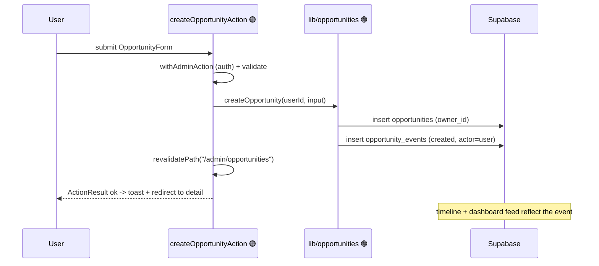

### 20.2 Create Opportunity → Task → Notification → AI summary (🟢 + 🟡 future)

```mermaid
sequenceDiagram
  participant U as User
  participant OPP as Opportunity 🟢
  participant BUS as Event bus / jobs 🟡
  participant TASK as Task automation 🟡
  participant NOTI as Notifications 🟡
  participant AI as AI summarize 🟡
  participant DB as Supabase
  U->>OPP: create + advance stage (🟢 writes opportunity_events)
  OPP-->>BUS: emit opportunity.stage_changed 🟡
  BUS->>TASK: automation rule -> create follow-up task 🟡
  TASK->>DB: insert task + opportunity_events(task_created) 🟡
  BUS->>NOTI: notify "stage changed" 🟡
  NOTI->>DB: notifications row 🟡
  BUS->>AI: summarize opportunity 🟡
  AI->>DB: opportunities.ai_summary + ai_audit_log 🟡
  Note over DB: today only the 🟢 opportunity_events step runs; 🟡 steps arrive in Phase 3
```

This walkthrough deliberately marks each hop: **only the 🟢 steps execute at
v1.0.0**; the 🟡 steps are the approved Phase 3 flows (jobs/automation/
notifications/AI), gated and audited.

---

## Document Control

- **Version:** 1.0
- **Owner:** Repository maintainer (Shivam Chaturvedi)
- **Last Updated:** 2026-07-28
- **Status:** 🟢 flows verified against the codebase (middleware, `lib/*` data
  layers + actions, API routes, `next.config.js`, module pages); 🟡/⚪ flows are the
  approved Phase 3 / future design. Baseline `v1.0.0` (`c2b5dc3`).
- **Related:** [Events](./EVENTS.md) · [API Reference](./API_REFERENCE.md) · [Schema Reference](../database/SCHEMA_REFERENCE.md) · [Security](../SECURITY.md) · [Runbook](../operations/RUNBOOK.md) · [Phase 3 Architecture](./PHASE_3_ARCHITECTURE.md) · [Implementation Guide](./PHASE_3_IMPLEMENTATION_GUIDE.md) · [ADRs](./decisions/README.md)
