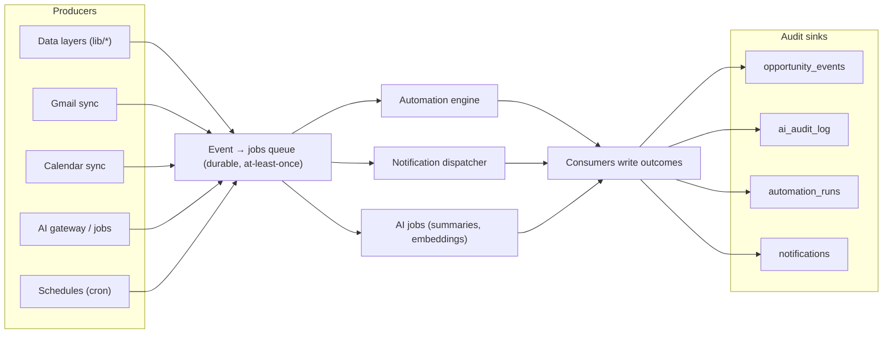
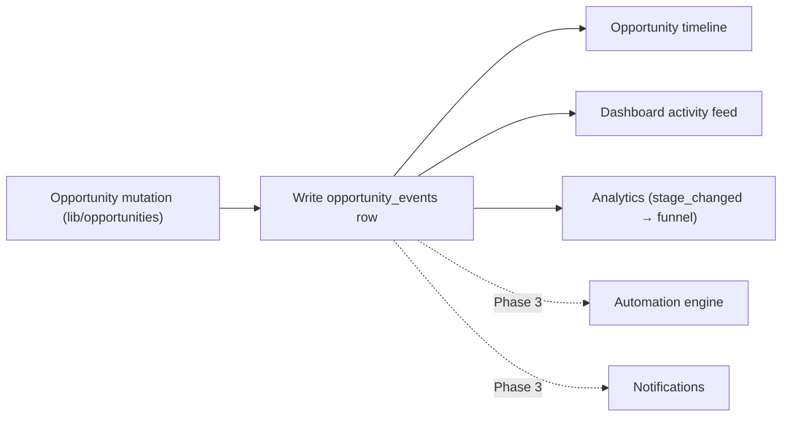
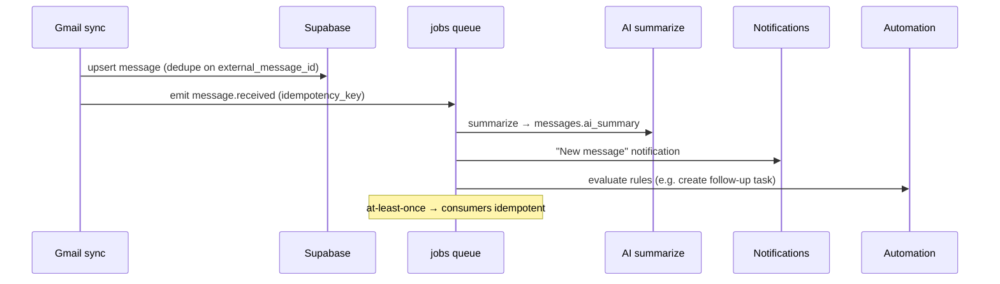
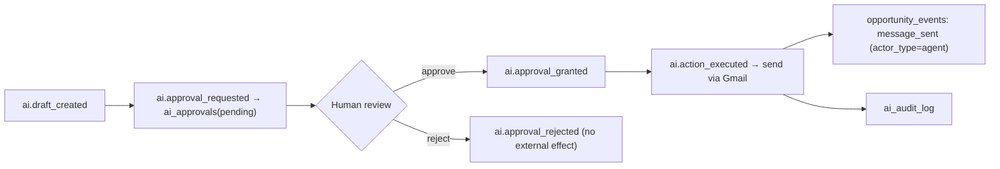

# Domain Events

The canonical catalogue of every domain event in the Career CRM — what exists
today and the full Phase 3 event contract that the automation, notification, and
AI layers will produce and consume.

**Related:** [System Architecture](./SYSTEM_ARCHITECTURE.md) ·
[Phase 3 Architecture](./PHASE_3_ARCHITECTURE.md) ·
[Phase 3 Implementation Guide](./PHASE_3_IMPLEMENTATION_GUIDE.md) ·
[AI Architecture](../ai/AI_ARCHITECTURE.md) ·
[Database Guide](../database/DATABASE_GUIDE.md)

> **Status legend**
> - ✅ **Emitted today** (v1.0.0) — persisted and in use.
> - 🟡 **Schema-reserved** — the `opportunity_event_type` enum value exists but is
>   not yet emitted; wired up in a Phase 3 milestone.
> - ⬜ **Planned** — Phase 3 domain-event contract; not implemented at v1.0.0.
>
> **Today (v1.0.0), the only persisted event stream is `opportunity_events`.**
> Companies, Contacts, Tasks, Messages, Calendar, Notifications, Automation, and
> AI events below define the Phase 3 contract; they are marked ⬜/🟡 accordingly.

---

## 1. Event Model

The CRM uses **two complementary event layers**:

1. **Persisted timeline/audit events** — the `opportunity_events` table
   (append-only, per opportunity). This is the durable audit trail and the source
   for the Dashboard activity feed and Opportunity timeline. It carries
   `actor_type ∈ {user, agent, system}`, so human and AI/automation actions are
   distinguishable. *(Exists today.)*
2. **Application domain events (event bus)** — a lightweight Phase 3 mechanism
   where `server-only` data layers emit typed events on mutation. Events are
   enqueued as durable `jobs` and delivered **at-least-once** to consumers
   (automation engine, notification dispatcher, AI jobs). Opportunity-scoped
   domain events *also* persist a row in `opportunity_events`. *(Phase 3.)*

### Canonical envelope

Every domain event shares one envelope shape (fields, not code):

| Field | Meaning |
|-------|---------|
| `id` | Event id (uuid) |
| `type` | `"<entity>.<action>"` (e.g. `opportunity.stage_changed`) |
| `occurred_at` | Timestamp |
| `actor_type` | `user` · `agent` · `system` |
| `actor_id` | User id / agent id (nullable) |
| `owner_id` | Owning user (RLS scope) |
| `entity_type`, `entity_id` | Subject record |
| `payload` | Event-specific fields (below) |
| `idempotency_key` | Dedupe key derived from `type` + salient fields |
| `source` | `app` · `gmail` · `calendar` · `automation` · `ai` |

---

## 2. Global Conventions

These apply to **all** events unless a category overrides them.

- **Delivery:** producers (data layers) emit → enqueue a durable `jobs` row →
  the cron-drained runner dispatches to consumers. **At-least-once** delivery, so
  **every consumer is idempotent**.
- **Idempotency:** each event carries an `idempotency_key` (deterministic from
  `type` + entity id + salient fields). Persisted events dedupe on natural keys
  (e.g. `opportunity_events` append + provider ids); consumers no-op on a
  duplicate key.
- **Retry behaviour:** delivery/consumption runs inside the job runner —
  exponential backoff + jitter, capped `max_attempts`, then **dead-letter**
  (`jobs.status='failed'`, surfaced in Settings). Producers never block on
  consumers (fire-and-forget enqueue). See
  [Implementation Guide §15](./PHASE_3_IMPLEMENTATION_GUIDE.md#15-rollback-checklist)
  and [Architecture §16](./PHASE_3_ARCHITECTURE.md#16-error-handling).
- **Audit logging:** opportunity-scoped events → `opportunity_events`
  (`actor_type`); AI actions → `ai_audit_log` + `opportunity_events`
  (`actor_type='agent'`); automation → `automation_runs`; notifications →
  `notifications`. Nothing consequential happens without an audit trail.
- **Security:** events are `owner_id`-scoped (RLS); external/high-impact actions
  triggered by events are **approval-gated** (`ai_approvals`).

---

## 3. Overall Event Flow

---

## 4. Opportunity Events

Persisted in **`opportunity_events`** (append-only). The mature layer today.

| Event (`type`) | Status | Purpose | Producer | Consumers | Payload |
|----------------|:------:|---------|----------|-----------|---------|
| `opportunity.created` | ✅ | Record creation | `lib/opportunities.createOpportunity` | Timeline, Dashboard feed, (P3) automation | `{ opportunity_id, stage }` |
| `opportunity.stage_changed` | ✅ | Stage transition | `changeStage` (board/detail) | Timeline, Dashboard, Analytics funnel, (P3) automation/notifications | `{ opportunity_id, from, to }` |
| `opportunity.archived` | ✅ | Soft-delete | `setOpportunityArchived(true)` | Timeline, Dashboard | `{ opportunity_id }` |
| `opportunity.restored` | ✅ | Un-archive | `setOpportunityArchived(false)` | Timeline, Dashboard | `{ opportunity_id }` |
| `opportunity.note_added` | ✅ | Note appended | `addNote` | Timeline | `{ opportunity_id }` |
| `opportunity.contact_linked` | ✅ | Contact linked | `addContactLink` | Timeline | `{ opportunity_id, contact_id }` |
| `opportunity.contact_unlinked` | ✅ | Contact unlinked | `removeContactLink` | Timeline | `{ opportunity_id, contact_id }` |
| `opportunity.updated` | ⬜ | Field edit | `updateOpportunity` | (P3) automation | `{ opportunity_id, changed[] }` |
| `opportunity.message_received` | 🟡 | Inbound mail linked | Gmail sync (M3) | Timeline, notifications | `{ opportunity_id, message_id }` |
| `opportunity.message_sent` | 🟡 | Outbound mail | Email drafting (M9) | Timeline | `{ opportunity_id, message_id }` |
| `opportunity.task_created` | 🟡 | Task linked | Tasks↔opp (P3) | Timeline | `{ opportunity_id, task_id }` |
| `opportunity.task_completed` | 🟡 | Task done | Tasks↔opp (P3) | Timeline, automation | `{ opportunity_id, task_id }` |
| `opportunity.interview_scheduled` | 🟡 | Calendar event created | Calendar (M4) | Timeline, notifications | `{ opportunity_id, calendar_event_id }` |
| `opportunity.document_added` | 🟡 | Document attached | (P3) | Timeline | `{ opportunity_id, ref }` |
| `opportunity.custom` | 🟡 | Extensible/agent events | Agents (P4) | Timeline | `{ opportunity_id, detail }` |

- **Idempotency:** append-only; duplicate suppression via `idempotency_key`
  (e.g. one `stage_changed` per actual transition; `changeStage` no-ops when
  `from == to`). Provider-driven events dedupe on `message_id`/`calendar_event_id`.
- **Retry:** synchronous today (written in the same request as the mutation); in
  P3 the *fan-out to consumers* is retried by the job runner, not the persisted row.
- **Audit:** the row **is** the audit record (`actor_type`, `actor_id`, `owner_id`,
  `detail`, `metadata`).
- **Future subscribers:** Automation engine (M10), Notification dispatcher (M5),
  Analytics cohort-funnel, AI agents (Opportunity/Follow-up).

---

## 5. Company Events ⬜ (Phase 3 contract)

No `company_events` store; these are **transient domain events** that drive
automation, notifications, and AI enrichment. Producer = `lib/companies.ts`
mutations.

| Event (`type`) | Purpose | Producer | Consumers | Payload |
|----------------|---------|----------|-----------|---------|
| `company.created` | New company recorded | `createCompany` | Automation, AI Research (enrich) | `{ company_id, domain? }` |
| `company.updated` | Company edited | `updateCompany` | Automation | `{ company_id, changed[] }` |
| `company.archived` | Soft-deleted | `setCompanyArchived(true)` | Automation | `{ company_id }` |
| `company.restored` | Un-archived | `setCompanyArchived(false)` | Automation | `{ company_id }` |

- **Idempotency:** key = `company.<action>:<company_id>:<updated_at>`; consumers
  dedupe. Enrichment guarded by `companies.ai_processed_at`.
- **Retry:** job runner (backoff, dead-letter).
- **Audit:** not persisted as company rows; consumer outcomes audited in
  `automation_runs` / `ai_audit_log`.
- **Future subscribers:** Research Agent (auto-enrich domain/logo), duplicate
  detection, portfolio analytics.

---

## 6. Contact Events ⬜ (Phase 3 contract)

Producer = `lib/contacts.ts` mutations. (Linking a contact to an opportunity is
represented by `opportunity.contact_linked`, §4.)

| Event (`type`) | Purpose | Producer | Consumers | Payload |
|----------------|---------|----------|-----------|---------|
| `contact.created` | New contact | `createContact` | Automation, AI enrich | `{ contact_id, company_id?, email? }` |
| `contact.updated` | Contact edited | `updateContact` | Automation | `{ contact_id, changed[] }` |
| `contact.archived` | Soft-deleted | `setContactArchived(true)` | Automation | `{ contact_id }` |
| `contact.restored` | Un-archived | `setContactArchived(false)` | Automation | `{ contact_id }` |

- **Idempotency:** key = `contact.<action>:<contact_id>:<updated_at>`; email-based
  enrichment deduped on `contacts.external_ids`.
- **Retry / Audit / Future subscribers:** as §5 — Research/Recruiter Agents,
  auto-link inbound mail to a matching contact.

---

## 7. Task Events ⬜ (Phase 3 contract)

Producer = `lib/tasks.ts`. When a task is linked to an opportunity, `task.created`
/ `task.completed` **also** emit the reserved `opportunity.task_created` /
`opportunity.task_completed` (§4).

| Event (`type`) | Purpose | Producer | Consumers | Payload |
|----------------|---------|----------|-----------|---------|
| `task.created` | New task | `createTask` | Automation, Notifications, (opp) timeline | `{ task_id, opportunity_id?, due_at? }` |
| `task.updated` | Task edited | `updateTask` | Automation | `{ task_id, changed[] }` |
| `task.status_changed` | Status transition | `changeStatus` | Automation, Notifications | `{ task_id, from, to }` |
| `task.completed` | Done (subset of above) | `changeStatus(done)` | Automation, timeline | `{ task_id, completed_at }` |
| `task.overdue` | Became overdue | Schedule (cron) | Notifications | `{ task_id, due_at }` |
| `task.archived` / `task.restored` | Soft-delete lifecycle | `setTaskArchived` | Automation | `{ task_id }` |

- **Idempotency:** `task.overdue` fires **once per task** (guard via a
  `metadata.overdue_notified_at` marker) to avoid daily repeats; others keyed on
  `task_id`+`updated_at`.
- **Retry:** job runner. **Audit:** opportunity-linked tasks audited via
  `opportunity_events`; standalone task events via `automation_runs`/`notifications`.
- **Future subscribers:** Follow-up Agent (nudge on overdue), reminder emails.

---

## 8. Message Events ⬜ (Phase 3 · M3/M9)

Producer = Gmail sync (`lib/sync/gmail-sync.ts`) and email drafting/send
(`lib/ai/drafting.ts` + Gmail adapter). Linked-to-opportunity messages also emit
`opportunity.message_received` / `opportunity.message_sent` (§4).

| Event (`type`) | Purpose | Producer | Consumers | Payload |
|----------------|---------|----------|-----------|---------|
| `message.received` | Inbound mail synced | Gmail sync | AI summarize, auto-link, Notifications, Automation | `{ message_id, account_id, thread_id, from }` |
| `message.sent` | Outbound mail sent | Gmail send (M9) | Timeline, Automation | `{ message_id, thread_id, to }` |
| `message.linked` | Linked to opp/contact/company | link action | Timeline | `{ message_id, opportunity_id?, contact_id?, company_id? }` |
| `message.read` | Marked read | `setMessageRead` | (analytics) | `{ message_id }` |
| `message.archived` | Archived | `setMessageArchived` | — | `{ message_id }` |

- **Idempotency:** the strongest case — deduped on the Phase-1 unique index
  `(integration_account_id, external_message_id)`; re-syncing a Gmail history page
  emits **no duplicate** `message.received`.
- **Retry:** sync job retries on quota/`401` (token refresh) with backoff; **send**
  uses an idempotency key so an approved draft is never sent twice.
- **Audit:** outbound → `opportunity_events.message_sent` + `ai_audit_log` (if
  AI-drafted).
- **Future subscribers:** Inbox Agent (classify/summarize), response-rate
  analytics, real-time push (Pub/Sub) replacing polling.

---

## 9. Calendar Events ⬜ (Phase 3 · M4)

Producer = Calendar sync (`lib/sync/calendar-sync.ts`) and interview creation.

| Event (`type`) | Purpose | Producer | Consumers | Payload |
|----------------|---------|----------|-----------|---------|
| `calendar.event_synced` | External event ingested | Calendar sync | Automation, Notifications | `{ calendar_event_id, external_event_id, starts_at }` |
| `calendar.event_created` | Interview created from opp | write path | `opportunity.interview_scheduled`, Notifications | `{ calendar_event_id, opportunity_id }` |
| `calendar.event_updated` | Event changed | Calendar sync | Notifications | `{ calendar_event_id, changed[] }` |
| `calendar.event_cancelled` | Event removed | Calendar sync | Notifications | `{ calendar_event_id }` |

- **Idempotency:** deduped on `calendar_events.external_event_id`; `syncToken`
  ensures each change is processed once.
- **Retry:** job runner; `410 Gone` (expired token) → full re-sync fallback.
- **Audit:** interview creation → `opportunity_events.interview_scheduled`.
- **Future subscribers:** Meeting Agent (prep/notes), reminder notifications.

---

## 10. Notification Events ⬜ (Phase 3 · M5)

Notifications are primarily **consumers** of other events, but have their own
lifecycle. Persisted in `notifications`.

| Event (`type`) | Purpose | Producer | Consumers | Payload |
|----------------|---------|----------|-----------|---------|
| `notification.created` | Notification enqueued | Dispatcher (from other events) | In-app bell, email job | `{ notification_id, type, entity_type, entity_id }` |
| `notification.dispatched` | Email delivered | `notification_dispatch` job → Resend | — | `{ notification_id, channel: "email" }` |
| `notification.read` | User read it | `markRead` action | (analytics) | `{ notification_id }` |

- **Idempotency:** dedupe key = `type:entity_id:owner_id[:day]` prevents duplicate
  notifications for the same trigger; email send keyed on `notification_id`.
- **Retry:** email dispatch via job runner (Resend transient errors retried);
  in-app creation is a single insert.
- **Audit:** the `notifications` row is the record; delivery status in
  `metadata`.
- **Future subscribers:** digest emails, push/mobile, per-channel preferences.

---

## 11. Automation Events ⬜ (Phase 3 · M10)

The automation engine both **consumes** domain events (as triggers) and
**emits** its own run-lifecycle events. Persisted in `automation_runs`.

| Event (`type`) | Purpose | Producer | Consumers | Payload |
|----------------|---------|----------|-----------|---------|
| `automation.rule_triggered` | A rule's trigger fired | Engine (on a domain event/schedule) | Engine (evaluate) | `{ rule_id, trigger_ref }` |
| `automation.run_started` | Evaluation began | Engine | `automation_runs` | `{ run_id, rule_id }` |
| `automation.condition_matched` | Conditions passed | Engine | Engine (execute) | `{ run_id }` |
| `automation.run_skipped` | Conditions failed | Engine | `automation_runs` | `{ run_id, reason }` |
| `automation.action_executed` | An action ran | Engine → `lib/*` / approvals | Target entity, `opportunity_events` | `{ run_id, action, result }` |
| `automation.run_completed` | Run finished | Engine | `automation_runs` | `{ run_id, status }` |
| `automation.run_failed` | Run errored | Engine | `automation_runs`, Notifications | `{ run_id, error }` |

- **Idempotency:** each trigger produces **one** `run_id`; re-delivery of the
  triggering event dedupes on `(rule_id, trigger_ref)`. Actions call the same
  `lib/*` data layers (their own idempotency applies).
- **Retry:** failed runs retried by the job runner; **loop guard** (per-entity run
  caps, cooldowns) prevents cascades (e.g. an action that re-triggers a rule).
- **Audit:** every run recorded in `automation_runs`; entity-affecting actions
  also write `opportunity_events` (`actor_type='agent'`).
- **Future subscribers:** run observability dashboards, alerting on failure rate.

---

## 12. AI Events ⬜ (Phase 3 · M6–M9)

Producer = AI gateway/jobs (`lib/ai/*`). Persisted in `ai_audit_log` /
`ai_approvals` / `ai_messages`; opportunity-affecting AI actions also write
`opportunity_events` (`actor_type='agent'`). Full internals in
[AI Architecture](../ai/AI_ARCHITECTURE.md).

| Event (`type`) | Purpose | Producer | Consumers | Payload |
|----------------|---------|----------|-----------|---------|
| `ai.summary_generated` | Message/opp summarized | `ai_summarize` job | Detail UI, `ai_audit_log` | `{ entity_type, entity_id, model, prompt_version }` |
| `ai.embedding_created` | Content vectorized | `ai_embed` job | Retrieval index | `{ entity_type, entity_id, model }` |
| `ai.conversation_message` | Copilot turn | `/api/ai/chat` | `ai_messages`, `ai_audit_log` | `{ conversation_id, role, tokens }` |
| `ai.draft_created` | Reply drafted | Drafting (M9) | Approvals queue | `{ entity_id, draft_ref }` |
| `ai.approval_requested` | Action needs a human | Gateway (external/high-impact) | Approvals UI, Notifications | `{ approval_id, action_type }` |
| `ai.approval_granted` | Human approved | Approve action | Executor | `{ approval_id }` |
| `ai.approval_rejected` | Human rejected | Reject action | — | `{ approval_id, reason? }` |
| `ai.action_executed` | Approved action ran | Executor → `lib/*` / Gmail | Target entity, `opportunity_events` | `{ approval_id, result }` |

- **Idempotency:** summaries guarded by `ai_processed_at` (summarize-once);
  embeddings keyed on `(entity, content hash)`; **send/action keyed on
  `approval_id`** so approving twice cannot double-execute.
- **Retry:** provider calls retried via gateway (backoff, circuit-breaker);
  token-budget exceeded → refuse/downgrade, not retry.
- **Audit:** every AI write stamps `ai_model`/`ai_prompt_version`/`ai_confidence`/
  `ai_processed_at`; actions logged to `ai_audit_log` **and**
  `opportunity_events` (`actor_type='agent'`). Nothing external happens without an
  `ai.approval_granted`.
- **Future subscribers:** eval harness, cost/observability dashboards, the nine
  specialized agents ([AI Architecture](../ai/AI_ARCHITECTURE.md#future-agents)).

---

## 13. Consumer / Subscriber Matrix

Which consumer reacts to which event families (P3 = Phase 3).

| Consumer | Opportunity | Company | Contact | Task | Message | Calendar | AI |
|----------|:----------:|:-------:|:-------:|:----:|:-------:|:--------:|:--:|
| **Timeline** (opp) | ✅ | — | — | 🟡 | 🟡 | 🟡 | 🟡 |
| **Dashboard feed** | ✅ | — | — | — | — | — | — |
| **Analytics** | ✅ (stage) | — | — | — | P3 | — | — |
| **Automation engine** | P3 | P3 | P3 | P3 | P3 | P3 | P3 |
| **Notification dispatcher** | P3 | — | — | P3 | P3 | P3 | P3 |
| **AI jobs** (summarize/embed) | — | P3 | P3 | — | P3 | — | ✅loop |
| **Approvals queue** | — | — | — | — | — | — | P3 |

---

## 14. Future Subscribers (roadmap)

- **Real-time push:** Gmail `watch` → Pub/Sub webhook emitting `message.received`
  without polling (sync engine unchanged).
- **Nine specialized agents** subscribing to their domains
  ([AI Architecture](../ai/AI_ARCHITECTURE.md#future-agents)) — Inbox, Follow-up,
  Recruiter, Opportunity, Interview, Research, Meeting, Analytics, Resume.
- **Multi-user/teams:** `owner_id`-scoped fan-out; per-user notification channels.
- **External webhooks:** outbound event delivery to third-party tools (Zapier-style).
- **Observability bus:** metrics/alerting on event volume, consumer lag, DLQ depth.
- **Cohort funnel:** Analytics subscribing to historical `stage_changed` for true
  conversion (vs snapshot).

---

## Document Control

- **Version:** 1.0
- **Owner:** Repository maintainer (Shivam Chaturvedi)
- **Last Updated:** 2026-07-28
- **Status:** `opportunity_events` documented as-built (v1.0.0); all other events
  are the approved Phase 3 contract (not yet implemented).

### Related Documents
- [Phase 3 Architecture](./PHASE_3_ARCHITECTURE.md) — automation engine, job strategy, flows
- [Phase 3 Implementation Guide](./PHASE_3_IMPLEMENTATION_GUIDE.md) — milestone plan, retry/rollback
- [AI Architecture](../ai/AI_ARCHITECTURE.md) — AI events, approvals, agents
- [Database Guide](../database/DATABASE_GUIDE.md) — `opportunity_events` / enum values / RLS
- [System Architecture](./SYSTEM_ARCHITECTURE.md) — current system

### Open Questions
1. **Event transport:** in-process emit → `jobs` (chosen), or an external bus
   (QStash/Inngest) for higher throughput / external subscribers?
2. **Standalone event stores:** keep company/contact/task events transient, or add
   a generic `activity_log` table for a global feed beyond opportunities?
3. **`task.overdue` cadence:** one-shot per task vs re-notify policy.
4. **Ordering guarantees:** do any consumers require strict per-entity ordering
   (currently at-least-once, unordered)?

### Verification
Markdown, formatting, Mermaid, and internal links verified at authoring time
(see the documentation report). Documentation only — no application code, schema,
or dependencies changed; production tag remains **v1.0.0** (`c2b5dc3`).
