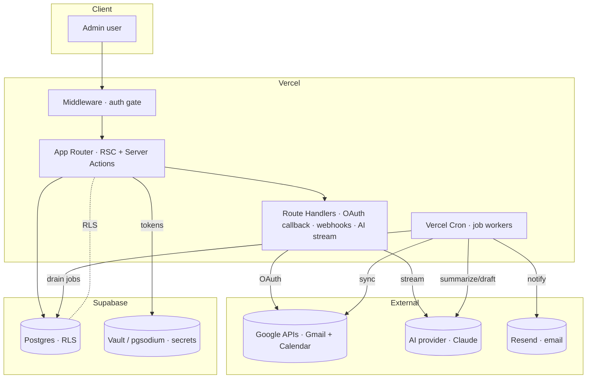
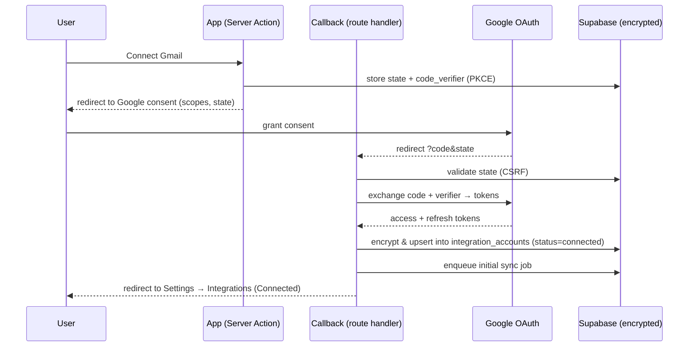
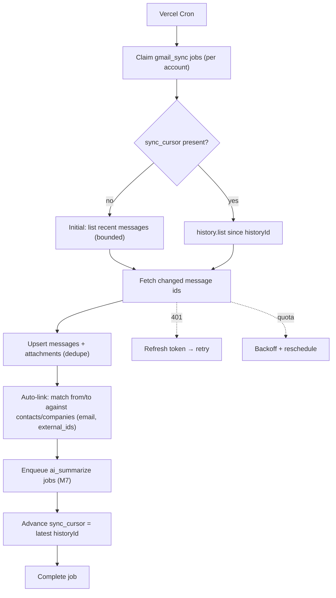
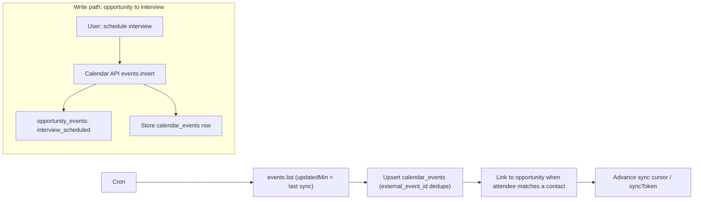
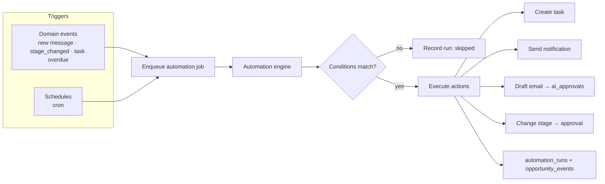
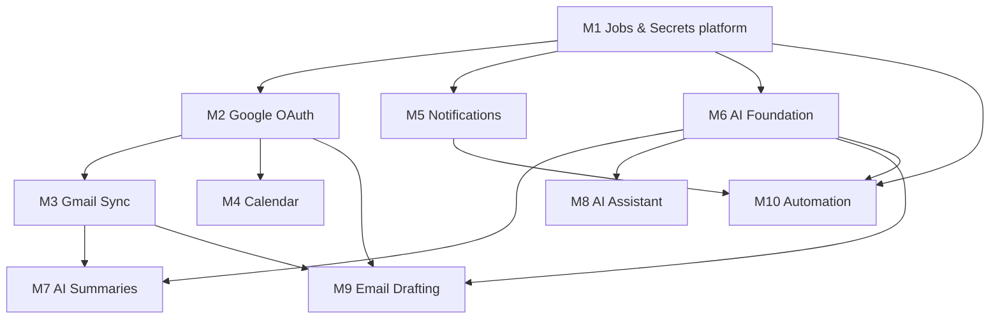

# Phase 3 Architecture — Integrations, AI & Automation

Technical design for Phase 3. **Design only — no implementation, no migrations,
no dependency changes.** This document is the blueprint from which Phase 3 is
built milestone-by-milestone without later redesign.

**Baseline:** Career CRM **v1.0.0** (`c2b5dc3`) — Phase 2 complete & tagged.
**Related:** [System Architecture](./SYSTEM_ARCHITECTURE.md) ·
[AI Architecture](../ai/AI_ARCHITECTURE.md) ·
[Database Guide](../database/DATABASE_GUIDE.md) ·
[Project Roadmap](../roadmap/PROJECT_ROADMAP.md)

> Phase 1 already shipped the schema hooks Phase 3 needs — `integration_accounts`
> (encrypted token columns, `sync_cursor`, `status`, `scopes`), source-agnostic
> `messages`/`message_attachments`, `ai_*` provenance columns, and
> `opportunity_events.actor_type ∈ {user, agent, system}`. Phase 3 is therefore
> **additive**: new tables + services, zero changes to existing tables.

---

## 1. Executive Summary

Phase 3 turns the CRM from a system of *record* into a system of *action*. It
connects real data sources (Gmail, Google Calendar), adds a durable background
job platform, layers an AI assistant that reads and (with approval) acts on CRM
data, and introduces a rule-based automation engine plus a notification system.

The design reuses everything from Phase 2 — Next.js App Router on Vercel,
Supabase (Postgres + Auth + RLS), `server-only` data layers, Server Actions, the
`ActionResult` pattern, and the M0 UI kit — and extends the platform with three
new capabilities: **an integration layer** (OAuth + provider adapters + sync),
**a job/automation platform** (durable queue + cron workers + rules engine), and
**an AI layer** (gateway + conversations + retrieval + approvals), all
human-in-the-loop and auditable.

Everything is **additive and feature-flagged**: each milestone ships dark, is
verified, then enabled — so v1.0.0 remains the rollback point throughout.

---

## 2. Phase 3 Objectives

1. **Connect Gmail** (OAuth) and continuously sync mail into `messages`.
2. **Connect Google Calendar** and sync events for interview/meeting context.
3. Provide a **durable background-job platform** (queue + workers + retries).
4. Ship an **AI assistant** that summarizes, drafts, and answers over CRM data.
5. Enable **AI email drafting** with mandatory human approval before send.
6. Introduce a **workflow automation engine** (event → condition → action).
7. Add **notifications** (in-app + email) for operationally important events.
8. Keep it **secure, observable, rate-limited, and cost-bounded** by design.
9. Preserve **additive-only** discipline: no changes to existing tables, auth,
   or middleware behaviour.

**Non-goals (Phase 3):** multi-user/team accounts, non-Google providers
(LinkedIn/ATS ingestion), two-way calendar writes beyond event creation, and
fully autonomous (un-approved) external actions.

---

## 3. Feature Scope

| Feature | Phase 3 scope | Explicitly out of scope |
|---|---|---|
| **Gmail OAuth** | Connect/disconnect one or more Gmail inboxes per user; encrypted token storage; refresh | Non-Google email; shared/team inboxes |
| **Gmail Sync** | Incremental history sync (cron-polled), idempotent upsert into `messages` + `message_attachments`, auto-link heuristics | Real-time push (Pub/Sub) — future; full-text of huge mailboxes |
| **Calendar Integration** | Read Google Calendar events → `calendar_events`; create interview events from an opportunity | Full two-way sync; recurring-event editing |
| **AI Assistant** | Conversational copilot over CRM data (RAG + tool calling), summaries | Autonomous agents acting without approval |
| **Email Drafting** | AI-drafted replies stored as approvals; send via Gmail on approve | Auto-send without human confirmation |
| **AI Summaries** | Per-message and per-opportunity summaries into `ai_summary` | — |
| **Workflow Automation** | Rule engine: triggers (events/schedules) → conditions → actions (task, notify, draft, stage-change w/ approval) | Arbitrary user-authored code; complex branching workflows |
| **Notifications** | In-app center + email (Resend) for due tasks, new mail, stage changes, approvals | Push/mobile; SMS |
| **Background Jobs** | Postgres-backed queue + Vercel Cron workers; retries/backoff/idempotency | Sub-second real-time processing |

The AI internals (agents, prompts, tool registry, embeddings, approval schema,
token accounting) are already designed in
[AI Architecture](../ai/AI_ARCHITECTURE.md); this document specifies how they are
**wired into Phase 3** and sequenced into milestones.

---

## 4. High-level System Architecture



**Three new platform pillars** on top of the Phase 2 app:

- **Integration layer** (`lib/integrations/*`): OAuth clients, provider adapters
  (Gmail, Calendar), token lifecycle, sync engines.
- **Job/automation platform** (`lib/jobs/*`, `lib/automation/*`): durable queue,
  cron workers, rule engine.
- **AI layer** (`lib/ai/*`): provider gateway, conversations, retrieval, tools,
  approvals — per [AI Architecture](../ai/AI_ARCHITECTURE.md).

---

## 5. Folder Structure

Additive; mirrors existing conventions (`lib/<domain>.ts` server-only data
layers, `app/admin/(dashboard)/<module>` routes, `components/admin/<module>`).

```
app/
├── admin/(dashboard)/
│   ├── calendar/           # Calendar module (nav item exists, disabled today)
│   ├── assistant/          # AI copilot UI (new nav item)
│   ├── automations/        # Automation rules UI (new nav item)
│   ├── settings/           # extended: real Integrations + Notifications tabs
│   └── notifications/      # optional full-page notifications view
├── api/
│   ├── integrations/google/
│   │   ├── connect/route.ts       # start OAuth (redirect)
│   │   └── callback/route.ts      # OAuth callback (code → tokens)
│   ├── ai/
│   │   └── chat/route.ts          # streaming assistant responses
│   ├── jobs/
│   │   └── run/route.ts           # cron-triggered job drainer (protected)
│   └── webhooks/
│       └── gmail/route.ts         # future: Pub/Sub push (optional)
lib/
├── integrations/
│   ├── google/oauth.ts            # OAuth client, PKCE/state, token exchange
│   ├── google/gmail.ts            # Gmail API adapter (list/history/get/send)
│   ├── google/calendar.ts         # Calendar API adapter
│   └── crypto.ts                  # token encryption/decryption (Vault/pgsodium)
├── sync/
│   ├── gmail-sync.ts              # incremental sync engine (historyId)
│   └── calendar-sync.ts
├── jobs/
│   ├── queue.ts                   # enqueue/claim/complete/fail
│   ├── runner.ts                  # dispatch by job type, retries/backoff
│   └── handlers/                  # one file per job type
├── automation/
│   ├── engine.ts                  # trigger → condition → action evaluation
│   ├── triggers.ts                # event/schedule sources
│   └── actions.ts                 # action executors (reuse existing lib/*)
├── ai/
│   ├── gateway.ts                 # provider abstraction, model routing, tokens
│   ├── prompts/                   # versioned prompt templates
│   ├── tools.ts                   # tool registry over existing data layers
│   ├── retrieval.ts               # hybrid FTS + vector retrieval
│   └── conversations.ts           # ai_conversations / ai_messages data layer
├── notifications.ts               # notifications data layer + email dispatch
├── calendar-events.ts             # calendar_events data layer
└── integrations.ts                # integration_accounts data layer (extends today)
components/admin/{calendar,assistant,automations,notifications}/
supabase/migrations/               # additive migrations (one per milestone)
```

---

## 6. Component Architecture

| Layer | Responsibility | Notes |
|---|---|---|
| **Route handlers** | OAuth start/callback, AI streaming, cron job drainer, webhooks | Thin; delegate to `lib/*`. Cron/webhook endpoints authenticated by a shared secret, not user session. |
| **Server Actions** | User-initiated mutations (connect/disconnect, enqueue sync, approve draft, toggle automation, mark notification read) | Reuse `withAdminAction` + `ActionResult`. |
| **Data layers (`lib/*.ts`)** | All DB access, `server-only`, RLS-bound | One per new domain, mirroring `lib/companies.ts` etc. |
| **Integration adapters** | Encapsulate provider APIs behind a stable interface | `GmailAdapter`, `CalendarAdapter` implement a common `ProviderAdapter` contract so future providers slot in. |
| **Job handlers** | Idempotent unit of async work | Pure functions `(payload, ctx) → result`; registered by `type`. |
| **Automation engine** | Evaluate rules against events/schedules | Actions call the *same* data layers the UI uses → RLS + validation apply. |
| **AI gateway** | Single path to the LLM provider | Model routing, structured output, token accounting, caching, guardrails. |
| **UI components** | New modules reuse the M0 kit | `Assistant` (chat), `AutomationRuleForm`, `NotificationBell`, `CalendarView`, `IntegrationConnectCard`. |

---

## 7. Server vs Client Component Boundaries

Continue the Phase 2 rule: **read on the server, interact on the client.**

| Concern | Server | Client |
|---|---|---|
| Lists/detail (calendar, automations, notifications) | RSC + `server-only` data layer | — |
| OAuth connect/disconnect | Server Action (start) + route handler (callback) | Button triggers action |
| **AI chat** | Route handler streams tokens (Edge/Node runtime); conversation persisted server-side | Chat UI (`"use client"`) consumes the stream (`ReadableStream`/SSE), optimistic message list |
| Draft approval | Server Action (`approve`/`reject` → send) | Approval UI |
| Automation toggle/create | Server Action + validation | `AutomationRuleForm` |
| Notification center | RSC initial load; Server Action to mark read | `NotificationBell` (poll or revalidate) |
| Cron workers | Route handler (no client) | — |

**New wrinkle vs Phase 2:** AI streaming requires a **client consumer** of a
server stream. The stream endpoint is a route handler; the conversation and all
tool execution happen server-side. No secrets or provider keys ever reach the
client.

---

## 8. Database Additions

**Additive only. No changes to existing tables.** Every new table follows
existing conventions: `id uuid`, `created_at`/`updated_at`, nullable
`owner_id → auth.users`, RLS enabled with the `"Authenticated admin full access"`
policy, `set_updated_at()` trigger. Delivered as one additive migration per
milestone. *(No SQL here — schema-change rule respected.)*

| Table / object | Purpose | Key columns (indicative) | Milestone |
|---|---|---|---|
| `jobs` | Durable async work queue | `type`, `payload jsonb`, `status`, `attempts`, `max_attempts`, `run_after`, `locked_at`, `last_error`, `idempotency_key`, `owner_id` | M1 |
| `notifications` | In-app/email notifications | `type`, `title`, `body`, `entity_type`, `entity_id`, `read_at`, `owner_id` | M5 |
| `calendar_events` | Synced Google Calendar events | `integration_account_id`, `external_event_id`, `calendar_id`, `title`, `starts_at`, `ends_at`, `location`, `attendees jsonb`, `opportunity_id?`, `external_ids`, `owner_id` | M4 |
| `oauth_states` *(or signed cookie)* | CSRF state for OAuth | `state`, `code_verifier`, `redirect_to`, `expires_at`, `owner_id` | M2 |
| `automation_rules` | User-defined automation | `name`, `trigger jsonb`, `conditions jsonb`, `actions jsonb`, `enabled`, `owner_id` | M10 |
| `automation_runs` | Automation audit/observability | `rule_id`, `trigger_ref`, `status`, `result jsonb`, `error`, `owner_id` | M10 |
| **AI tables** (`ai_conversations`, `ai_messages`, `ai_embeddings`, `ai_approvals`, `ai_audit_log`, `prompt_templates`) | Per [AI Architecture](../ai/AI_ARCHITECTURE.md#schema-integration-summary--no-redesign-required) | see that doc | M6–M10 |
| `pgvector` extension | Semantic retrieval | enables `ai_embeddings.embedding vector` | M8 |

**Additive columns on `integration_accounts`** (already has token columns) may be
introduced additively if needed (e.g. `granted_scopes`, `watch_expiry`) — never
altering existing columns.

**Reused Phase-1 hooks (no new columns):** `messages.*` + `message_attachments.*`
(Gmail sync target), `messages.ai_summary` / `opportunities.ai_summary` (AI
summaries), `opportunity_events` with `actor_type='agent'` (automation/AI audit),
`external_ids` (cross-source matching), `integration_accounts.sync_cursor` (Gmail
`historyId`), `integration_accounts.access_token_encrypted` / `refresh_token_encrypted`.

---

## 9. Security Architecture

Security is the load-bearing concern of Phase 3 (we now hold third-party tokens
and act on the user's behalf).

- **Token encryption at rest.** OAuth access/refresh tokens are encrypted before
  storage in `integration_accounts.*_encrypted`. Preferred: **Supabase Vault /
  pgsodium** (keys never leave the DB boundary). Fallback: app-layer AES-GCM
  with a key from a Vercel env var (rotate-able). Plaintext tokens never touch
  logs, the client bundle, or non-encrypted columns. `lib/integrations/crypto.ts`
  is the only module that decrypts, and it is `server-only`.
- **Least-privilege scopes.** Request the minimal Gmail/Calendar scopes per
  capability; store `granted_scopes`; degrade gracefully if a scope is missing.
- **OAuth CSRF + PKCE.** `state` + `code_verifier` validated on callback
  (`oauth_states` or a signed, httpOnly cookie); `redirect_uri` allow-listed.
- **RLS everywhere.** All new tables enable RLS with the existing admin policy;
  `owner_id` present so per-user isolation is a policy change later.
- **Server-only secrets.** Provider keys, encryption keys, and the cron secret
  are Vercel env vars, read only in `server-only` code / route handlers.
- **Authenticated system endpoints.** Cron drainer and any webhook verify a
  shared secret / provider signature — never a user session.
- **Human-in-the-loop for external actions.** Sending email, creating calendar
  events, and stage changes proposed by AI/automation are **approval-gated**
  (`ai_approvals`) — nothing outbound happens without explicit confirmation.
- **Auditability.** Agent/automation actions log to `opportunity_events`
  (`actor_type='agent'`) and `ai_audit_log` / `automation_runs`.
- **PII/prompt hygiene.** The AI gateway redacts secrets, bounds context, and
  never sends tokens; `body_html` remains sanitized (Phase 2) before any display.
- **No changes to auth/middleware.** Phase 3 uses the existing session gate;
  new routes live under `/admin/*` (gated) or are secret-authenticated system
  endpoints.

---

## 10. OAuth Flow



- **Refresh:** adapters refresh on `401`/near-expiry using the encrypted refresh
  token; on refresh failure → mark account `status='error'`, notify, require
  reconnect. **Disconnect:** revoke at Google + soft-delete the account
  (`archived_at`), stop its jobs.

---

## 11. Gmail Synchronization Flow

Poll-based incremental sync via `historyId` (cron), idempotent by
`(integration_account_id, external_message_id)` (the Phase-1 unique index).



- **Idempotency:** upserts keyed on the provider message id; re-running a job is
  safe. **Auto-linking:** match sender/recipient emails to `contacts.email` /
  `companies.domain`; set `messages.contact_id`/`company_id`/`opportunity_id`
  when confident, else leave unlinked (user links in the Messages UI).
- **Attachments:** metadata → `message_attachments`; blob storage
  (Supabase Storage) is a follow-up; store `file_url` when persisted.
- **Real-time (future):** Gmail `watch` → Pub/Sub → `/api/webhooks/gmail`
  replaces polling; the sync engine is unchanged.

---

## 12. Calendar Synchronization Flow



- **Read:** incremental via Calendar `syncToken`. **Write:** creating an
  interview event from an opportunity (approval-gated if AI-initiated) writes to
  Google + logs `interview_scheduled`. Recurring-event edits are out of scope.

---

## 13. AI Request Flow

Detailed design in [AI Architecture](../ai/AI_ARCHITECTURE.md); Phase 3 wiring:

```mermaid
sequenceDiagram
    participant C as Client (chat UI)
    participant RH as /api/ai/chat (route handler)
    participant GW as AI Gateway (lib/ai)
    participant R as Retrieval (FTS + vector)
    participant T as Tools (lib/* data layers)
    participant P as Provider Claude
    participant DB as Supabase

    C->>RH: user message (conversationId)
    RH->>DB: persist user turn (ai_messages)
    RH->>R: assemble context (RLS-scoped)
    RH->>GW: prompt + tools + context
    GW->>P: request (model routing, token budget)
    P-->>GW: tool call | text (streamed)
    GW->>T: execute tool (read = run; write/external = propose → ai_approvals)
    T->>DB: query/mutate (RLS + validation)
    GW-->>RH: stream tokens
    RH-->>C: SSE stream
    RH->>DB: persist assistant turn + ai_audit_log (model, prompt_version, tokens)
```

- **Provider:** Claude (latest Opus/Sonnet-class) behind a pluggable gateway;
  model routing (cheap model for summaries/classification, strong model for
  reasoning). No model IDs hard-coded here — chosen at build against current
  provider docs.
- **Retrieval:** hybrid — Phase-1 `search_vector` (keyword) + `ai_embeddings`
  (semantic, pgvector), scoped by `owner_id`.
- **Provenance:** every AI write stamps `ai_model`/`ai_prompt_version`/
  `ai_confidence`/`ai_processed_at`.

---

## 14. Automation Engine

Rule shape: **trigger → conditions → actions**, stored in `automation_rules`.



- **Triggers** are emitted where mutations already happen (data layers emit a
  domain event → enqueue a job) and by cron (schedules). **Actions** call the
  *same* `lib/*` functions the UI uses, so RLS/validation/events apply
  uniformly. **Safety:** external/high-impact actions are approval-gated; every
  run is recorded in `automation_runs` for observability and debugging.
- **Determinism first:** conditions are declarative (field comparisons); AI is
  an *optional* action (e.g. "draft a reply"), never the rule evaluator.

### 14.1 Automation Rule Schema (DSL)

The `automation_rules` JSON columns follow a small, declarative, **non-Turing**
DSL — **no user-authored code**. Validated by `lib/validation` on create/update
(unknown keys/types rejected). These shapes are the M10 contract; they document the
existing trigger→condition→action design and introduce no new architecture.

**`trigger jsonb`** — exactly one trigger.

| Field | Type | Rules |
|-------|------|-------|
| `type` | enum | `event` \| `schedule` (required) |
| `event` | string | required when `type=event`; a domain-event `type` from [Events](./EVENTS.md) (e.g. `opportunity.stage_changed`, `message.received`, `task.overdue`) |
| `schedule` | string | required when `type=schedule`; a cron expression (UTC) |

**`conditions jsonb`** — an AND-array (all must pass; `[]` = always). Each entry is
one field comparison against the trigger entity; **no nesting, no code**.

| Field | Type | Rules |
|-------|------|-------|
| `field` | string | dotted path on the event entity (e.g. `opportunity.stage`, `message.direction`) |
| `op` | enum | `eq · neq · in · not_in · gt · gte · lt · lte · contains · exists · is_null` |
| `value` | scalar/array | required except for `exists`/`is_null`; type must match the field; `in`/`not_in` take arrays |

**`actions jsonb`** — an ordered, non-empty array; each executes via the **same
`lib/*` data layer the UI uses** (RLS + validation apply). External/high-impact
actions are approval-gated (`ai_approvals`).

| `action` (enum) | Payload | Approval |
|-----------------|---------|:-------:|
| `create_task` | `{ title, due_in_days?, priority?, opportunity_id? }` | no |
| `send_notification` | `{ type, title, body? }` | no |
| `add_note` | `{ opportunity_id, body }` | no |
| `draft_email` | `{ template?, to? }` → `ai_approvals` | **yes** |
| `change_stage` | `{ opportunity_id, to }` | **yes** |

**Validation rules (enforced server-side before persist):**

- `trigger.type`, `condition.op`, and `action.action` must be known enum members;
  unknown keys are rejected.
- `condition.field` must resolve to a readable field on the trigger entity, and
  `value` is type-checked against it (including enum domains).
- `change_stage.to` ∈ `opportunity_stage`; `create_task.priority` ∈ `task_priority`
  (see [Schema Reference §2 Enums](../database/SCHEMA_REFERENCE.md)).
- At least one action; approval-gated actions cannot be marked auto-execute.
- `enabled=false` (or `FEATURE_AUTOMATION` off) makes the rule fully inert.

**Loop safety:** an action that could re-fire its own trigger is bounded by
per-entity run caps + cooldowns, recorded in `automation_runs` (see the loop-guard
note above and [Events](./EVENTS.md)).

```json
{
  "trigger": { "type": "event", "event": "opportunity.stage_changed" },
  "conditions": [
    { "field": "opportunity.stage", "op": "eq", "value": "interview" }
  ],
  "actions": [
    { "action": "create_task", "title": "Send prep materials", "due_in_days": 2, "priority": "high" },
    { "action": "send_notification", "type": "interview_prep", "title": "Interview stage reached" }
  ]
}
```

---

## 15. Background Job Strategy

**Decision:** a **Postgres-backed job queue drained by Vercel Cron** — no new
infrastructure, reuses Supabase, transactional with domain writes.

- **Enqueue:** insert into `jobs` (`type`, `payload`, `run_after`,
  `idempotency_key`). **Claim:** worker `SELECT … FOR UPDATE SKIP LOCKED`
  (or an atomic `update … returning`) to lease a batch, set `locked_at`.
  **Execute:** dispatch by `type` to a handler. **Complete/Fail:** mark done or
  increment `attempts`, set `run_after = now + backoff`, record `last_error`;
  past `max_attempts` → dead-letter (`status='failed'`, surfaced in Settings).
- **Scheduling:** `vercel.json` `crons` hit `/api/jobs/run` (secret-authed) every
  N minutes; the drainer processes a bounded batch within the function time
  limit, then returns (re-triggered next tick). Long work is chunked into
  follow-up jobs (keeps each run under Vercel's execution limit).
- **Idempotency:** every handler is safe to re-run (dedupe keys, upserts).
- **Job types (initial):** `gmail_sync`, `calendar_sync`, `ai_summarize`,
  `ai_embed`, `automation_run`, `notification_dispatch`.
- **Upgrade path:** if durable multi-step workflows or higher throughput are
  needed, adopt **Inngest** or **Vercel Queues/Workflow (WDK)** — the `lib/jobs`
  interface is designed so the queue backend can be swapped without touching
  handlers. *(Not adopted in Phase 3 to avoid a new dependency.)*

---

## 16. Error Handling

- **Jobs:** classify errors — *retryable* (network, 429, 5xx, token-refreshable
  401) → backoff + retry; *fatal* (400, revoked grant) → dead-letter + notify.
  Exponential backoff with jitter; capped `max_attempts`.
- **Provider adapters:** typed errors (`RateLimited`, `AuthExpired`,
  `NotFound`, `Transient`); token refresh on `AuthExpired`; circuit-breaker on
  the AI provider to fail fast during outages.
- **User-facing:** Server Actions keep returning `ActionResult`
  (`fieldErrors`/`formError`); route-level `error.tsx`/`loading.tsx` per new
  module (Phase 2 pattern). AI streaming surfaces graceful partial-failure
  messages, never raw errors.
- **Observability:** `last_error` on jobs, `automation_runs.error`,
  `ai_audit_log`, and `integration_accounts.last_error`/`status` give a full
  failure trail; Settings surfaces connection/sync/job health.

---

## 17. Rate Limiting

| Boundary | Strategy |
|---|---|
| **Gmail/Calendar API** | Respect per-user quotas; batch requests; exponential backoff on 429; spread accounts across cron ticks; store `historyId`/`syncToken` to minimize calls |
| **AI provider** | Per-owner **token/cost budgets** (daily) enforced in the gateway; refuse/downgrade when exceeded; request-level concurrency cap; prompt/result caching |
| **User-triggered actions** | Reuse existing `lib/rateLimit.ts` pattern for connect/sync-now/chat endpoints |
| **Cron drainer** | Bounded batch size per run; one in-flight lease per job (SKIP LOCKED) prevents thundering herd |
| **Webhooks (future)** | Verify signature; debounce/coalesce Pub/Sub notifications into a single sync job per account |

---

## 18. Performance Considerations

- **Server-side aggregation** continues (exact counts, single joined selects, no
  N+1) — Phase 2 discipline.
- **Sync is incremental** (historyId/syncToken); never full-scan a mailbox after
  the initial bounded backfill.
- **AI cost/latency:** model routing (cheap for summaries), caching keyed on
  prompt-version + input hash, `ai_processed_at` prevents re-summarizing
  unchanged content, retrieval trimming bounds context size.
- **Vector search:** `ai_embeddings` with an IVFFlat/HNSW index; hybrid retrieval
  blends keyword + semantic, capped to top-k.
- **Streaming** keeps the assistant responsive (first token fast) instead of
  awaiting full completions.
- **Jobs are chunked** to stay within Vercel function limits; heavy work never
  blocks a request path.

---

## 19. Caching Strategy

- **Next.js cache:** `revalidatePath` after mutations (existing pattern) for the
  new modules (calendar, notifications, automations).
- **AI runtime cache:** gateway caches deterministic prompt/result pairs; embed
  cache avoids recomputing vectors for unchanged content.
- **Provider ETags / sync tokens:** Gmail/Calendar deltas avoid refetching
  unchanged data.
- **Idempotency as cache:** `ai_processed_at`, `messages` dedupe, and job
  `idempotency_key` prevent duplicate work.
- **Consider** Vercel Runtime Cache (per-region KV) for hot, cross-request AI
  lookups — optional, additive.

---

## 20. Deployment Strategy

- **Same pipeline:** push to `main` → Vercel build/deploy; `www` alias tracks
  the latest Ready production deployment.
- **Feature flags:** every Phase 3 capability ships behind an env-var/config
  flag (and the sidebar `enabled` toggle) — dark until verified, then enabled.
  Rollback = flip the flag (no redeploy) or promote the previous deployment /
  `v1.0.0`.
- **Migrations out-of-band** (Supabase SQL editor / CLI), additive + idempotent,
  applied before the code that depends on them — the Phase 1/2 discipline.
- **New env vars:** Google OAuth client id/secret, OAuth redirect URI, token
  **encryption key**, AI provider key, **cron secret**, Resend key (exists).
- **Cron config:** `vercel.json` `crons` entries per worker cadence.
- **Runtime choice:** AI streaming route may run on the Edge or Node runtime;
  Gmail/crypto workers run on Node (SDK/crypto support).

---

## 21. Testing Strategy

| Level | Coverage |
|---|---|
| **Unit** | Data layers, crypto (encrypt/decrypt round-trip), job runner (backoff/idempotency), automation condition evaluation, AI gateway (provider mocked) |
| **Integration** | OAuth callback (mocked Google), Gmail sync idempotency (replay a history page → no dupes), calendar upsert, notification dispatch |
| **Contract** | Provider adapters against recorded fixtures (Gmail/Calendar payloads) so API shape changes are caught |
| **E2E (Playwright)** | Connect Gmail (mock) → see messages; run automation → task appears; approve draft → send (mock); notification bell |
| **Security** | RLS (anon denied), token never in logs/bundle, OAuth state/PKCE validation, approval gating enforced |
| **AI evals** | Prompt-version eval harness (summary quality, tool-call correctness, refusal handling) per [AI Architecture](../ai/AI_ARCHITECTURE.md) |
| **Load/limits** | Job drainer under batch load; rate-limit/backoff behavior; token-budget enforcement |

CI gates unchanged: lint + `tsc --noEmit` + build, extended with the test suites
above; each milestone must pass before enablement.

---

## 22. Risks

| Risk | Impact | Mitigation |
|---|---|---|
| **Token leakage** | Critical | Vault/pgsodium encryption; server-only decrypt; no logging; RLS; least scope |
| **OAuth/Google verification** | Blocks Gmail send/scopes | Start with restricted scopes; plan Google OAuth app verification early; test with limited-access first |
| **Vercel function/cron limits** | Sync/AI jobs time out | Chunked jobs, bounded batches, incremental sync, streaming |
| **AI cost overrun** | Budget | Per-owner token budgets, model routing, caching, summarize-once |
| **AI wrong/harmful action** | Trust/data | Approval-gating for all external/high-impact actions; full audit trail |
| **Sync duplication/loss** | Data integrity | Idempotent upserts (unique index), cursor advance only after success, dead-letter |
| **Provider API changes** | Breakage | Adapter abstraction + contract tests |
| **Scope creep into future phases** | Timeline | Strict milestone gating; non-goals fixed above |
| **pgvector / infra availability** | AI retrieval | Confirm Supabase pgvector; degrade to FTS-only if unavailable |

---

## 23. Future Expansion

- **More providers** (LinkedIn, Wellfound, Greenhouse, Lever, Ashby, Workday,
  Indeed, portals) via the same `ProviderAdapter` + `source`/`external_ids`
  model — no schema redesign.
- **Real-time** Gmail push (Pub/Sub) replacing polling.
- **Multi-user/teams** — activate `owner_id`-scoped RLS; assignee directory.
- **Autonomous agents** — graduate specific low-risk actions past approval once
  trust/evals justify it.
- **Advanced automation** — branching workflows (adopt Inngest/WDK), the nine
  specialized agents from [AI Architecture](../ai/AI_ARCHITECTURE.md).
- **Reporting deepening** — cohort funnel conversion from `opportunity_events`,
  message response-rate analytics.

---

## 24. Milestone Breakdown

Each milestone is **independently deployable** (additive migration + feature
flag), verified, then enabled. Dependencies shown; order respects them.



### M1 — Jobs & Secrets Platform
- **Objective:** durable background-job queue + encrypted-secret plumbing that everything else builds on.
- **Deliverables:** `jobs` table; `lib/jobs/{queue,runner}`; `/api/jobs/run` (cron, secret-authed); `vercel.json` cron; `lib/integrations/crypto.ts` (Vault/pgsodium); job health surface in Settings.
- **DB impact:** +`jobs` (additive). Confirm Vault/pgsodium availability.
- **UI impact:** Settings → "System/Jobs" health panel (read-only).
- **APIs:** `POST /api/jobs/run` (internal, secret).
- **Testing:** runner backoff/idempotency units; SKIP LOCKED concurrency; crypto round-trip; cron auth.
- **Rollback:** disable cron entry / flag; `jobs` table inert if unused; revert to `v1.0.0`.

### M2 — Google OAuth
- **Objective:** connect/disconnect Google account with encrypted tokens.
- **Deliverables:** `lib/integrations/google/oauth.ts`; connect Server Action + `/api/integrations/google/callback`; `oauth_states`; real Integrations tab (Gmail "Connect" live).
- **DB impact:** +`oauth_states` (or signed cookie); write encrypted tokens to existing `integration_accounts`.
- **UI impact:** Settings → Integrations: Connect/Disconnect/status.
- **APIs:** `GET /connect`, `GET /callback`.
- **Testing:** OAuth state/PKCE, token exchange (mocked), refresh, disconnect/revoke; RLS on `oauth_states`.
- **Rollback:** feature-flag the connect button; disconnect flow revokes; no impact to existing Messages module.

### M3 — Gmail Sync
- **Objective:** populate `messages`/`message_attachments` from a connected inbox.
- **Deliverables:** `lib/integrations/google/gmail.ts`, `lib/sync/gmail-sync.ts`, `gmail_sync` job handler; auto-link heuristics; Messages module goes live with data.
- **DB impact:** none new (writes to existing `messages`/`message_attachments`; advances `sync_cursor`).
- **UI impact:** Messages inbox now non-empty; "Sync now" action; sync status in Settings.
- **APIs:** internal job only.
- **Testing:** idempotent replay (no dupes), incremental history, attachment metadata, backoff/quota, auto-link correctness.
- **Rollback:** disable `gmail_sync` job type / flag; existing rows remain; Messages viewer already tolerates empty/data.

### M4 — Calendar Integration
- **Objective:** sync Google Calendar events; create interview events from opportunities.
- **Deliverables:** `lib/integrations/google/calendar.ts`, `lib/sync/calendar-sync.ts`, `calendar_events` data layer; Calendar module UI (nav item enabled).
- **DB impact:** +`calendar_events`.
- **UI impact:** `/admin/calendar` list/agenda; "Schedule interview" from opportunity.
- **APIs:** internal job; write via Server Action → Calendar API.
- **Testing:** upsert dedupe (`external_event_id`), syncToken increments, event creation + `interview_scheduled` event.
- **Rollback:** flag Calendar nav off; `calendar_events` inert.

### M5 — Notifications
- **Objective:** in-app + email notifications for operational events.
- **Deliverables:** `notifications` table + `lib/notifications.ts`; `NotificationBell`; email dispatch via **Resend** (existing dep); `notification_dispatch` job.
- **DB impact:** +`notifications`.
- **UI impact:** header bell + notifications view; Notifications tab in Settings becomes real (toggles persist).
- **APIs:** Server Actions (mark read/all read); job for email send.
- **Testing:** creation on triggers (due task, new mail, stage change, approval), read state, email dispatch (mock), preference gating.
- **Rollback:** flag off; table inert.

### M6 — AI Foundation
- **Objective:** the shared AI gateway + conversation store + accounting.
- **Deliverables:** `lib/ai/{gateway,prompts,tools,conversations}`; `ai_conversations`, `ai_messages`, `ai_audit_log`, `prompt_templates`; token budgets; provider key wiring.
- **DB impact:** +AI tables above.
- **UI impact:** none user-facing yet (foundation); internal test harness.
- **APIs:** none public yet (gateway used server-side).
- **Testing:** gateway with mocked provider, structured output, token accounting, prompt-version stamping, tool registry auth (RLS).
- **Rollback:** unused if not called; flag; revert.

### M7 — AI Summaries
- **Objective:** summarize messages and opportunities.
- **Deliverables:** `ai_summarize` job handler; write `messages.ai_summary` / `opportunities.ai_summary` + `ai_*`; enqueue from Gmail sync and on demand.
- **DB impact:** none new (existing `ai_*` columns).
- **UI impact:** summary shown on message/opportunity detail (Phase 2 already renders `ai_summary`); "Summarize" action.
- **APIs:** internal job; Server Action to trigger.
- **Testing:** summarize-once (`ai_processed_at`), eval quality harness, cost budget.
- **Rollback:** disable job type/flag; summaries simply absent.

### M8 — AI Assistant (Copilot)
- **Objective:** conversational assistant over CRM data with retrieval + tools.
- **Deliverables:** `/api/ai/chat` streaming route; `components/admin/assistant/*`; `lib/ai/retrieval.ts`; `ai_embeddings` + pgvector; `ai_embed` job; new "Assistant" nav item.
- **DB impact:** +`ai_embeddings`, enable `pgvector`.
- **UI impact:** `/admin/assistant` chat UI (client stream consumer).
- **APIs:** `POST /api/ai/chat` (SSE).
- **Testing:** streaming, tool-call correctness, RAG relevance, RLS-scoped retrieval, refusal/guardrails, backfill embeddings.
- **Rollback:** flag Assistant nav/route off; embeddings inert.

### M9 — Email Drafting
- **Objective:** AI-drafted replies, approval-gated, sent via Gmail.
- **Deliverables:** draft action (AI) → `ai_approvals`; approval UI; send via Gmail adapter on approve → append outbound `messages` row + `message_sent` event.
- **DB impact:** +`ai_approvals` (if not from M6).
- **UI impact:** "Draft reply" on a message/opportunity; approvals queue; send/edit/reject.
- **APIs:** Server Actions (draft/approve/reject/send).
- **Testing:** draft generation, approval gating (no send without approve), Gmail send (mock), audit trail, idempotent send.
- **Rollback:** flag off; drafts remain unsent (safe by design).

### M10 — Workflow Automation
- **Objective:** rule engine (trigger → condition → action).
- **Deliverables:** `automation_rules`/`automation_runs`; `lib/automation/*`; `automation_run` job; triggers emitted from data layers + schedules; Automations UI.
- **DB impact:** +`automation_rules`, `automation_runs`.
- **UI impact:** `/admin/automations` CRUD + run history; new nav item.
- **APIs:** Server Actions (CRUD/enable/disable/test-run).
- **Testing:** condition matching, action execution via existing `lib/*` (RLS/validation), approval-gated actions, run observability, no-infinite-loop safeguards.
- **Rollback:** disable all rules (`enabled=false`) / flag; engine no-ops; tables inert.

---

*Design complete. Phase 3 is buildable milestone-by-milestone (M1→M10), each
additive, feature-flagged, independently deployable, and reversible to the
**v1.0.0** baseline. Implementation begins only on approval.*
