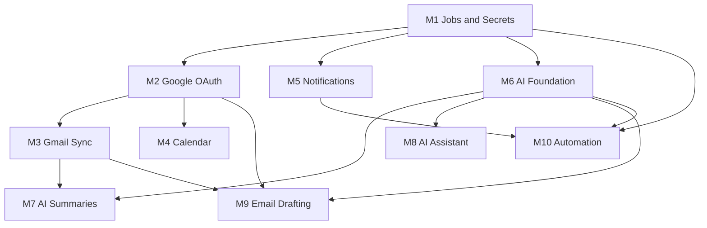

# Phase 3 Implementation Guide

The **single source of truth** for building Phase 3 (Integrations, AI &
Automation) — an operational playbook that turns the
[Phase 3 Architecture](./PHASE_3_ARCHITECTURE.md) design into an executable,
milestone-by-milestone plan with concrete checklists.

**Baseline / rollback point:** Career CRM **v1.0.0** (`c2b5dc3`).
**Related:** [Phase 3 Architecture](./PHASE_3_ARCHITECTURE.md) ·
[AI Architecture](../ai/AI_ARCHITECTURE.md) ·
[Database Guide](../database/DATABASE_GUIDE.md) ·
[System Architecture](./SYSTEM_ARCHITECTURE.md) ·
[Project Roadmap](../roadmap/PROJECT_ROADMAP.md)

> **How to use this document.** Read the *global standards* (§10–§17, §Global
> Gates) once. Then execute one **Milestone Card** (§Per-Milestone Playbook) at a
> time, top to bottom. A milestone is not "done" until every box in its Definition
> of Done is checked and it is live in production behind its flag.

---

## 1. Executive Summary

Phase 3 is delivered as **ten additive, independently deployable, feature-flagged
milestones (M1–M10)**. Each ships dark, is verified against the checklists below,
then enabled. Nothing modifies existing tables, auth, or middleware behaviour, so
**v1.0.0 remains the rollback point throughout**.

This guide standardizes *how* each milestone is built and shipped: the folders
and files it touches, its database impact (none / additive / migration / indexes
/ RLS / rollback), APIs, environment variables, feature flag, and the security,
smoke, QA, regression, deployment, and rollback checklists it must pass. Every
milestone ends with the same gate: **Lint → Typecheck → Build → Smoke →
Regression → Production Deploy**.

Estimated span: 10 milestones; complexity ranges from **S** (Notifications) to
**XL** (AI Assistant / Automation). See §19.

---

## 2. Overall Milestone Roadmap

| # | Milestone | Objective (one line) | DB | Complexity |
|---|-----------|----------------------|----|-----------|
| **M1** | Jobs & Secrets Platform | Durable Postgres job queue + cron workers + token encryption | Additive | M |
| **M2** | Google OAuth | Connect/disconnect Google with encrypted tokens | Additive | M |
| **M3** | Gmail Sync | Incremental sync into `messages`/`message_attachments` | None* | L |
| **M4** | Calendar | Sync Google Calendar events; create interview events | Additive | M |
| **M5** | Notifications | In-app + email notifications | Additive | S |
| **M6** | AI Foundation | Provider gateway, conversations, accounting | Additive | L |
| **M7** | AI Summaries | Summarize messages & opportunities | None* | M |
| **M8** | AI Assistant (RAG) | Copilot: streaming chat + retrieval + tools | Additive (+pgvector) | XL |
| **M9** | Email Drafting | AI drafts, approval-gated, sent via Gmail | Additive** | L |
| **M10** | Workflow Automation | Rule engine: trigger → condition → action | Additive | XL |

\* *Writes to existing Phase-1 tables/columns only — no new schema.*
\** *`ai_approvals` may land in M6; if so, M9 is "None".*

---

## 3. Dependency Graph

**Hard rules**

- **M1 first** — jobs + encryption underpin M3/M5/M6/M7/M9/M10.
- **M2 before M3, M4, M9** — no Gmail/Calendar without OAuth tokens.
- **M6 before M7, M8, M9, M10** — all AI features need the gateway.
- **M5 before M10** — automation actions dispatch notifications.

**Recommended order:** M1 → M2 → M3 → M4 → M5 → M6 → M7 → M8 → M9 → M10.
(M4/M5 may run in parallel with M3 once M1/M2 land; M7 needs M3+M6.)

---

## 4. Folder Strategy

Folders touched per milestone (all additive unless noted). Conventions match
Phase 2: `lib/<domain>.ts` (server-only) · `app/admin/(dashboard)/<module>` ·
`app/api/<area>` · `components/admin/<module>` · `supabase/migrations`.

| Milestone | Folders created / touched |
|-----------|---------------------------|
| M1 | `lib/jobs/`, `lib/integrations/` (crypto), `app/api/jobs/`, `supabase/migrations/`, `vercel.json`, Settings component (health panel) |
| M2 | `lib/integrations/google/`, `app/api/integrations/google/`, `lib/integrations.ts`, Settings → Integrations components, `supabase/migrations/` |
| M3 | `lib/integrations/google/` (gmail), `lib/sync/`, `lib/jobs/handlers/`, Messages components (sync affordances) |
| M4 | `lib/integrations/google/` (calendar), `lib/sync/`, `lib/calendar-events.ts`, `app/admin/(dashboard)/calendar/`, `components/admin/calendar/`, `supabase/migrations/` |
| M5 | `lib/notifications.ts`, `app/admin/(dashboard)/notifications/`, `components/admin/notifications/`, Settings (Notifications tab), `supabase/migrations/` |
| M6 | `lib/ai/`, `supabase/migrations/` |
| M7 | `lib/ai/` (summarize), `lib/jobs/handlers/`, Messages/Opportunities detail (render trigger) |
| M8 | `lib/ai/` (retrieval), `app/api/ai/`, `app/admin/(dashboard)/assistant/`, `components/admin/assistant/`, `supabase/migrations/` |
| M9 | `lib/ai/` (drafting), `lib/integrations/google/` (send), `components/admin/messages/` + approvals UI, `supabase/migrations/`* |
| M10 | `lib/automation/`, `app/admin/(dashboard)/automations/`, `components/admin/automations/`, `lib/jobs/handlers/`, `supabase/migrations/` |

Shared, low-touch edits every enablement milestone: `lib/admin/navigation.ts`
(enable a nav item) and Settings.

---

## 5. File Strategy

Indicative files. **Reads = Server Components / `server-only` data layers;
mutations = Server Actions; provider/stream/cron = route handlers; interactive UI
= client (`"use client"`).** No secrets ever reach client bundles.

| Milestone | Expected files created (indicative) | Boundary |
|-----------|-------------------------------------|----------|
| M1 | `lib/jobs/queue.ts`, `lib/jobs/runner.ts`, `lib/integrations/crypto.ts`, `app/api/jobs/run/route.ts`, `vercel.json`, migration | Server-only + route handler (cron) |
| M2 | `lib/integrations/google/oauth.ts`, `app/api/integrations/google/connect/route.ts`, `.../callback/route.ts`, `lib/integrations.ts`, `components/admin/settings/IntegrationConnectCard.tsx`, actions, migration | Route handlers + Server Actions + client card |
| M3 | `lib/integrations/google/gmail.ts`, `lib/sync/gmail-sync.ts`, `lib/jobs/handlers/gmail-sync.ts`, `components/admin/messages/SyncNowButton.tsx` | Server-only + client button |
| M4 | `lib/integrations/google/calendar.ts`, `lib/sync/calendar-sync.ts`, `lib/calendar-events.ts`, `app/admin/(dashboard)/calendar/{page,loading,error}.tsx`, `components/admin/calendar/*`, migration | RSC reads + client views |
| M5 | `lib/notifications.ts`, `components/admin/notifications/NotificationBell.tsx`, `app/admin/(dashboard)/notifications/page.tsx`, actions, `lib/jobs/handlers/notification-dispatch.ts`, migration | RSC + client bell + Server Actions |
| M6 | `lib/ai/{gateway,tools,conversations}.ts`, `lib/ai/prompts/*`, migration | Server-only |
| M7 | `lib/ai/summarize.ts`, `lib/jobs/handlers/ai-summarize.ts`, detail-page "Summarize" action | Server-only + Server Action |
| M8 | `app/api/ai/chat/route.ts`, `lib/ai/retrieval.ts`, `lib/jobs/handlers/ai-embed.ts`, `app/admin/(dashboard)/assistant/*`, `components/admin/assistant/*`, migration | Streaming route handler + client chat |
| M9 | `lib/ai/drafting.ts`, `lib/integrations/google/` (send), approvals data layer + UI, actions, migration* | Server Actions + client approvals |
| M10 | `lib/automation/{engine,triggers,actions}.ts`, `lib/jobs/handlers/automation-run.ts`, `app/admin/(dashboard)/automations/*`, `components/admin/automations/*`, migration | RSC + Server Actions + engine (server) |

**Files modified (recurring, small):** `lib/admin/navigation.ts` (enable item),
Settings page/tabs, and — only where a domain event must be emitted for automation
— the relevant `lib/<entity>.ts` gains a fire-and-forget `enqueue(event)` call
(additive, no logic change to existing mutations).

---

## 6. Database Impact

Per-milestone. All new tables: `id uuid`, `created_at`/`updated_at`, nullable
`owner_id → auth.users`, RLS **on** with the existing
`"Authenticated admin full access"` policy, `set_updated_at()` trigger, additive +
idempotent migration. See [Database Guide](../database/DATABASE_GUIDE.md#migration-conventions).

| Milestone | Schema | New tables / objects | Indexes | RLS | Rollback impact |
|-----------|--------|----------------------|---------|-----|-----------------|
| M1 | Additive | `jobs` | `(status, run_after)`, `idempotency_key` unique (partial), `(type)` | Policy on `jobs` | Table inert if cron off; drop only if unused |
| M2 | Additive | `oauth_states` (or signed cookie → none) | `state` unique, `expires_at` | Policy on `oauth_states` | Disconnect revokes; states expire; table inert |
| M3 | **None** | — (writes existing `messages`/`message_attachments`) | uses Phase-1 unique dedupe indexes | existing | Stop job; rows remain valid |
| M4 | Additive | `calendar_events` | `(integration_account_id)`, `(external_event_id)` unique partial, `(starts_at)` | Policy | Flag off; table inert |
| M5 | Additive | `notifications` | `(owner_id, read_at)`, `(created_at desc)` | Policy | Flag off; table inert |
| M6 | Additive | `ai_conversations`, `ai_messages`, `ai_audit_log`, `prompt_templates` | FK cols, `(conversation_id)`, `(created_at)` | Policy on each | Unused if gateway not called; inert |
| M7 | **None** | — (writes existing `ai_summary`/`ai_*`) | — | existing | Stop job; summaries simply absent |
| M8 | Additive | `ai_embeddings` (+ enable **pgvector**) | vector index (IVFFlat/HNSW), `(entity_type, entity_id)` | Policy | Flag off; embeddings inert; extension harmless |
| M9 | Additive* | `ai_approvals` (if not in M6) | `(status)`, `(entity_type, entity_id)` | Policy | Drafts unsent by design; inert |
| M10 | Additive | `automation_rules`, `automation_runs` | `(enabled)`, `(rule_id)`, `(created_at desc)` | Policy | Set all rules `enabled=false`; tables inert |

**Never:** alter existing tables, change existing indexes, or touch inquiry
tables. Additive columns on `integration_accounts` (e.g. `granted_scopes`) are
permitted additively if a milestone requires them.

---

## 7. APIs Involved

| Milestone | Endpoint / mechanism | Type | Auth |
|-----------|----------------------|------|------|
| M1 | `POST /api/jobs/run` | Route handler (cron) | Cron secret |
| M2 | `GET /api/integrations/google/connect`, `GET /api/integrations/google/callback` | Route handlers | Session (connect) / OAuth state (callback) |
| M3 | internal job (`gmail_sync`); Gmail REST (list/history/get) | Adapter | Encrypted token |
| M4 | internal job (`calendar_sync`); Calendar REST (list/insert) | Adapter | Encrypted token |
| M5 | Server Actions (mark read); job (`notification_dispatch`) → Resend | Actions + job | Session / cron |
| M6 | none public (gateway used server-side) | — | — |
| M7 | internal job (`ai_summarize`); Server Action (summarize now) | Job + action | Cron / session |
| M8 | `POST /api/ai/chat` (SSE stream) | Route handler | Session |
| M9 | Server Actions (draft/approve/reject/send); Gmail send REST | Actions + adapter | Session + encrypted token |
| M10 | Server Actions (rule CRUD/test); job (`automation_run`) | Actions + job | Session / cron |

External APIs: **Google Gmail**, **Google Calendar**, **AI provider (Claude)**,
**Resend** (existing). All third-party calls happen **server-side only**.

---

## 8. Environment Variables Required

Add per milestone; never expose secrets to the client (no `NEXT_PUBLIC_` on
secrets). Configure in Vercel (Preview + Production) before enabling the flag.

| Variable | Introduced | Purpose | Secret |
|----------|-----------|---------|:------:|
| `CRON_SECRET` | M1 | Authenticate `/api/jobs/run` | ✅ |
| `TOKEN_ENCRYPTION_KEY` *(if app-layer AES; else Vault)* | M1 | Encrypt/decrypt OAuth tokens | ✅ |
| `GOOGLE_OAUTH_CLIENT_ID` | M2 | Google OAuth client | ✅ |
| `GOOGLE_OAUTH_CLIENT_SECRET` | M2 | Google OAuth client | ✅ |
| `GOOGLE_OAUTH_REDIRECT_URI` | M2 | Allow-listed callback URL | — |
| `AI_PROVIDER_API_KEY` (e.g. `ANTHROPIC_API_KEY`) | M6 | LLM provider auth | ✅ |
| `AI_DAILY_TOKEN_BUDGET` | M6 (optional) · **M7 required** | Cost guardrail for **unattended paths only** — ingest and backfill refuse to enqueue without it. Manual actions are exempt by design | — |
| `RESEND_API_KEY` | M5 (exists) | Email delivery | ✅ |
| Feature-flag vars (§9) | per-M | Gate each capability | — |

**Existing (unchanged):** `NEXT_PUBLIC_SUPABASE_URL`,
`NEXT_PUBLIC_SUPABASE_ANON_KEY`, `SUPABASE_SERVICE_ROLE_KEY`, Turnstile keys.

---

## 9. Feature Flags

Every milestone ships **dark**. A flag (env var read server-side, plus the
sidebar `enabled` toggle for nav) controls exposure. Rollback = flip the flag (no
redeploy).

| Flag | Gates | Milestone |
|------|-------|-----------|
| `FEATURE_JOBS` | Cron drainer active | M1 |
| `FEATURE_GOOGLE_OAUTH` | Connect button + callback | M2 |
| `FEATURE_GMAIL_SYNC` | `gmail_sync` job scheduling | M3 |
| `FEATURE_CALENDAR` | Calendar nav + sync | M4 |
| `FEATURE_NOTIFICATIONS` | Bell + dispatch | M5 |
| `FEATURE_AI` | AI gateway callable | M6 |
| `FEATURE_AI_SUMMARIES` | Summarize jobs/actions | M7 |
| `FEATURE_ASSISTANT` | Assistant nav + `/api/ai/chat` | M8 |
| `FEATURE_EMAIL_DRAFTING` | Draft/approve/send | M9 |
| `FEATURE_AUTOMATION` | Automations nav + engine | M10 |

Flag conventions: default **off** in Production until acceptance passes; a
disabled flag must make the feature fully inert (routes gated, jobs not scheduled,
nav item hidden/disabled).

---

## 10. Security Checklist (applies to every milestone)

- [ ] No secret in client bundle, logs, or non-encrypted columns (grep bundle/log).
- [ ] OAuth tokens encrypted at rest; only `lib/integrations/crypto.ts` decrypts (server-only).
- [ ] New tables have RLS **on** + the admin policy; anon key denied (verify).
- [ ] `owner_id` present on every new table.
- [ ] System endpoints (cron/webhook) require a shared secret / signature — never a user session.
- [ ] OAuth: `state` + PKCE validated; `redirect_uri` allow-listed; least-privilege scopes.
- [ ] External/high-impact AI or automation actions are **approval-gated**.
- [ ] Agent/automation writes audited (`opportunity_events` `actor_type='agent'` / `ai_audit_log` / `automation_runs`).
- [ ] AI prompts redact secrets/PII; `body_html` remains sanitized before display.
- [ ] No change to `middleware.ts` or auth; new routes under `/admin/*` are session-gated.

---

## 11. Smoke Tests (methodology + per-milestone anchors)

**Methodology.** After deploy, run unauthenticated HTTP checks (routes gated →
`307 → /admin/login`; public `/` → `200`), confirm the new route(s) exist and are
gated, and confirm no prior route regressed. Authenticated functional smoke is
performed by the operator with valid admin credentials.

| Milestone | Smoke anchors |
|-----------|---------------|
| M1 | `/api/jobs/run` rejects without `CRON_SECRET`; accepts with it (dev); job row transitions pending→done |
| M2 | Connect redirects to Google; callback stores encrypted token; Settings shows "Connected"; disconnect revokes |
| M3 | Sync job populates `messages`; re-run yields no duplicates; Messages inbox renders data |
| M4 | `/admin/calendar` gated + renders; event upsert dedupes; interview creation logs event |
| M5 | Bell appears; a triggering action creates a notification; email dispatched (mock/live) |
| M6 | Gateway callable server-side (internal harness); tokens accounted; no public route |
| M7 | Summarize writes `ai_summary`; re-summarize is a no-op (`ai_processed_at`) |
| M8 | `/admin/assistant` gated; chat streams; a tool call returns RLS-scoped data |
| M9 | Draft creates an approval; send blocked until approved; approve sends + logs `message_sent` |
| M10 | Rule triggers a run; action executes via existing `lib/*`; run recorded; disable stops it |

---

## 12. QA Checklist (every milestone)

- [ ] New pages have `loading.tsx`, `error.tsx`, empty state, and (detail) `not-found.tsx`.
- [ ] Reuses M0 kit (PageHeader, DataTable/Pagination/FilterBar, Drawer/Dialog, Toast, states) — no ad-hoc styles.
- [ ] Server/client boundaries correct; no secret imported into a client component.
- [ ] `ActionResult` returned from all mutations; `revalidatePath` on affected paths.
- [ ] Responsive at mobile/tablet/desktop; keyboard operable; ARIA labels; visible focus.
- [ ] Idempotency verified for any job/sync/AI write.
- [ ] Feature fully inert when its flag is off.
- [ ] No unused imports / dead code (ESLint clean); no stray `console.log`.

---

## 13. Regression Checklist (every milestone)

- [ ] `git` scope guard: no changes to `inquir*`, `/auth/`, `lib/auth`, `middleware`, `supabase/schema`, or any **prior module's** business logic (only additive files + flagged enable).
- [ ] Existing tables unchanged (no `ALTER`/`DROP`); only additive migration applied.
- [ ] Prior modules (Companies…Analytics, Settings, Inquiry) still gated + healthy in build and smoke.
- [ ] Build route list unchanged for prior routes; no bundle regressions on unrelated pages.
- [ ] Auth/middleware behaviour identical (all `/admin/*` still `307 → login` unauthenticated).

---

## 14. Production Deployment Checklist (every milestone)

1. [ ] Branch from `main`; implement the milestone additively.
2. [ ] Apply the additive migration to Supabase (SQL editor / CLI) **before** deploying code that reads it; verify objects + RLS.
3. [ ] Set required env vars in Vercel (Preview + Production); flag **off** in Production.
   - [ ] **Verify cost-control variables that have no code guard.** A milestone
     that spends without a human in the loop must not rely on a checklist alone
     for the variables it *does* enforce, and must be read by eye for the ones it
     does not (M7: `AI_MODEL_FAST`). See [Runbook §19.8](../operations/RUNBOOK.md).
   - [ ] **Preview shares the production database.** Any acceptance run in
     Preview writes real rows; know the cleanup statement before you start.
4. [ ] Local gates: `npm run lint` · `npx tsc --noEmit` · `npm run build` — all green.
5. [ ] Commit (conventional message) → push → open PR → merge to `main`.
6. [ ] Wait for Vercel deployment → **Ready**; capture deployment id + commit SHA.
7. [ ] Unauthenticated smoke (§11) + regression (§13).
8. [ ] Operator authenticated smoke behind the flag (Preview or Production with flag on for the operator).
9. [ ] Flip the flag on in Production once acceptance (§16) passes.
10. [ ] Record outcome; update this guide's changelog / Open Questions if needed.

---

## 15. Rollback Checklist (every milestone)

- **First line:** flip the feature flag **off** (no redeploy) → feature inert.
- **Code:** revert the milestone commit / promote the previous Ready deployment; ultimate fallback = redeploy **v1.0.0** (`c2b5dc3`).
- **Database:** additive tables are inert when unused — leave in place (roll-forward preferred). A destructive teardown (`drop table … cascade`) is a separate, explicit migration, only if no real data exists.
- **Integrations:** disconnect flow revokes provider grants; stop the related job type.
- **Never** hand-edit applied objects; never roll back by deleting data with real content.
- **Verify after rollback:** prior routes healthy, `v1.0.0` still tags `c2b5dc3`.

---

## 16. Acceptance Criteria (per milestone)

| Milestone | Accepted when… |
|-----------|----------------|
| M1 | Cron drains jobs; retries/backoff + idempotency proven; crypto round-trips; unauthorized cron rejected |
| M2 | A Google account connects, stores an **encrypted** token, refreshes, and disconnects/revokes; Settings reflects status |
| M3 | A connected inbox populates `messages` idempotently (replay → 0 dupes); attachments captured; auto-link correct; Messages live |
| M4 | Calendar events sync + dedupe; interview creation writes Google + logs `interview_scheduled`; Calendar UI live |
| M5 | Triggers create notifications; in-app + email delivery; read state + preference gating work |
| M6 | Gateway returns structured output with token accounting + prompt-version stamping; tool registry enforces RLS; nothing user-facing leaks |
| M7 | Message/opportunity summaries generate once, render on detail, respect budget |
| M8 | Streaming copilot answers over RLS-scoped data via retrieval + tools; refusals/guardrails hold; embeddings backfilled |
| M9 | AI reply drafts require approval; approve sends via Gmail + logs outbound; no send without approval |
| M10 | A rule fires on its trigger, matches conditions, executes actions via existing `lib/*`, records a run; disabling stops it; loops prevented |

---

## 17. Definition of Done

A milestone is **Done** only when **all** of the following pass (the required
per-milestone gate):

- ✓ **Lint** (`npm run lint` — clean)
- ✓ **Typecheck** (`npx tsc --noEmit` — clean)
- ✓ **Build** (`npm run build` — success)
- ✓ **Smoke Tests** (§11 anchors, unauth + operator auth)
- ✓ **Regression** (§13 — prior modules/schema/auth intact)
- ✓ **Production Deploy** (Vercel Ready; §14 completed)

…**plus:** acceptance criteria (§16) met, security checklist (§10) passed, QA
checklist (§12) passed, docs updated (this guide + relevant architecture/DB
docs), feature flag flipped on, and `v1.0.0` still the rollback baseline.

---

## Per-Milestone Playbook

Self-contained cards. Each inherits the global checklists (§10–§17) and adds its
specifics.

### M1 — Jobs & Secrets Platform · `M`
- **Objective:** durable Postgres job queue + scheduled workers + token encryption that everything async depends on.
- **Folders/files:** `lib/jobs/{queue,runner}.ts`, `lib/integrations/crypto.ts`, `app/api/jobs/run/route.ts`, `vercel.json`, Settings jobs-health panel; migration for `jobs`. *(server-only + one cron route handler + read-only panel).*
- **DB:** additive `jobs` (+status/idempotency indexes, RLS). **APIs:** `POST /api/jobs/run` (cron secret). **Env:** `CRON_SECRET`, `TOKEN_ENCRYPTION_KEY`/Vault. **Flag:** `FEATURE_JOBS`.
- **Security deltas:** cron secret constant-time compare; crypto keys server-only; `SKIP LOCKED` leasing.
- **Smoke/Acceptance:** see §11/§16 M1. **Rollback:** disable cron; `jobs` inert.
- **Risk:** medium (Vercel function/time limits) → chunk jobs, bounded batches.

### M2 — Google OAuth · `M`
- **Objective:** connect/disconnect Google with encrypted token storage + refresh.
- **Folders/files:** `lib/integrations/google/oauth.ts`, `app/api/integrations/google/{connect,callback}/route.ts`, `lib/integrations.ts`, `components/admin/settings/IntegrationConnectCard.tsx`, connect/disconnect actions; migration for `oauth_states` (or signed cookie).
- **DB:** additive `oauth_states` (or none). **APIs:** connect + callback. **Env:** `GOOGLE_OAUTH_CLIENT_ID/SECRET/REDIRECT_URI`. **Flag:** `FEATURE_GOOGLE_OAUTH`.
- **Security deltas:** PKCE + state; allow-listed redirect; least scope; revoke on disconnect.
- **Risk:** medium (Google OAuth app verification lead time) → begin verification early; restricted scopes first.

### M3 — Gmail Sync · `L`
- **Objective:** incremental sync into `messages`/`message_attachments`.
- **Folders/files:** `lib/integrations/google/gmail.ts`, `lib/sync/gmail-sync.ts`, `lib/jobs/handlers/gmail-sync.ts`, `components/admin/messages/SyncNowButton.tsx`.
- **DB:** **none** (existing tables; advances `sync_cursor`). **APIs:** internal job + Gmail REST. **Flag:** `FEATURE_GMAIL_SYNC`.
- **Security deltas:** token decrypt server-only; sanitize on render (already).
- **Risk:** high (dedupe/quotas) → idempotent upsert on `(integration_account_id, external_message_id)`, backoff, cursor-advance-after-success.

### M4 — Calendar · `M`
- **Objective:** sync calendar events; create interview events.
- **Folders/files:** `lib/integrations/google/calendar.ts`, `lib/sync/calendar-sync.ts`, `lib/calendar-events.ts`, `app/admin/(dashboard)/calendar/{page,loading,error}.tsx`, `components/admin/calendar/*`; migration `calendar_events`.
- **DB:** additive `calendar_events`. **APIs:** job + Calendar REST (insert). **Flag:** `FEATURE_CALENDAR`.
- **Risk:** medium (sync token expiry) → full re-sync fallback on `410`.

### M5 — Notifications · `S`
- **Objective:** in-app + email notifications.
- **Folders/files:** `lib/notifications.ts`, `components/admin/notifications/NotificationBell.tsx`, `app/admin/(dashboard)/notifications/page.tsx`, mark-read actions, `lib/jobs/handlers/notification-dispatch.ts`; migration `notifications`.
- **DB:** additive `notifications`. **APIs:** actions + dispatch job → Resend. **Flag:** `FEATURE_NOTIFICATIONS`.
- **Risk:** low → dedupe notifications; respect (placeholder) preferences.

### M6 — AI Foundation · `L`
- **Objective:** provider gateway + conversation store + accounting.
- **Folders/files:** `lib/ai/{gateway,tools,conversations}.ts`, `lib/ai/prompts/*`; migration `ai_conversations`, `ai_messages`, `ai_audit_log`, `prompt_templates`.
- **DB:** additive AI tables. **APIs:** none public. **Env:** `AI_PROVIDER_API_KEY`, budget. **Flag:** `FEATURE_AI`.
- **Security deltas:** provider key server-only; tool registry runs under RLS; prompt redaction.
- **Risk:** medium (provider/model choice, cost) → model routing, budgets, caching. Confirm model IDs against current provider docs at build time.

### M7 — AI Summaries · `M` — ✅ **as built**
- **Objective:** summarize messages & opportunities.
- **Shipped in five slices:** M7.0 flag + prompt templates · M7.1 manual message
  summaries (synchronous) · M7.2 automatic summaries on Gmail ingest (job) ·
  M7.3 opportunity rollups (on demand) · M7.4 operator backfill · M7.5 docs.
- **Files:** `lib/ai/summarize.ts` (the only decision layer),
  `lib/ai/prompts/templates/{message,opportunity}-summary.ts`,
  `lib/jobs/handlers/ai-summarize.ts`, `requestMessageSummary` in
  `lib/sync/gmail-sync.ts`, three Server Actions (messages, opportunities,
  settings), two `SummarizeButton`s + `BackfillSummariesButton`.
- **DB:** **none** — writes only the Phase-1 `ai_summary`/`ai_*` columns. No migration.
- **Flag:** `FEATURE_AI_SUMMARIES`, gating **eight** points including both
  detail renders, so a flip hides existing summaries as well as stopping new ones.
  Enumerated in [Runbook §11](../operations/RUNBOOK.md); verify with
  `grep -rn FEATURE_AI_SUMMARIES lib app components`.
- **Env prerequisites:** `AI_DAILY_TOKEN_BUDGET` (**enforced** — unattended paths
  refuse to enqueue without it) and `AI_MODEL_FAST` (**not enforced** — unset
  costs ~5×). See [Runbook §19.6–§19.8](../operations/RUNBOOK.md).
- **Risk as realised:** cost governance, not correctness. Two review gates (C3)
  were failed and remediated before release: uncapped default spend, and
  configuration failures completing silently as successful jobs.
- **Known limitations:** rollups never auto-refresh (the block shows its
  generation date); backfill covers messages only and cannot advance past a scan
  window of permanently-ineligible mail; `ai_audit_log.job_id` is null because
  the runner passes no job id to handlers; no eval harness (Phase 5).
- **Rollback:** flag off, then the prompt-version-scoped cleanup statement in
  Runbook §19.7. No migration to reverse.

### M8 — AI Assistant (RAG) · `XL`
- **Objective:** streaming copilot with retrieval + tools.
- **Split in delivery**, per the §21 note on separating retrieval:

**M8a — streaming copilot · shipped**
- **Delivered:** `AiProvider.stream()` + `AiCapabilities.streaming` (optional, with a `complete()` fallback so streaming stays a capability, not a requirement); `AiGateway.stream()` reusing the same policy pipeline as `complete()`; `lib/ai/retrieval.ts` (keyword recall over the existing `search_vector`/GIN indexes across all seven record types); `search_crm` tool; `assistant` prompt template; `lib/ai/assistant.ts` (conversation + history + persistence); `POST /api/ai/chat` (SSE); `/admin/assistant` + `components/admin/assistant/*`; flag-gated nav.
- **DB:** none — no migration.
- **Flag:** `FEATURE_ASSISTANT` (requires `FEATURE_AI`).
- **Tests:** `test/ai/streaming.test.ts` (frame assembly + agent loop), `test/ai/retrieval.test.ts` (owner scoping, interleaving, degradation).

**M8b — semantic retrieval · blocked**
- **Scope:** migration `ai_embeddings` + enable **pgvector**; `AiProvider.embed()`; `lib/jobs/handlers/ai-embed.ts`; blend vector neighbours into `retrieve()`.
- **Blocked on:** an embedding provider. The configured provider exposes no embeddings endpoint, so there is nothing to implement `embed()` against until a second one is added — which needs a vendor decision and a key.
- **Also unconfirmed:** pgvector availability on the Supabase plan (open question §21.3). The FTS fallback named in the risk table is what M8a ships.
- **Seam:** `retrieve()` is the single entry point and returns ranked `RetrievedItem[]`; adding embeddings means a second candidate source inside it and blending in `rank()`. No caller changes.
- **Security deltas:** retrieval RLS-scoped; tools consequence-classed; no key client-side.
- **Risk:** high (pgvector availability, streaming, tool correctness) → confirm pgvector; contract-test tools; guardrail evals.

### M9 — Email Drafting · `L` · shipped
- **Objective:** AI drafts, approval-gated, sent via Gmail.
- **Delivered:** migration `ai_approvals` (it was NOT in M6 — deferred by decision D4); `lib/approvals.ts` state machine; `lib/ai/drafting.ts`; `email_reply` prompt template; `lib/ai/send.ts` executor; `sendMessage` + `buildRawMessage` in `lib/integrations/google/gmail.ts`; `GMAIL_SEND_SCOPES` via incremental auth; `/admin/approvals` + `components/admin/approvals/*`; draft panel on the message detail page.
- **DB:** additive `ai_approvals`. **Flag:** `FEATURE_EMAIL_DRAFTING` (requires `FEATURE_AI`).
- **Two distinct guarantees, deliberately not conflated:**
  1. *One send per approval* — `claimForSend` moves `approved -> sending` conditionally; whoever wins owns the effect. This is ADR-006's "keyed on approval_id".
  2. *One open proposal per action* — `idempotency_key` uniquely indexed, but only across states that can still send and only while un-archived, so a rejected or sent proposal stops blocking and re-drafting works.
- **Security deltas:** no send without an `approved` row; recipients derived from the synced message, never from model output; subject and addresses stripped of CR/LF before reaching a header; `no send without approval` re-enforced in the executor rather than trusted from the client.
- **Ordering invariant:** mark sent *before* CRM bookkeeping. Past the Gmail call the mail exists, so reporting failure would invite a duplicate-producing retry; bookkeeping errors are logged, not raised.
- **Known limitation:** a request that dies between claim and result strands a row in `sending`. No automatic recovery is correct — after a crash nobody can say whether the mail went out — so the operator can archive it ("Set aside"), which frees the idempotency key without asserting an outcome.
- **Operational prerequisites (not code):** `gmail.send` is a **restricted** scope requiring Google app verification for production, and anyone connected before M9 must reconnect to grant it.
- **Tests:** `test/ai/approvals.test.ts` (transition predicates), `test/ai/drafting.test.ts` (recipients never from model output), `test/ai/send.test.ts` (irreversibility ordering), `test/integrations/gmail-send.test.ts` (header injection).

### M10 — Workflow Automation · `XL`
- **Objective:** rule engine (trigger → condition → action).
- **Rule DSL:** the `trigger`/`conditions`/`actions` JSON schema + validation rules are specified in [Phase 3 Architecture §14.1](./PHASE_3_ARCHITECTURE.md#141-automation-rule-schema-dsl).
- **Folders/files:** `lib/automation/{engine,triggers,actions}.ts`, `lib/jobs/handlers/automation-run.ts`, `app/admin/(dashboard)/automations/*`, `components/admin/automations/*`; migration `automation_rules`, `automation_runs`. Minor additive `enqueue(event)` calls in emitting data layers.
- **DB:** additive `automation_rules`, `automation_runs`. **Flag:** `FEATURE_AUTOMATION`.
- **Security deltas:** actions run via existing `lib/*` (RLS/validation); external actions approval-gated; loop guard.
- **Risk:** high (infinite loops, unintended actions) → run caps, idempotency, dry-run/test-run, `enabled=false` kill switch.

---

## 18. Risk Assessment

| Risk | Likelihood | Impact | Milestones | Mitigation |
|------|:---------:|:------:|-----------|-----------|
| Token leakage | Low | Critical | M1–M2 | Vault/pgsodium, server-only decrypt, no logging, RLS |
| Google OAuth verification delay | Med | High | M2, M9 | Start verification early; restricted scopes first |
| Vercel function/cron limits | Med | Med | M1, M3, M8 | Chunked jobs, bounded batches, incremental sync, streaming |
| Sync duplication/loss | Med | High | M3, M4 | Idempotent upserts, cursor-after-success, dead-letter |
| AI cost overrun | Med | Med | M6–M9 | Token budgets, model routing, caching, summarize-once |
| AI/automation wrong action | Med | High | M8–M10 | Approval gating, audit trail, loop guards |
| pgvector unavailable | Low | Med | M8 | Confirm early; degrade to FTS-only retrieval |
| Provider API change | Low | Med | M3–M4, M6–M9 | Adapter abstraction + contract tests |
| Scope creep | Med | Med | all | Milestone gating; fixed non-goals |

---

## 19. Estimated Complexity

Relative sizing (`S < M < L < XL`) — for sequencing/risk, not time commitments.

| Milestone | Size | Primary drivers |
|-----------|:----:|-----------------|
| M1 | M | Queue semantics, cron, crypto |
| M2 | M | OAuth correctness, token lifecycle |
| M3 | L | Incremental sync, dedupe, linking, quotas |
| M4 | M | Calendar sync + write path |
| M5 | S | Straightforward CRUD + email |
| M6 | L | Gateway, tools, accounting, prompts |
| M7 | M | Job orchestration + eval |
| M8 | XL | Streaming + RAG + pgvector + tools |
| M9 | L | Drafting + approval + send safety |
| M10 | XL | Rule engine, triggers, action safety, loops |

Highest-risk/most-complex: **M8** and **M10** — schedule buffer and extra review.

---

## 20. Future Considerations

- **Real-time Gmail** via `watch` + Pub/Sub webhook (replaces polling; sync engine unchanged).
- **More providers** (LinkedIn, Wellfound, Greenhouse, Lever, Ashby, Workday, Indeed, portals) via the `ProviderAdapter` contract + `source`/`external_ids`.
- **Multi-user/teams** — activate `owner_id`-scoped RLS; assignee directory; per-user budgets.
- **Durable workflow backend** (Inngest / Vercel WDK) if automation grows branchy — swappable behind `lib/jobs`.
- **Autonomous agents** — graduate low-risk actions past approval once evals justify it (the nine agents in [AI Architecture](../ai/AI_ARCHITECTURE.md)).
- **Attachment blob storage** (Supabase Storage) for message attachments.
- **Observability** — structured logging, metrics, alerting on job/sync/AI health.

---

## Document Control

- **Version:** 1.0
- **Owner:** Repository maintainer (Shivam Chaturvedi)
- **Last Updated:** 2026-07-28
- **Status:** Approved for planning; implementation not yet started.

### Related Documents
- [Phase 3 Architecture](./PHASE_3_ARCHITECTURE.md) — the design this guide operationalizes
- [AI Architecture](../ai/AI_ARCHITECTURE.md) — AI layer internals (agents, prompts, embeddings, approvals)
- [Database Guide](../database/DATABASE_GUIDE.md) — schema conventions + migration rules
- [System Architecture](./SYSTEM_ARCHITECTURE.md) — current (Phase 2) system
- [Project Roadmap](../roadmap/PROJECT_ROADMAP.md) — phases 0–6
- [Phase 1 Completion](../roadmap/PHASE_1_COMPLETION.md) — decisions, rollback strategy precedent

### Future Changes
- Fold real-time Gmail (Pub/Sub) into M3 once webhook infra is chosen.
- Split M8 if pgvector/RAG proves larger than XL (separate retrieval milestone).
- Add a dedicated "Observability" milestone before general availability.

### Open Questions
1. **Token encryption:** Supabase Vault/pgsodium vs app-layer AES — confirm availability + key rotation policy (blocks M1/M2).
2. **Google OAuth verification:** timeline for restricted-scope verification (Gmail send/read) — start early (blocks M9 send).
3. **pgvector:** confirmed available on the Supabase plan? (blocks M8 retrieval; fallback = FTS-only).
4. **AI provider/model:** confirm Claude model tier + budget ceiling; check current model IDs at build (M6).
5. **Job backend:** stay Postgres+Cron for all of Phase 3, or adopt Inngest/WDK at M10?
6. **Notifications delivery:** email-only via Resend, or add in-app-only preference granularity (M5)?

### Verification
Formatting, Markdown, and internal links verified at authoring time (see the
accompanying documentation report). This guide is documentation only — no
application code, schema, or dependencies were changed, and the production tag
remains **v1.0.0** (`c2b5dc3`).
