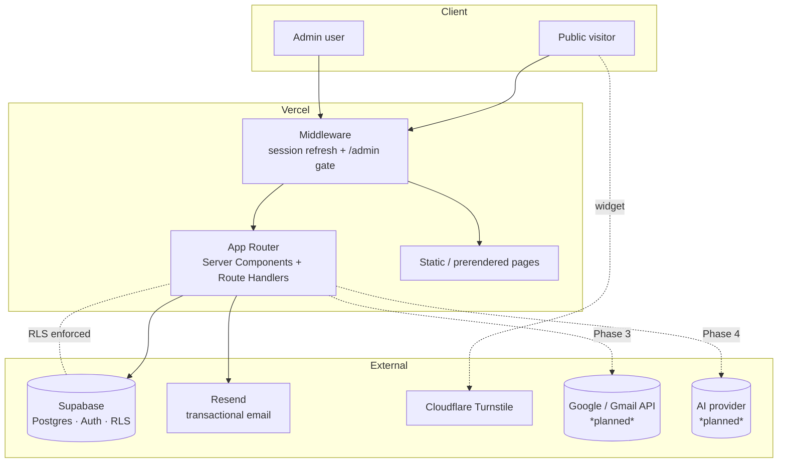
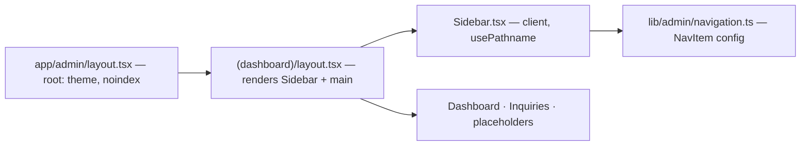
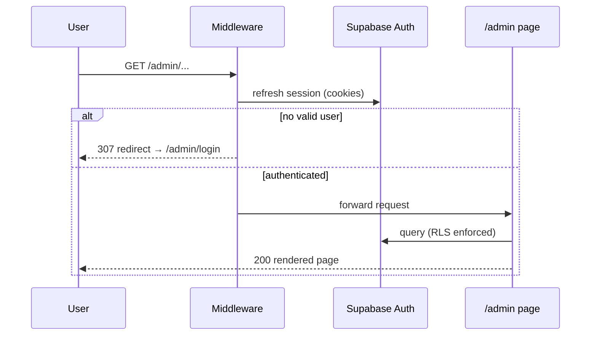
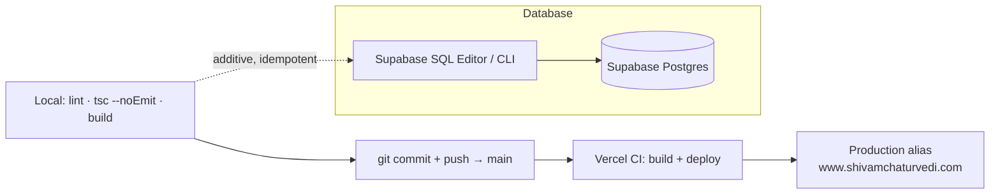
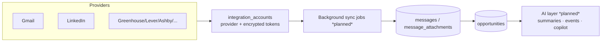

# System Architecture

This document describes how the `shivam-portfolio` / Career CRM system is
structured across the frontend, backend, database, authentication, middleware,
navigation, deployment, and future integrations.

> Scope: architecture as of **Phase 1 complete**. Phase 2+ components are marked
> as *planned*.

---

## High-level topology

---

## Frontend

- **Framework:** Next.js 14 App Router with React 18 Server Components; client
  components are used only where interactivity is required (e.g. the admin
  sidebar, sign-out, form controls).
- **Route groups:**
  - `app/(marketing)` — public site + blog, largely static/prerendered.
  - `app/admin/(dashboard)` — the authenticated CRM shell; a layout renders the
    sidebar and wraps every child page.
  - `app/admin/{login,signup,reset-password}` — unauthenticated auth screens.
- **Styling:** Tailwind CSS with `clsx` + `tailwind-merge` for composition;
  `next-themes` for light/dark; Framer Motion for animation; lucide-react icons.
- **Components:** grouped by domain under `components/` (`admin`, `auth`,
  `layout`, `sections`, `ui`).

---

## Backend

The backend is Next.js server-side code — there is no separate API server.

- **Route handlers** (`app/api/**`):
  - `api/contact` — public contact-form intake (rate-limited, Turnstile-verified,
    writes via service role, emails via Resend).
  - `api/admin/inquiries/**` — inquiry mutations (status, lead-source, notes,
    delete) and CSV export, behind auth.
  - `api/auth/{role,signup}` — role lookup and allowlist-gated signup.
  - `app/auth/callback` — Supabase auth callback.
- **Server data access** lives in `lib/` (`inquiries.ts`, `rateLimit.ts`,
  `tokens.ts`) and the Supabase client factories.
- **Supabase client flavors** (`lib/supabase/`):
  - `client.ts` — browser client (anon key, RLS-bound).
  - `server.ts` — SSR client bound to the request's cookies/session.
  - `service.ts` — **server-only** service-role client that bypasses RLS (guarded
    by `import "server-only"`).
  - `middleware.ts` — session refresh helper used by the edge middleware.

---

## Database

- **Engine:** Postgres (Supabase). See
  [`../database/DATABASE_GUIDE.md`](../database/DATABASE_GUIDE.md) for the full
  ER diagram and object-by-object documentation.
- **Two layers:**
  - *Baseline* (`supabase/schema.sql`): the inquiry system.
  - *Career CRM foundation* (`supabase/migrations/*.sql`): 10 additive tables.
- **Cross-cutting conventions:** `uuid` PKs, `timestamptz` audit columns, a shared
  `set_updated_at()` trigger, nullable `owner_id → auth.users`, `external_ids`
  for source-agnostic matching, `ai_*` provenance, and generated `tsvector` FTS.

---

## Authentication

- **Provider:** Supabase Auth (email/password) with allowlist-gated admin signup
  (`lib/auth/adminEmail.ts`).
- **Session:** managed via Supabase cookies; refreshed on every request by the
  middleware helper so Server Components see a fresh session.
- **Authorization:** a single admin role model today — any authenticated user is
  treated as admin (enforced by RLS `auth.role() = 'authenticated'`). Per-user
  authorization is a Phase 6 concern (columns already in place via `owner_id`).

---

## Middleware

`middleware.ts` runs on `/admin/:path*` and:

1. Refreshes the Supabase session (`updateSupabaseSession`).
2. Redirects unauthenticated users to `/admin/login` (except `login`, `signup`,
   and `reset-password`, which must be reachable without a session).
3. Redirects already-authenticated users away from `login`/`signup` to `/admin`.

Because the matcher is `/admin/:path*`, **all** current and future admin routes —
including the Phase 1 placeholder modules and any Phase 2 pages — inherit the
same auth gate with no additional wiring.

---

## Navigation

The admin sidebar is **fully configuration-driven**:

- `lib/admin/navigation.ts` exports a typed `NavItem[]` (`id`, `label`, `href`,
  `icon`, `enabled`).
- `components/admin/Sidebar.tsx` (client) maps over that config, computes the
  active item from `usePathname`, renders enabled items as links and disabled
  items as non-navigable "Soon" placeholders, and hosts the sign-out control.
- Enabling a module = flip `enabled` and point `href` at the (already-gated) page.

---

## Deployment

- **App:** Vercel builds and deploys on every push to `main`; the production
  domain aliases the latest Ready deployment.
- **Database:** migrations are applied **out of band** to Supabase (SQL Editor or
  CLI). Vercel never runs migrations. Migrations are additive and idempotent, so
  ordering relative to a deploy is not fragile.

---

## Future integrations

Designed for, but not yet built:

- **Gmail (Phase 3):** OAuth connection persisted in `integration_accounts`
  (encrypted tokens), incremental sync via `sync_cursor` (Gmail `historyId`),
  idempotent upserts into `messages` keyed on
  `(integration_account_id, external_message_id)`, attachments into
  `message_attachments`, driven by background jobs.
- **Additional providers:** LinkedIn, Wellfound, Greenhouse, Lever, Ashby,
  Workday, Indeed, company portals — all fit the same `source` /
  `integration_account_id` / `external_ids` model with **no schema change**.
- **AI layer (Phase 4):** agents read CRM data and write provenance-tracked
  output (`ai_*` columns; `actor_type = 'agent'` events).

---

*Keep this document in sync with structural changes. For data-model specifics,
defer to the database guide.*
