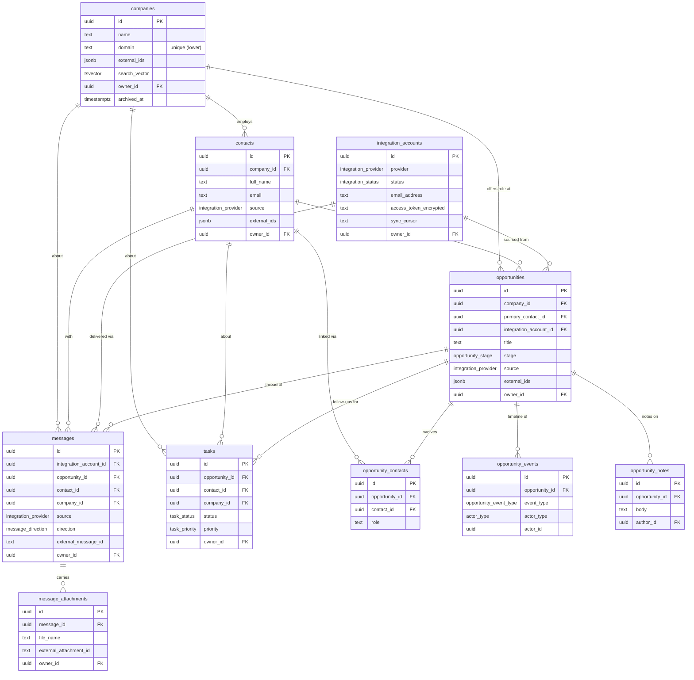

# Database Guide

Reference for the Career CRM database: schema, relationships, enums, indexes,
RLS, triggers, and the conventions every migration must follow.

- **Engine:** Postgres (Supabase)
- **Baseline:** `supabase/schema.sql` (inquiry system)
- **Career CRM foundation:** `supabase/migrations/20260726183601_career_crm_foundation.sql`
  (10 additive tables, applied to production)

> The CRM foundation is **additive** — it does not modify the inquiry tables,
> their triggers/policies, or the `search_inquiries` RPC.

---

## ER diagram

---

## Table descriptions

| Table | Description | Soft-delete |
|-------|-------------|:-----------:|
| `companies` | Organizations you pursue or interact with (employers, agencies, portals). Enrichment fields (`website`, `linkedin_url`, `careers_url`, `employee_range`, `headquarters`, `country`, `industry`, `logo_url`). | `archived_at` |
| `contacts` | People (recruiters, hiring managers, referrals, interviewers), optionally tied to a company. | `archived_at` |
| `integration_accounts` | Connected provider inboxes/APIs. Holds `provider`, `status`, encrypted tokens, `scopes`, and the incremental `sync_cursor`. Multi-account, multi-provider. | `archived_at` |
| `opportunities` | **Core entity** — one job pursuit/application. Pipeline `stage`, role attributes (`location_type`, `employment_type`, `seniority`, salary range), follow-up timing (`applied_at`, `next_action_at`). | `archived_at` |
| `opportunity_contacts` | Join table: which contacts are involved in an opportunity, and their `role`. | — (join) |
| `messages` | Normalized communications (email/LinkedIn/ATS). Direction, provider, threading, html/plain bodies, `is_read`, AI summary. | `archived_at` |
| `message_attachments` | Files carried by a message; deleted with the parent message. | `archived_at` |
| `opportunity_events` | Append-only timeline/audit trail per opportunity, with `actor_type` (user/agent/system). | — (append-only) |
| `opportunity_notes` | Free-form notes attached to an opportunity. | `archived_at` |
| `tasks` | Follow-ups / to-dos linked to an opportunity, contact, and/or company. Status, priority, due/complete timestamps, assignee. | `archived_at` |

Every table also carries: `id uuid PK`, `created_at`, `updated_at`, and a
nullable `owner_id → auth.users`.

---

## Relationship explanations

- **companies → contacts / opportunities (`ON DELETE SET NULL`).** Deleting a
  company never destroys its people or deals; it unlinks them, preserving history.
- **opportunities → primary_contact / integration_account (`SET NULL`).** A deal
  keeps existing if its primary contact or source account is removed.
- **opportunities ↔ contacts via `opportunity_contacts` (`CASCADE` both sides).**
  A pure join row is meaningless if either endpoint is gone, so it cascades.
  Uniqueness is enforced per `(opportunity_id, contact_id)`.
- **opportunities → events / notes / tasks (`CASCADE`).** These are children of a
  deal; removing the deal removes its timeline, notes, and follow-ups. (`tasks`
  cascade only on `opportunity_id`; their `contact_id`/`company_id` links
  `SET NULL`.)
- **messages → account / opportunity / contact / company (`SET NULL`).** Messages
  are historical records; they survive the deletion of anything they reference.
- **messages → message_attachments (`CASCADE`).** Attachments belong to a message.
- **owner_id / author_id / assignee_id → auth.users (`SET NULL`).** Removing a
  user never deletes their data; ownership simply nullifies.
- **actor_id (opportunity_events)** is intentionally **not** an FK — it is
  polymorphic (a user id *or* an agent id), disambiguated by `actor_type`.

---

## Enum documentation

Native Postgres enums are used for closed, stable domains (extend with
`ALTER TYPE ... ADD VALUE`, which is non-breaking). Open-ended, high-variance
sets (`seniority`, `work_authorization`, `application_method`, `role`) are
deliberately `text`.

| Enum | Values | Used by |
|------|--------|---------|
| `integration_provider` | gmail, linkedin, wellfound, greenhouse, lever, ashby, workday, indeed, company_portal, manual, other | `integration_accounts.provider`, `*.source` |
| `integration_status` | pending, connected, syncing, error, disconnected | `integration_accounts.status` |
| `message_direction` | inbound, outbound | `messages.direction` |
| `opportunity_stage` | lead, applied, screening, interview, offer, hired, rejected, withdrawn, on_hold | `opportunities.stage` |
| `employment_type` | full_time, part_time, contract, internship, temporary, freelance, other | `opportunities.employment_type` |
| `location_type` | remote, hybrid, onsite | `opportunities.location_type` |
| `task_status` | todo, in_progress, blocked, done, cancelled | `tasks.status` |
| `task_priority` | low, medium, high, urgent | `tasks.priority` |
| `actor_type` | user, agent, system | `opportunity_events.actor_type` |
| `opportunity_event_type` | created, stage_changed, archived, restored, message_received, message_sent, contact_linked, contact_unlinked, note_added, task_created, task_completed, interview_scheduled, document_added, custom | `opportunity_events.event_type` |

---

## Index strategy

60 explicit indexes (plus 10 implicit primary-key indexes).

- **Unique / partial (8)** — enforce dedup and idempotent ingestion, conditional
  on the relevant id being present:
  - `companies (lower(domain))`
  - `contacts (owner_id, lower(email))`
  - `integration_accounts (provider, external_account_id)` and
    `(owner_id, provider, lower(email_address))`
  - `opportunities (source, external_job_id)`
  - `opportunity_contacts (opportunity_id, contact_id)`
  - `messages (integration_account_id, external_message_id)` ← makes re-syncing safe
  - `message_attachments (message_id, external_attachment_id)`
- **GIN (7)** — `search_vector` full-text on companies/contacts/opportunities/
  messages, and `external_ids` on companies/contacts/opportunities (cross-source
  identity matching).
- **B-tree (45)** — every foreign key, plus filter/sort columns: `stage`,
  `status`, `direction`, `source`, `due_at`, `next_action_at`, `received_at`,
  `created_at`, `archived_at`, `employment_type`, `location_type`.

**Caveat:** the `owner_id`-scoped unique indexes only fully engage once rows
carry a non-null `owner_id` (Postgres treats NULLs as distinct). Fine for the
single-admin phase; revisit when multi-user lands.

---

## RLS strategy

- RLS is **enabled on every table**.
- Each table has one policy — `"Authenticated admin full access"` — allowing
  `FOR ALL` when `auth.role() = 'authenticated'`, with the same `WITH CHECK`.
- The **anon key can never** read or write any CRM table. The public contact
  form writes only to inquiries, via the **service role** (server-only, bypasses
  RLS).
- `owner_id` exists on every table so policies can later be narrowed to
  per-user (`owner_id = auth.uid()`) with **no schema change** — a Phase 5
  (Production Hardening) task.

---

## Trigger strategy

- A single shared function, `set_updated_at()` (defined in the baseline schema
  and re-declared idempotently in the migration), sets `NEW.updated_at = now()`.
- Every CRM table has a `BEFORE UPDATE` trigger bound to it, so `updated_at` is
  maintained by the database, not application code.
- No other triggers are defined in Phase 1 (event emission, denormalized
  counters, etc. are deferred to later phases).

---

## Naming conventions

- **Tables:** plural, `snake_case` (`opportunity_notes`).
- **Primary keys:** `id uuid` via `gen_random_uuid()`.
- **Foreign keys:** `<referenced_singular>_id` (`company_id`, `opportunity_id`).
- **Timestamps:** `*_at` (`created_at`, `updated_at`, `archived_at`, `applied_at`).
- **External identity:** typed `external_<thing>_id` for a primary provider id,
  plus `external_ids jsonb` (`{provider: id}`) for cross-provider matching.
- **AI provenance:** `ai_model`, `ai_prompt_version`, `ai_confidence`,
  `ai_processed_at`, and `ai_summary` where a summary applies.
- **Ownership:** nullable `owner_id`; user references (`author_id`, `assignee_id`)
  follow the same `*_id → auth.users` pattern.
- **Enums:** singular type names describing the domain (`opportunity_stage`).
- **Indexes:** `<table>_<columns>_idx`; unique indexes end in `_uniq`.

---

## Migration conventions

1. **Additive & idempotent.** Guard every statement: `create table if not exists`,
   `create index if not exists`, `do $$ ... if not exists ... $$` for enums,
   `drop ... if exists` before `create` for triggers/policies. Migrations must be
   safe to re-run.
2. **Never modify existing objects** in a foundation migration — no `ALTER`/`DROP`
   on inquiry tables or previously shipped CRM tables without an explicit,
   reviewed migration dedicated to that change.
3. **File naming:** `supabase/migrations/<UTC timestamp>_<slug>.sql`
   (`YYYYMMDDHHMMSS`).
4. **Apply out of band.** Run via the Supabase SQL Editor or CLI; Vercel does not
   run migrations. Because migrations are additive/idempotent, apply order
   relative to a deploy is not fragile.
5. **Verify after apply:** table/column existence (REST or SQL), and — where
   possible — object counts via `pg_tables` / `pg_type` / `pg_indexes` /
   `pg_trigger` / `pg_policies`.
6. **Enums evolve forward** with `ALTER TYPE ... ADD VALUE`; do not attempt to
   remove or renumber enum values in place.

---

*For the applied SQL, see
`supabase/migrations/20260726183601_career_crm_foundation.sql`. For system-level
context, see [`../architecture/SYSTEM_ARCHITECTURE.md`](../architecture/SYSTEM_ARCHITECTURE.md).*
