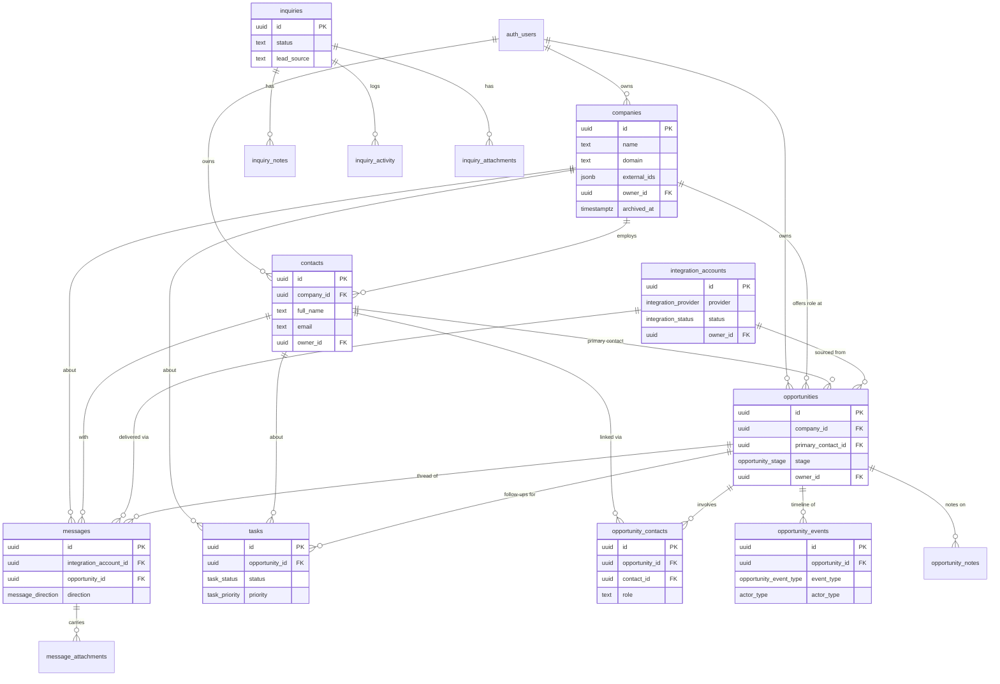
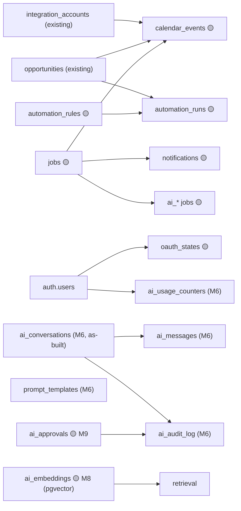

# Schema Reference

The canonical database reference for the entire Career CRM — every **existing**
table (baseline inquiry system + Phase 1 CRM foundation) and every **planned /
future** table (Phase 3 integrations, AI, automation, notifications, calendar,
jobs). For conventions and the migration playbook see the
[Database Guide](./DATABASE_GUIDE.md).

**Related:** [Phase 3 Architecture](../architecture/PHASE_3_ARCHITECTURE.md) ·
[Phase 3 Implementation Guide](../architecture/PHASE_3_IMPLEMENTATION_GUIDE.md) ·
[Events](../architecture/EVENTS.md) ·
[API Reference](../architecture/API_REFERENCE.md) ·
[Runbook](../operations/RUNBOOK.md) ·
[ADRs](../architecture/decisions/README.md)

> **Status legend:** 🟢 **Existing** (in production at v1.0.0) · 🟡 **Planned
> (Phase 3)** — designed, migration lands with its milestone · ⚪ **Future** —
> candidate beyond Phase 3, not yet designed in detail.

---

## 0. Global Conventions

Applied to **every** table (exceptions noted per-table). See
[Database Guide](./DATABASE_GUIDE.md) · [ADR-008](../architecture/decisions/ADR-008-additive-schema-and-rls.md).

- **Primary key:** `id uuid` via `gen_random_uuid()`.
- **Audit columns:** `created_at`, `updated_at` (`timestamptz not null default now()`);
  `updated_at` maintained by the shared **`set_updated_at()`** `BEFORE UPDATE` trigger.
- **Ownership:** nullable `owner_id → auth.users(id) ON DELETE SET NULL`.
- **RLS (standard):** enabled; one policy **`"Authenticated admin full access"`**
  (`auth.role() = 'authenticated'` for `USING` + `WITH CHECK`). The anon key can
  never read/write. Service-role bypasses RLS and is used **only** by the public
  contact intake.
- **Soft delete:** `archived_at timestamptz` where appropriate (entity tables);
  join/append-only tables omit it.
- **Migrations:** additive + idempotent, one file per change (`YYYYMMDDHHMMSS_slug.sql`),
  applied out-of-band. Existing tables are never altered.

**Legend shorthand in cards:** "RLS: standard" = the policy above; "Trigger:
updated_at" = the shared trigger; "Soft delete: `archived_at`" = the standard
soft-delete column.

---

## 1. ER Diagram

### Existing entities (🟢)

### Planned Phase 3 additions (🟡)

---

## 2. Enum Reference (🟢 existing)

Native Postgres enums (extend via `ALTER TYPE … ADD VALUE`). Defined in the Phase 1 migration.

| Enum | Values | Used by |
|------|--------|---------|
| `integration_provider` | gmail, linkedin, wellfound, greenhouse, lever, ashby, workday, indeed, company_portal, manual, other | `integration_accounts.provider`, `*.source` |
| `integration_status` | pending, connected, syncing, error, disconnected | `integration_accounts.status` |
| `message_direction` | inbound, outbound | `messages.direction` |
| `opportunity_stage` | lead, applied, screening, interview, offer, hired, rejected, withdrawn, on_hold | `opportunities.stage` |
| `employment_type` | full_time, part_time, contract, internship, temporary, freelance, other | `opportunities.employment_type` |
| `location_type` | remote, hybrid, onsite | `opportunities.location_type` |
| `task_status` | todo, in_progress, blocked, done, cancelled | `tasks.status` |
| `task_priority` | low, medium, high, urgent | `tasks.priority` |
| `actor_type` | user, agent, system | `opportunity_events.actor_type` |
| `opportunity_event_type` | created, stage_changed, archived, restored, message_received, message_sent, contact_linked, contact_unlinked, note_added, task_created, task_completed, interview_scheduled, document_added, custom | `opportunity_events.event_type` |

---

## 3. Authentication Tables

### `auth.users` 🟢 (managed by Supabase Auth)
- **Purpose:** identity/session store for the admin(s). **Status:** 🟢 Existing (managed — not defined by our migrations). **Owner module:** Auth (platform).
- **PK:** `id uuid`. **FKs:** referenced by every `owner_id`/`author_id`/`assignee_id`/`actor_id`. **Relationships:** 1→N to all owned rows.
- **Important columns:** `id`, `email`, `email_confirmed_at`, `last_sign_in_at`, `user_metadata`.
- **Indexes / Constraints:** managed by Supabase. **RLS:** Supabase-managed (`auth` schema, not exposed via PostgREST).
- **Soft delete:** n/a (delete → dependents `SET NULL`). **Audit:** Supabase auth logs. **Triggers:** managed.
- **Events produced:** none in-app (sign-in/out handled by Auth). **Events consumed:** none.
- **Typical queries:** `supabase.auth.getUser()`; allowlist check `isAdminEmail(user.email)`.
- **Performance notes:** not queried in hot paths. **Migration history:** provisioned by Supabase. **Future:** multi-user roles/teams (Phase 5 · Production Hardening).

> **Authorization model:** single-admin — any authenticated user is admin (RLS
> `auth.role()='authenticated'`). The **allowlist** (`lib/auth/adminEmail.ts`) is
> the real boundary, gating signup ([API Reference](../architecture/API_REFERENCE.md#22-post-apiauthsignup--public-allowlist-gated)).

---

## 4. CRM Tables

### 4a. Inquiry system (🟢 legacy — Phase 0, frozen)

#### `inquiries` 🟢
- **Purpose:** contact-form submissions & manually-added leads. **Owner module:** Inquiry.
- **PK:** `id`. **FKs:** none. **Relationships:** 1→N `inquiry_notes`, `inquiry_activity`, `inquiry_attachments`.
- **Important columns:** `name`, `email`, `organization`, `message`, `status` (CHECK), `lead_source` (CHECK). *(Uses `text + CHECK`, predating native enums.)*
- **Indexes:** `created_at desc`, `status`, `email`. **Constraints:** `status`/`lead_source` CHECK lists.
- **RLS:** standard. **Soft delete:** none (hard delete / `status`). **Audit:** `inquiry_activity` + `updated_at` trigger. **Triggers:** `set_updated_at`.
- **Events produced:** `inquiry.created/status_changed/lead_source_changed/note_added` (recorded in `inquiry_activity`). **Events consumed:** none.
- **Typical queries:** `search_inquiries` RPC (FTS-ish over inquiries+notes), list/filter, CSV export.
- **Performance:** small volume; ilike search. **Migration:** `supabase/schema.sql` (baseline). **Future:** frozen; would migrate to Server-Action pattern if unfrozen ([API Reference](../architecture/API_REFERENCE.md)).

#### `inquiry_notes` 🟢
- **Purpose:** admin-only internal notes on an inquiry. **PK:** `id`. **FKs:** `inquiry_id → inquiries ON DELETE CASCADE`.
- **Important columns:** `body`, `created_at`. **Indexes:** `inquiry_id`. **RLS:** standard. **Soft delete:** none. **Audit:** append. **Triggers:** none.
- **Events produced/consumed:** produced `inquiry.note_added` (via activity); none consumed. **Typical queries:** notes for an inquiry. **Performance:** trivial. **Migration:** baseline. **Future:** —.

#### `inquiry_activity` 🟢
- **Purpose:** append-only audit trail per inquiry. **PK:** `id`. **FKs:** `inquiry_id → inquiries CASCADE`.
- **Important columns:** `event_type` (CHECK), `detail`. **Indexes:** `inquiry_id`. **RLS:** standard. **Soft delete:** none (append-only). **Audit:** is the audit log. **Triggers:** none.
- **Events produced:** none (it *is* the record). **Events consumed:** inquiry mutations. **Typical queries:** timeline for an inquiry. **Migration:** baseline. **Future:** generalize into a global `activity_log` (⚪).

#### `inquiry_attachments` 🟢 (prepared, unused)
- **Purpose:** schema prepared for future inquiry attachments; not wired to any API/UI. **PK:** `id`. **FKs:** `inquiry_id → inquiries CASCADE`.
- **Important columns:** `file_name`, `file_url`, `file_size_bytes`. **Indexes:** FK only. **RLS:** standard. **Soft delete:** none. **Triggers:** none.
- **Events:** none. **Typical queries:** none yet. **Migration:** baseline. **Future:** blob storage wiring.

### 4b. CRM core (🟢 Phase 1)

#### `companies` 🟢
- **Purpose:** organizations pursued/interacted with. **Owner module:** Companies.
- **PK:** `id`. **FKs:** `owner_id → auth.users SET NULL`. **Relationships:** 1→N contacts, opportunities, messages, tasks (all `SET NULL`).
- **Important columns:** `name` (req), `domain`, `website`, `linkedin_url`, `careers_url`, `industry`, `employee_range`, `headquarters`, `country`, `external_ids jsonb`, `ai_* `, `search_vector` (generated).
- **Indexes:** **unique** `lower(domain)` (partial); btree `owner_id`, `lower(name)`, `created_at desc`, `archived_at`; **gin** `external_ids`, `search_vector`.
- **Constraints:** domain dedupe (owner-agnostic). **RLS:** standard. **Soft delete:** `archived_at`. **Audit:** `updated_at` trigger (no per-company event log). **Triggers:** `set_updated_at`.
- **Events produced:** `company.created/updated/archived/restored` (🟡 P3 bus). **Events consumed:** none.
- **Typical queries:** FTS list + industry/country filters + sort + pagination; `getCompany`; relation counts; domain dedupe.
- **Performance:** FTS via `search_vector` GIN; facet queries capped. **Migration:** `20260726183601_career_crm_foundation`. **Future:** AI enrichment (Research Agent) via `ai_*`/`external_ids`.

#### `contacts` 🟢
- **Purpose:** people (recruiters, hiring managers, referrals). **Owner module:** Contacts.
- **PK:** `id`. **FKs:** `company_id → companies SET NULL`, `owner_id → auth.users SET NULL`. **Relationships:** N→1 company; M:N opportunities via `opportunity_contacts`; 1→N messages, tasks.
- **Important columns:** `full_name` (req), `email`, `phone`, `title`, `department`, `linkedin_url`, `timezone`, `source`, `external_ids`, `ai_*`, `search_vector`.
- **Indexes:** **unique** `(owner_id, lower(email))` (partial); btree `company_id`, `owner_id`, `lower(email)`, `lower(full_name)`, `created_at desc`; **gin** `external_ids`, `search_vector`.
- **Constraints:** owner-scoped email dedupe (dormant while `owner_id` null). **RLS:** standard. **Soft delete:** `archived_at`. **Audit/Triggers:** `updated_at`.
- **Events produced:** `contact.created/updated/archived/restored` (🟡). **Consumed:** none.
- **Typical queries:** FTS list (+company join) + company/source filters; `getContact` (company join); active-contact search for pickers.
- **Performance:** FTS GIN; join to companies. **Migration:** Phase 1. **Future:** enrichment; vCard/CSV import (⚪).

#### `opportunities` 🟢 (core entity)
- **Purpose:** one job pursuit/application — the pipeline core. **Owner module:** Opportunities.
- **PK:** `id`. **FKs:** `company_id`, `primary_contact_id`, `integration_account_id` (all `SET NULL`), `owner_id`. **Relationships:** 1→N opportunity_contacts/notes/events/tasks (CASCADE for contacts/notes/events; tasks CASCADE on opp), 1→N messages (SET NULL).
- **Important columns:** `title` (req), `stage` (enum), `source`, `external_job_id`, `external_ids`, `location_type`, `employment_type`, `seniority`, `work_authorization`, `application_method`, `salary_min/max`, `applied_at`, `next_action_at`, `ai_summary`, `ai_*`, `search_vector`.
- **Indexes:** **unique** `(source, external_job_id)` (partial); btree company/primary_contact/integration_acct/owner/`stage`/`employment_type`/`location_type`/`next_action_at`/`created_at desc`/`archived_at`; **gin** `external_ids`, `search_vector`.
- **Constraints:** provider job dedupe. **RLS:** standard. **Soft delete:** `archived_at`. **Audit:** **`opportunity_events`** (rich timeline) + `updated_at`. **Triggers:** `set_updated_at`.
- **Events produced:** `opportunity.created/stage_changed/archived/restored/note_added/contact_linked/contact_unlinked` (🟢 today) + reserved message/task/interview (🟡). **Consumed:** none.
- **Typical queries:** FTS list + stage/company/source filters + sort + pagination; pipeline (grouped by stage); `getOpportunity` (deep joins).
- **Performance:** stage/next_action indexes drive board + dashboard; board capped at 500. **Migration:** Phase 1. **Future:** cohort funnel from events; AI agents.

#### `opportunity_contacts` 🟢 (join)
- **Purpose:** M:N opportunity↔contact with a per-deal `role`. **Owner module:** Opportunities.
- **PK:** `id`. **FKs:** `opportunity_id → opportunities CASCADE`, `contact_id → contacts CASCADE`, `owner_id`. **Relationships:** the join itself.
- **Important columns:** `role`, `metadata`. **Indexes:** **unique** `(opportunity_id, contact_id)`; btree `contact_id`.
- **Constraints:** one link per pair. **RLS:** standard. **Soft delete:** **none** (join). **Audit:** parent `opportunity_events` (`contact_linked/unlinked`). **Triggers:** `updated_at`.
- **Events produced:** via parent (`opportunity.contact_linked/unlinked`). **Consumed:** none. **Typical queries:** contacts for an opportunity (contact join). **Performance:** trivial. **Migration:** Phase 1. **Future:** richer roles/enum.

#### `opportunity_notes` 🟢
- **Purpose:** free-form notes on an opportunity. **Owner module:** Opportunities.
- **PK:** `id`. **FKs:** `opportunity_id → opportunities CASCADE`, `author_id`, `owner_id`. **Important columns:** `body` (req), `metadata` (AI provenance for drafted notes).
- **Indexes:** `opportunity_id`, `created_at desc`. **RLS:** standard. **Soft delete:** `archived_at`. **Audit:** parent `opportunity_events` (`note_added`). **Triggers:** `updated_at`.
- **Events produced:** `opportunity.note_added`. **Consumed:** none. **Typical queries:** notes for an opportunity (desc). **Migration:** Phase 1. **Future:** AI-drafted notes; markdown.

#### `tasks` 🟢
- **Purpose:** follow-ups/to-dos linked to opp/contact/company. **Owner module:** Tasks.
- **PK:** `id`. **FKs:** `opportunity_id → opportunities CASCADE`, `contact_id`/`company_id` (`SET NULL`), `assignee_id`/`owner_id → auth.users`. **Relationships:** N→1 to opp/contact/company.
- **Important columns:** `title` (req), `description`, `status` (enum), `priority` (enum), `due_at`, `completed_at`, `assignee_id`, `ai_*`, `metadata`. *(No `search_vector` — ilike search.)*
- **Indexes:** btree `opportunity_id`, `contact_id`, `company_id`, `assignee_id`, `owner_id`, `status`, `due_at`.
- **Constraints:** enum-bounded status/priority. **RLS:** standard. **Soft delete:** `archived_at`. **Audit/Triggers:** `updated_at`.
- **Events produced:** `task.created/updated/status_changed/completed/overdue/archived/restored` (🟡); linked-opp tasks also emit `opportunity.task_created/completed` (🟡). **Consumed:** schedules (overdue).
- **Typical queries:** ilike search + status/priority/overdue filters + sort; status board; overdue (`due_at < now` & open).
- **Performance:** `status`/`due_at` indexes drive board + dashboard buckets. **Migration:** Phase 1. **Future:** recurring tasks; AI-suggested; calendar surface.

---

## 5. Opportunity Events

### `opportunity_events` 🟢 (append-only audit/timeline)
- **Purpose:** durable audit trail + timeline per opportunity; supports user/agent/system actors. **Owner module:** Opportunities (shared audit sink).
- **PK:** `id`. **FKs:** `opportunity_id → opportunities CASCADE`, `owner_id`. `actor_id` is **polymorphic (no FK)** — user or agent id. **Relationships:** N→1 opportunity.
- **Important columns:** `event_type` (enum), `actor_type` (enum, default `user`), `actor_id`, `detail`, `metadata jsonb`.
- **Indexes:** `opportunity_id`, `event_type`, `created_at desc`. **Constraints:** enum `event_type`/`actor_type`. **RLS:** standard.
- **Soft delete:** **none** (append-only). **Audit:** it *is* the audit log. **Triggers:** `updated_at` (rows rarely updated).
- **Events produced:** none (it records them). **Events consumed:** **all opportunity domain events** — the persist sink for `opportunity.*` (see [Events](../architecture/EVENTS.md#4-opportunity-events)).
- **Typical queries:** timeline for an opportunity (desc, limit); dashboard recent-activity feed (global desc, limit); Analytics `stage_changed` history.
- **Performance:** `created_at desc` index for feed; grows unbounded (append) — consider partitioning/retention at scale. **Migration:** Phase 1. **Future:** cohort-funnel analytics; agent-event styling; a generalized `activity_log` for all entities (⚪).

---

## 6. Integration Tables

### `integration_accounts` 🟢 (connections) / evolves in Phase 3
- **Purpose:** connected provider inboxes/APIs (Gmail now; multi-account, multi-provider). **Owner module:** Integrations/Settings.
- **PK:** `id`. **FKs:** `owner_id`. **Relationships:** 1→N messages, opportunities (`SET NULL`), calendar_events (🟡).
- **Important columns:** `provider` (enum), `external_account_id`, `email_address`, `status` (enum), `scopes text[]`, **`access_token_encrypted`**, **`refresh_token_encrypted`**, `token_expires_at`, `sync_cursor` (Gmail `historyId`), `last_synced_at`, `last_error`, `metadata`.
- **Indexes:** **unique** `(provider, external_account_id)` (partial), `(owner_id, provider, lower(email_address))` (partial); btree `owner_id`, `provider`, `status`.
- **Constraints:** account dedupe per provider/owner. **RLS:** standard. **Soft delete:** `archived_at` (disconnect). **Audit/Triggers:** `updated_at`; `status`/`last_error` track health.
- **Events produced:** connection lifecycle (🟡). **Events consumed:** OAuth callback (M2), sync jobs.
- **Typical queries:** list active accounts (Settings); pick account for sync; check `status`.
- **Performance:** small. **Security:** **tokens must be encrypted** (Vault/pgsodium; ADR-004) — never plaintext. **Migration:** Phase 1 (columns present); Phase 3 may add columns additively (`granted_scopes`, `watch_expiry`). **Future:** additional providers (⚪, ADR-007).

### `messages` 🟢 (schema) / populated in Phase 3
- **Purpose:** normalized comms (email/LinkedIn/ATS), source-agnostic. **Owner module:** Messages.
- **PK:** `id`. **FKs:** `integration_account_id`, `opportunity_id`, `contact_id`, `company_id` (all `SET NULL`), `owner_id`. **Relationships:** 1→N `message_attachments` (CASCADE).
- **Important columns:** `source` (enum, default gmail), `direction` (enum), `external_message_id`, `thread_id`, `in_reply_to`, `subject`, `snippet`, `body_text`, `body_html`, `from_*`, `to_addresses[]`, `cc_addresses[]`, `is_read`, `sent_at`, `received_at`, `ai_summary`, `ai_*`, `search_vector`.
- **Indexes:** **unique** `(integration_account_id, external_message_id)` (partial — **idempotent ingest**); btree opportunity/contact/company/integration_acct/`thread_id`/`source`/`direction`/`received_at desc`/`owner_id`; **gin** `search_vector`.
- **Constraints:** provider-message dedupe. **RLS:** standard. **Soft delete:** `archived_at`. **Audit/Triggers:** `updated_at`.
- **Events produced:** `message.received/sent/read/linked/archived` (🟡); linked → `opportunity.message_received/sent` (🟡). **Consumed:** Gmail sync (produces rows); AI summarize.
- **Typical queries:** FTS inbox + direction/source/unread/unlinked filters; thread (`thread_id`); `getMessage` (joins + attachments). **Security:** `body_html` **sanitized server-side** before render (ADR-011).
- **Performance:** highest-volume table; `received_at desc` for inbox; offset pagination today (keyset a future optimization). **Migration:** Phase 1. **Future:** real-time push; attachment blobs.

### `message_attachments` 🟢 (schema) / populated in Phase 3
- **Purpose:** files carried by a message; scale independently of message rows. **Owner module:** Messages.
- **PK:** `id`. **FKs:** `message_id → messages CASCADE`, `owner_id`. **Important columns:** `file_name` (req), `file_url`, `mime_type`, `file_size_bytes bigint`, `is_inline`, `external_attachment_id`, `metadata`.
- **Indexes:** **unique** `(message_id, external_attachment_id)` (partial); btree `message_id`. **RLS:** standard. **Soft delete:** `archived_at`. **Triggers:** `updated_at`.
- **Events produced:** none direct. **Consumed:** Gmail sync (attachment metadata). **Typical queries:** attachments for a message. **Migration:** Phase 1. **Future:** Supabase Storage blob refs.

### `oauth_states` 🟡 (Phase 3 · M2)
- **Purpose:** short-lived OAuth CSRF state + PKCE verifier (or replace with a signed cookie). **Owner module:** Integrations.
- **PK:** `id`. **FKs:** `owner_id`. **Important columns:** `state` (unique), `code_verifier`, `redirect_to`, `expires_at`.
- **Indexes:** unique `state`, `expires_at`. **Constraints:** state uniqueness. **RLS:** standard. **Soft delete:** none (TTL/expire). **Triggers:** `updated_at`.
- **Events produced/consumed:** none / OAuth connect+callback. **Typical queries:** validate state on callback; purge expired. **Performance:** tiny; prune job. **Migration:** M2 additive. **Future:** — (may become a cookie-only impl).

---

## 7. AI Tables (Phase 3 · M6–M9)

Full internals in [AI Architecture](../ai/AI_ARCHITECTURE.md). All standard
conventions; provenance columns (`ai_model`/`ai_prompt_version`/`ai_confidence`/
`ai_processed_at`) reuse existing entity columns where the output lands on an
entity (no new columns needed there).

> **Status split.** The five M6 tables below are **as-built** — documented from
> `supabase/migrations/20260731090000_ai_foundation.sql`, implemented on
> `feat/phase3-m6-ai-foundation`, **not yet applied to any database**. The M8/M9
> rows remain 🟡 design-only.

### 7a. M6 — AI Foundation (as-built)

| Table | Purpose | PK / key FKs | Notable columns | Indexes | RLS | Soft delete |
|-------|---------|--------------|-----------------|---------|-----|-------------|
| `ai_conversations` | Multi-turn run container | `id`; `owner_id → auth.users SET NULL`; poly `entity_type` + `entity_id` | `subject`, `status` (default `active`), `metadata jsonb` | `(owner_id, created_at desc)`, `(entity_type, entity_id)` | standard | `archived_at` |
| `ai_messages` | Individual turns | `id`; `conversation_id → ai_conversations CASCADE`; `owner_id` | `role`, `content`, `tool_calls jsonb`, `input_tokens`, `output_tokens`, `ai_provider`, `ai_model`, `ai_prompt_version`, `metadata jsonb` | `(conversation_id, created_at)`, `(owner_id)` | standard | none (append) |
| `ai_audit_log` | One row per provider call | `id`; `conversation_id → ai_conversations SET NULL`; `owner_id` | `actor`, `action`, `ai_provider`, `ai_model`, `ai_prompt_version`, `input_tokens`, `output_tokens`, `cached_input_tokens`, `cost_micros`, `latency_ms`, `outcome`, `error_code`, `job_id` | `(owner_id, created_at desc)`, `(created_at desc)`, `(outcome)` | standard | none (append) |
| `prompt_templates` | Runtime mirror / A-B surface | `id`; `owner_id` | `template_id`, `version`, `body`, `task_class`, `is_active`, `metadata jsonb` | **unique** `(template_id, version)`, `(is_active)` | standard | none |
| `ai_usage_counters` | Atomic daily budget ledger | `id`; `owner_id → auth.users **CASCADE**` | `usage_date`, `tokens_reserved`, `tokens_used`, `cost_micros bigint`, `request_count` | **unique** `(owner_id, usage_date)` | standard | none |

**Notes that differ from the original design and matter when reading the code:**

- **`ai_usage_counters` is an addition beyond the design's four tables** (approved
  as decision D2). Budget enforcement must be atomic: aggregating `ai_audit_log`
  is racy — two concurrent calls both read the pre-spend total and both proceed —
  and its scan cost grows with every call ever made. A counter row makes the check
  a single indexed conditional `UPDATE`: correct under concurrency, O(1), and safe
  under PgBouncer transaction pooling (the constraint that also shaped
  `claim_jobs`).
- **`ai_provider` is a first-class column** on `ai_messages` and `ai_audit_log`.
  Together with `ai_model` it is **opaque provenance** — recorded, never branched
  on. This is what lets the provider be swapped with no migration.
- **`cost_micros`** is millionths of a USD. `bigint` on the ledger, `integer` on
  the audit row (a single call cannot approach the `int4` ceiling).
- **`outcome`** is one of `success` / `refused` / `truncated` / `error` —
  refusal and truncation are recorded distinctly so a partial reply is never
  mistaken for a successful one.
- **`prompt_templates` ships unread.** M6 resolves templates from the repo
  (`lib/ai/prompts/`) so they stay reviewable and diffable; the table is the
  future runtime-override surface.

#### Functions

| Function | Security | Purpose |
|---|---|---|
| `ai_reserve_budget(p_owner_id uuid, p_tokens integer, p_limit integer) → boolean` | `SECURITY DEFINER`, `search_path = public, pg_temp`; **revoked from `public`**, granted to `authenticated` + `service_role` | Atomically reserve tokens or refuse. One statement, both branches guarded: the `INSERT` (first call of the day) refuses when a single request alone exceeds the limit; the `ON CONFLICT DO UPDATE` refuses when it would push the running total past it. **No rows returned = refused** (the caller treats `NULL` as denial). `p_limit IS NULL` means unlimited. |
| `ai_commit_budget(p_owner_id uuid, p_estimate integer, p_actual integer, p_cost_micros bigint) → void` | same | Reconcile a reservation to measured usage: `tokens_reserved = greatest(0, reserved - estimate + actual)`, accumulate `tokens_used` and `cost_micros`. |

> **Why the explicit `REVOKE`:** Postgres grants `EXECUTE` on new functions to
> `PUBLIC`. Without the revoke, a `SECURITY DEFINER` budget function is callable
> by the `anon` role over PostgREST — an unauthenticated caller could inflate any
> owner's counters and disable the AI layer. This mirrors the existing
> `claim_jobs` / `enqueue_job` grants from M1.

**Budget lifecycle:** reserve an estimate → call → reconcile to actual. If the
commit never lands (crash, or a DB failure after a successful provider call) the
reservation stands. That over-counts the day's usage, which is the safe direction:
the budget can under-spend, never over-spend.

### 7b. M8/M9 — design only 🟡

| Table | Status | Purpose | Notable columns | Indexes | Migration |
|-------|:------:|---------|-----------------|---------|-----------|
| `ai_embeddings` | 🟡 M8 | Semantic vectors (**pgvector**) | `entity_type`, `entity_id`, `chunk`, `embedding vector`, `ai_model` | vector (IVFFlat/HNSW), `(entity_type, entity_id)` | M8 |
| `ai_approvals` | 🟡 M9 | Human-in-the-loop gate | `agent`, `action_type`, `proposed_payload jsonb`, `rationale`, `ai_confidence`, `status`, `decided_by`, `decided_at` | `(status)`, `(entity_type, entity_id)` | M9 |

`ai_approvals` was **deferred from M6 to M9** (decision D4): M6 registers no
`write`/`external` tools, so an approvals queue would have had no producers. The
policy that refuses unapproved execution ships in M6; the queue that satisfies it
ships in M9.

- **Audit strategy:** AI writes stamp `ai_*`; opportunity-affecting actions also write `opportunity_events` (`actor_type='agent'`). **Triggers:** `updated_at` on every table above.
- **Typical queries:** conversation history (`(conversation_id, created_at)`); today's ledger (`(owner_id, usage_date)`); failure count (`(outcome)`); hybrid retrieval, M8.
- **Performance:** budget check is one indexed statement; vector index sizing is an M8 concern. **Future:** the nine specialized agents ([AI Architecture](../ai/AI_ARCHITECTURE.md#future-agents)); `ai_profiles` (resume, ⚪).
- **Cross-ref:** [ADR-006 approval gating](../architecture/decisions/ADR-006-ai-approval.md) · [Security §9](../SECURITY.md).

---

## 8. Automation Tables 🟡 (Phase 3 · M10)

| Table | Status | Purpose | PK / FKs | Notable columns | Indexes | RLS | Soft delete | Events produced | Consumed | Migration |
|-------|:------:|---------|----------|-----------------|---------|-----|-------------|-----------------|----------|-----------|
| `automation_rules` | 🟡 M10 | User rules (trigger→cond→action) | `id`; `owner_id` | `name`, `trigger jsonb`, `conditions jsonb`, `actions jsonb`, `enabled` | `(enabled)`, `(owner_id)` | standard | `archived_at` | — | engine reads | M10 |
| `automation_runs` | 🟡 M10 | Per-trigger run audit | `id`; `rule_id → automation_rules CASCADE` | `trigger_ref`, `status`, `result jsonb`, `error` | `(rule_id)`, `(created_at desc)` | standard | none (append) | `automation.run_*`, `action_executed` | engine writes | M10 |

- **Audit:** every run recorded in `automation_runs`; entity-affecting actions also write `opportunity_events` (`actor_type='agent'`). **Triggers:** `updated_at` on `automation_rules`.
- **Events consumed:** domain events (as triggers) + schedules; **produced:** `automation.*` (see [Events §11](../architecture/EVENTS.md)).
- **Rule DSL:** the `trigger`/`conditions`/`actions` JSON schema + validation rules are specified in [Phase 3 Architecture §14.1](../architecture/PHASE_3_ARCHITECTURE.md#141-automation-rule-schema-dsl).
- **Typical queries:** enabled rules for a trigger type; run history for a rule. **Performance:** loop guards / run caps prevent cascades. **Future:** branching workflows (Inngest/WDK, ⚪). **Cross-ref:** [ADR-005 jobs](../architecture/decisions/ADR-005-background-jobs.md).

---

## 9. Notification Tables 🟡 (Phase 3 · M5)

### `notifications` 🟡
- **Purpose:** in-app + email notifications for operational events. **Owner module:** Notifications.
- **PK:** `id`. **FKs:** `owner_id`. **Relationships:** references any entity via `entity_type`/`entity_id`.
- **Important columns:** `type`, `title`, `body`, `entity_type`, `entity_id`, `read_at`, `metadata` (channel/status).
- **Indexes:** `(owner_id, read_at)`, `(created_at desc)`. **Constraints:** —. **RLS:** standard. **Soft delete:** none (read/expire). **Audit:** row is the record. **Triggers:** `updated_at`.
- **Events produced:** `notification.created/dispatched/read` (🟡). **Consumed:** other domain events (message/task/stage/approval) via the dispatcher.
- **Typical queries:** unread for owner (bell); mark read/all read. **Performance:** `(owner_id, read_at)` index. **Migration:** M5 additive. **Future:** digests, push/mobile, per-channel prefs. **Cross-ref:** [Events §10](../architecture/EVENTS.md).

---

## 10. Calendar Tables 🟡 (Phase 3 · M4)

### `calendar_events` 🟡
- **Purpose:** synced Google Calendar events; created interview events. **Owner module:** Calendar.
- **PK:** `id`. **FKs:** `integration_account_id → integration_accounts SET NULL`, `opportunity_id → opportunities SET NULL`, `owner_id`. **Relationships:** N→1 account/opportunity.
- **Important columns:** `external_event_id`, `calendar_id`, `title`, `starts_at`, `ends_at`, `location`, `attendees jsonb`, `external_ids`, `metadata`.
- **Indexes:** **unique** `(integration_account_id, external_event_id)` (partial — idempotent); btree `starts_at`, `opportunity_id`. **Constraints:** event dedupe. **RLS:** standard. **Soft delete:** `archived_at` (or cancelled flag). **Triggers:** `updated_at`.
- **Events produced:** `calendar.event_synced/created/updated/cancelled` (🟡); interview creation → `opportunity.interview_scheduled` (🟡). **Consumed:** calendar sync.
- **Typical queries:** upcoming events; events for an opportunity; upsert by `external_event_id`. **Performance:** `starts_at` for agenda views; `syncToken` minimizes API calls. **Migration:** M4 additive. **Future:** two-way sync; recurring events. **Cross-ref:** [Events §9](../architecture/EVENTS.md).

---

## 11. Jobs Tables 🟡 (Phase 3 · M1)

### `jobs` 🟡 (durable queue)
- **Purpose:** durable async work queue drained by Vercel Cron. **Owner module:** Platform (jobs). See [ADR-005](../architecture/decisions/ADR-005-background-jobs.md).
- **PK:** `id`. **FKs:** `owner_id` (nullable; system jobs). **Relationships:** references entities via `payload`.
- **Important columns:** `type`, `payload jsonb`, `status` (pending/running/done/failed), `attempts`, `max_attempts`, `run_after`, `locked_at`, `last_error`, `idempotency_key`.
- **Indexes:** `(status, run_after)` (claim), `(type)`; **unique** `idempotency_key` (partial). **Constraints:** idempotency. **RLS:** standard (admin visibility); the drainer runs as a system endpoint (cron secret, not session).
- **Soft delete:** none (retain done/failed for observability; prune old). **Audit:** `last_error`, status transitions. **Triggers:** `updated_at`.
- **Events produced:** none itself. **Consumed:** enqueued from domain events; dispatches to handlers (sync/summarize/embed/dispatch/automation).
- **Typical queries:** claim batch (`status='pending' AND run_after<=now()` `FOR UPDATE SKIP LOCKED`); dead-letter list; stuck-lease reset (Runbook §6/§8).
- **Performance:** `(status, run_after)` index is the hot path; bounded batches; chunked jobs. **Migration:** M1 additive. **Future:** swap backend (Inngest/WDK) behind `lib/jobs` (⚪). **Cross-ref:** [Runbook · Jobs/Cron/Queue](../operations/RUNBOOK.md).

---

## 12. Future Provider-Abstraction Tables ⚪

**Deliberately table-light.** The provider model (ADR-007) needs **no new tables**
for additional providers: rows carry `source` (enum), `integration_account_id`,
typed `external_*_id`, and `external_ids jsonb`; a new provider is an **adapter +
enum value**, not a schema change. Candidate ⚪ tables *if* future needs arise:

| Table ⚪ | Purpose | Notes |
|----------|---------|-------|
| `activity_log` | Generic domain-event store for a global cross-entity feed | Generalizes `opportunity_events`/`inquiry_activity` beyond opportunities |
| `ai_profiles` | Structured resume/candidate profile (Resume Agent) | Feeds matching; provenance via `ai_*` |
| `webhook_subscriptions` | Outbound event delivery to third parties | For an eventing API to external tools |
| `provider_sync_state` | Extracted per-account sync cursors/watch expiry | Only if `integration_accounts` columns become insufficient |
| `attachment_blobs` | Blob storage references for message/inquiry attachments | Supabase Storage integration |

All would follow the standard conventions (§0) and land as additive migrations.

---

## Cross-References

- [Phase 3 Architecture](../architecture/PHASE_3_ARCHITECTURE.md) · [Implementation Guide](../architecture/PHASE_3_IMPLEMENTATION_GUIDE.md) — planned tables + rollout
- [Events](../architecture/EVENTS.md) — events each table produces/consumes
- [API Reference](../architecture/API_REFERENCE.md) — endpoints/actions that read/write these tables
- [Runbook](../operations/RUNBOOK.md) — jobs/queue/backup/recovery operations
- [Database Guide](./DATABASE_GUIDE.md) — conventions + migration rules
- ADRs: [002 Supabase](../architecture/decisions/ADR-002-supabase-backend.md) · [003 Events](../architecture/decisions/ADR-003-event-architecture.md) · [004 OAuth](../architecture/decisions/ADR-004-oauth.md) · [005 Jobs](../architecture/decisions/ADR-005-background-jobs.md) · [006 AI approval](../architecture/decisions/ADR-006-ai-approval.md) · [007 Provider abstraction](../architecture/decisions/ADR-007-provider-abstraction.md) · [008 Additive schema + RLS](../architecture/decisions/ADR-008-additive-schema-and-rls.md)

---

## Document Control

- **Version:** 1.1
- **Owner:** Repository maintainer (Shivam Chaturvedi)
- **Last Updated:** 2026-07-31
- **Status:** 🟢 tables documented as-built (v1.0.0 — baseline `supabase/schema.sql`
  + `supabase/migrations/20260726183601_career_crm_foundation.sql`); 🟡 tables are
  the approved Phase 3 contract; ⚪ tables are future candidates. Baseline `v1.0.0`
  (`c2b5dc3`).
- **v1.1 (2026-07-31):** §7 rewritten as-built for **Phase 3 · M6** from
  `supabase/migrations/20260731090000_ai_foundation.sql` — five tables
  (`ai_conversations`, `ai_messages`, `ai_audit_log`, `prompt_templates`,
  `ai_usage_counters`) plus `ai_reserve_budget` / `ai_commit_budget`. Implemented
  on `feat/phase3-m6-ai-foundation`, **not applied to any database**. M8/M9 AI
  tables remain design-only.
