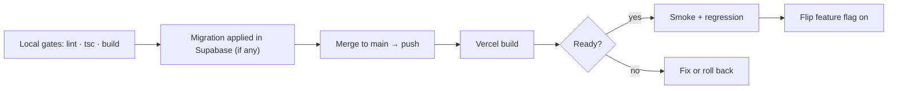
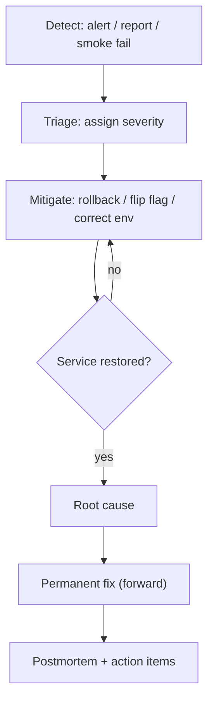

# Production Runbook

The operations handbook for the Career CRM in production. Procedures for
deployment, rollback, incident response, recovery, monitoring, and maintenance.

**Audience:** whoever is on call for production.
**Related:** [System Architecture](../architecture/SYSTEM_ARCHITECTURE.md) ·
[Phase 3 Implementation Guide](../architecture/PHASE_3_IMPLEMENTATION_GUIDE.md) ·
[Database Guide](../database/DATABASE_GUIDE.md) ·
[API Reference](../architecture/API_REFERENCE.md)

> **Status legend:** ✅ **Active now** (v1.0.0) · ⬜ **Phase 3** (procedure applies
> once that milestone ships). Cron/queue/jobs/OAuth sections are ⬜ today.

---

## 0. System Inventory (quick reference)

| Item | Value |
|------|-------|
| Product | Career CRM (Next.js 14 App Router · Supabase · Vercel) |
| Production URL | `https://www.shivamchaturvedi.com` |
| Vercel project / scope | `shivam-portfolio` / `shivamchat` |
| Supabase project | hosted (`<project-ref>.supabase.co`) — Postgres + Auth + RLS |
| Repository | `github.com/ChaturvediShivam/shivam-portfolio`, branch `main` |
| Production baseline (rollback) | tag **`v1.0.0`** → commit **`c2b5dc3`** |
| CI gates | `npm run lint` · `npx tsc --noEmit` · `npm run build` |
| Migrations | additive, idempotent; applied **out-of-band** in Supabase (not by Vercel) |
| Email | Resend | Bot protection | Cloudflare Turnstile |

**Golden rules**
1. **`v1.0.0` (`c2b5dc3`) is the always-good rollback point.**
2. Migrations are **additive-only**; never `ALTER`/`DROP` existing tables in an incident.
3. **First response to a bad release = roll back / flip the feature flag**, then diagnose.
4. Never paste secrets into logs, tickets, or chat.

---

## 1. Severity Levels & On-Call

| Sev | Definition | Examples | Target response |
|-----|-----------|----------|-----------------|
| **SEV1** | Production down / data at risk | Site 5xx, auth broken, data loss/leak | Immediate |
| **SEV2** | Major feature broken, no workaround | A module errors for all users, sync stopped | < 1h |
| **SEV3** | Degraded / minor | Slow page, one non-critical action failing | Same day |
| **SEV4** | Cosmetic / low | Copy, styling, edge case | Backlog |

**On-call priorities:** (1) stop the bleeding (rollback/flag), (2) restore service,
(3) preserve evidence, (4) root-cause, (5) write the postmortem.

---

## 2. Deployment ✅

**Standard path:** merge to `main` → Vercel auto-builds → promotes to Production →
`www` alias updates.

1. Pre-flight (local): `npm run lint` · `npx tsc --noEmit` · `npm run build` — all green.
2. If a migration is required: apply it in **Supabase → SQL Editor** *before*
   deploying the code that reads it; verify objects + RLS. Migrations are additive
   and idempotent.
3. Set/confirm required env vars in Vercel (Production + Preview). New features
   ship **flag-off** in Production.
4. Merge to `main` → push. Vercel builds automatically.
5. Watch the deployment reach **Ready**; capture the deployment id + commit SHA.
6. Run **§16 Verification** (smoke + regression).
7. Enable the feature flag only after acceptance passes.

**Verify a deployment**
```
vercel ls shivam-portfolio                 # newest deployment + status
vercel inspect https://<deployment>.vercel.app   # status, aliases, commit
curl -s -o /dev/null -w "%{http_code}" https://www.shivamchaturvedi.com/         # 200
curl -s -o /dev/null -w "%{http_code}" https://www.shivamchaturvedi.com/admin    # 307 -> login
```



---

## 3. Rollback ✅

**Decide by cause:**

| Cause | Action |
|-------|--------|
| Bad **code** deploy | Promote the previous Ready deployment (instant) or revert commit + redeploy |
| Bad **feature** (flagged) | **Flip the flag off** — no redeploy needed (fastest) |
| Bad **config/env** | Correct the env var in Vercel → redeploy |
| Bad **migration** | Roll **forward** with a corrective additive migration; never destructively drop tables with real data |

**Fastest safe rollback (code):** in the **Vercel dashboard → Deployments**,
find the last-known-good deployment (e.g. the one for `c2b5dc3` / `v1.0.0`) and
**Promote to Production** ("Instant Rollback"). The `www` alias switches with no
rebuild. See exact commands in **§17**.

**Post-rollback:** verify (§16), confirm `git rev-list -n1 v1.0.0` still `c2b5dc3`,
open a ticket, and root-cause before re-attempting the release.

---

## 4. Secret Rotation ✅

Secrets live as **Vercel Environment Variables** (Production/Preview) and in
Supabase (its own keys). Rotate on suspected exposure, staff change, or schedule.

**General procedure**
1. Generate the new secret at the source (Supabase / Google / Resend / provider).
2. Update it in **Vercel → Settings → Environment Variables** (Production + Preview).
3. **Redeploy** so functions pick up the new value (env changes require a new deployment).
4. Revoke the old secret at the source once traffic is confirmed healthy.
5. Verify (§16); record the rotation (date, what, who) — never the value.

**Per-secret notes**

| Secret | Source | Notes |
|--------|--------|-------|
| `SUPABASE_SERVICE_ROLE_KEY` | Supabase → API settings (rotate) | Used only by the public contact intake; rotating invalidates old key immediately — redeploy promptly |
| `NEXT_PUBLIC_SUPABASE_ANON_KEY` | Supabase | Public by design; rotate only if project keys are cycled |
| `RESEND_API_KEY` | Resend dashboard | Rotate key; contact form email breaks until redeploy |
| `CLOUDFLARE_TURNSTILE_SECRET_KEY` | Cloudflare | Contact form verification |
| `TOKEN_ENCRYPTION_KEY` ⬜ | Vercel/KMS | **Rotating requires re-encrypting stored OAuth tokens** — plan a migration/backfill; keep both keys during transition |
| `GOOGLE_OAUTH_CLIENT_SECRET` ⬜ | Google Cloud Console | Rotating forces token refresh; may require reconnect |
| `AI_PROVIDER_API_KEY` ⬜ | Provider console | Rotate; AI features fail until redeploy |
| `CRON_SECRET` ⬜ | Vercel env | Update env **and** the cron config header |

> ⚠️ **Token encryption key** is special: rotating it without re-encrypting
> `integration_accounts.*_encrypted` makes existing connections undecryptable →
> users must reconnect. Prefer dual-key (decrypt-old/encrypt-new) migration.

---

## 5. OAuth Recovery ⬜ (Phase 3)

**Symptoms:** an integration shows `status='error'`; sync stopped; "reconnect"
prompts.

**Diagnosis → action**

| Symptom | Likely cause | Action |
|--------|--------------|--------|
| `401` on provider calls | Access token expired | Adapter auto-refreshes; if refresh fails → next row |
| Refresh fails | Revoked grant / expired refresh token / rotated client secret | Set account `status='error'`, notify user, require **reconnect** (re-run OAuth) |
| Callback CSRF error | `state`/PKCE mismatch, stale `oauth_states` | Retry the connect flow; ensure clock/redirect URI correct |
| Missing scope | Consent granted fewer scopes | Prompt reconnect with required scopes; degrade feature gracefully |
| Tokens undecryptable | Encryption key rotated without backfill | Restore prior key or force reconnect (§4 warning) |

**Reconnect (operator-guided):** Settings → Integrations → Disconnect (revokes at
provider) → Connect again. Disconnect is safe (soft-deletes the account,
`archived_at`); synced `messages`/`calendar_events` remain.

---

## 6. Background Jobs ⬜ (Phase 3)

Durable queue = the `jobs` table; workers = Vercel Cron hitting
`POST /api/jobs/run` (secret-authed). Job types: `gmail_sync`, `calendar_sync`,
`ai_summarize`, `ai_embed`, `notification_dispatch`, `automation_run`.

**Health checks**
- Pending backlog: rows with `status='pending'` and `run_after <= now()`.
- Stuck/leased: `status='running'` with an old `locked_at` (worker died mid-run).
- Dead-letter: `status='failed'` (exceeded `max_attempts`) — surfaced in Settings → Jobs.

**Common operations**
- **Reset a stuck lease:** clear `locked_at` / set `status='pending'` for rows
  running longer than the lease timeout (idempotent handlers make re-run safe).
- **Retry dead-letter:** reset `status='pending'`, `attempts=0`, after fixing the
  root cause.
- **Drain manually (staging/dev):** invoke `POST /api/jobs/run` with the
  `CRON_SECRET` header.
- **Pause processing:** disable the cron entry / flag → queue accumulates safely.

---

## 7. Cron Failures ⬜ (Phase 3)

**Symptoms:** jobs not progressing; backlog growing; sync silent.

| Check | Action |
|-------|--------|
| Cron configured? | Confirm `vercel.json` `crons` + schedule in Vercel dashboard |
| Endpoint auth | `POST /api/jobs/run` must accept the cron header (`CRON_SECRET`); a rotated secret without config update → `401` every tick |
| Function errors/timeouts | `vercel logs` on the cron function; chunk work if hitting the time limit |
| Cron disabled by flag | Re-enable `FEATURE_JOBS` |
| Overlap/thundering herd | `SKIP LOCKED` leasing prevents double-processing; verify batch size |

**Recovery:** fix the cause → the next tick drains the accrued backlog
(idempotent handlers). For urgency, trigger a manual drain (§6).

---

## 8. Queue Failures ⬜ (Phase 3)

**Symptoms:** rows stuck `pending`/`running`; repeated failures; duplicates.

| Failure | Cause | Action |
|---------|-------|--------|
| Growing backlog | Cron down / slow handler | §7; scale batch; chunk long jobs |
| Repeated `failed` | Deterministic handler bug or bad payload | Fix handler; requeue after fix; if poison, quarantine the row |
| Duplicate side effects | Non-idempotent handler | Enforce idempotency key/upsert; the design mandates idempotent handlers |
| Lost jobs | Worker crash after lease, before complete | Lease timeout returns them to `pending`; re-run is safe |
| DB pressure | Queue table hot | Add/verify `(status, run_after)` index; bounded batches |

**Golden rule:** the queue is Postgres — it is **backed up with the database**
(§12) and transactional with domain writes; no separate broker to recover.

---

## 9. Supabase Recovery ✅

Supabase is the hosted Postgres + Auth + RLS system of record.

| Scenario | Action |
|----------|--------|
| **RLS misconfig** (data visible/denied wrongly) | Re-apply the table's `"Authenticated admin full access"` policy from the migration; verify anon key is denied |
| **Bad migration applied** | Roll **forward** with a corrective additive migration; restore from backup only if data is corrupted (§12) |
| **Auth issues** (can't sign in) | Check Supabase Auth status; confirm allowlist (`isAdminEmail`); the signup path is allowlist-gated |
| **Connection/quota** | Check Supabase project health/limits; the app degrades to error states (route `error.tsx`) — no crash |
| **Key compromised** | Rotate keys (§4) + redeploy |
| **Data loss/corruption** | Point-in-time restore / backup (§12, §13) |

**Verify RLS quickly (unauth):** anon requests to admin routes must not return
data; `/admin/*` pages redirect to login. See [Database Guide](../database/DATABASE_GUIDE.md#rls-strategy).

---

## 10. Vercel Recovery ✅

| Scenario | Action |
|----------|--------|
| **Build failing** | Read the build log in Vercel; reproduce locally (`npm run build`); fix or **promote the last good deployment** (§3/§17) |
| **Function errors (5xx)** | `vercel logs <deployment>`; identify route; roll back if release-induced |
| **Bad env var** | Correct in Vercel env → redeploy |
| **Domain/alias broken** | Verify the production alias points at a Ready deployment; re-promote if needed |
| **Region/platform outage** | Check Vercel status page; wait/roll back; nothing to do app-side |
| **Runaway cost/usage** ⬜ | Pause crons (flag), inspect job volume/AI token spend |

---

## 11. Production Incident Process ✅



1. **Detect** — alert, user report, or a failed verification (§16).
2. **Declare** severity (§1); for SEV1/2 start an incident log (timeline, actions).
3. **Mitigate first** — roll back or flip the flag; restore service before diagnosing.
4. **Communicate** — status to stakeholders; keep the log updated.
5. **Preserve evidence** — capture deployment id, logs, error digests *before* they rotate.
6. **Root-cause & fix forward** — a corrected release, additive migration if needed.
7. **Verify** (§16), close the incident, keep the flag/rollback until confident.
8. **Postmortem** (blameless) — timeline, cause, action items, prevention.

---

## 12. Backups ✅

- **Database:** Supabase provides automated backups / point-in-time recovery
  (availability depends on the project plan). **Verify the backup policy is
  enabled** and note the retention window and RPO.
- **Code & migrations:** Git is the source of truth (`main` + tag `v1.0.0`); every
  migration is committed under `supabase/migrations/`.
- **Config:** environment variables are held in Vercel; maintain a secure,
  offline inventory of *which* vars exist (names only, not values).
- **Queue (Phase 3):** the `jobs` table is included in DB backups.
- **Action item:** confirm the Supabase backup cadence + PITR window for this
  project and record it here.

---

## 13. Disaster Recovery ✅

**Objectives (set/confirm with the plan):** define target **RTO** (time to
restore) and **RPO** (max acceptable data loss) — DB RPO is bounded by the
Supabase backup/PITR window.

**Scenarios**

| Disaster | Recovery |
|----------|----------|
| Bad deploy takes prod down | Promote last-good deployment / `v1.0.0` (minutes) — §3/§17 |
| Data corruption | Supabase PITR/restore to a pre-incident timestamp; re-apply any additive migrations since |
| Supabase project loss | Restore from backup into a new/repaired project; update `NEXT_PUBLIC_SUPABASE_URL`/keys in Vercel; redeploy; re-apply migrations from `supabase/migrations/` |
| Vercel account/project loss | Re-create the project from the GitHub repo; re-add env vars; redeploy `main`; re-point the domain |
| Secret compromise | Rotate all secrets (§4), redeploy, audit access |
| Total rebuild | Clone repo → provision Supabase → apply `supabase/schema.sql` + `supabase/migrations/*` → set env → deploy to Vercel → point domain → verify |

**DR test (recommended):** periodically rehearse a restore into a staging project.

---

## 14. Monitoring ✅ / ⬜

**Today (✅):**
- **Vercel dashboard** — deployment status, build/function logs, basic analytics.
- **Supabase dashboard** — DB health, logs, auth activity.
- **Synthetic check** — periodic `curl` of `/` (200) and `/admin` (307) confirms
  the app + auth gate are alive (see §16).

**Phase 3 additions (⬜):**
- Job/queue health (backlog, dead-letter depth) surfaced in Settings.
- Integration health (`integration_accounts.status`/`last_error`).
- AI token/cost spend vs budget; automation run failure rate.

**Recommended (action item):** add an external uptime monitor + error tracking
(e.g. an APM/error service) and alerting to Slack/email; the app currently has no
external APM.

---

## 15. Logging ✅

- **Application:** `console.error` in route `error.tsx` boundaries, the Server
  Action wrapper (`withAdminAction`), and API handlers → visible via **`vercel
  logs <deployment>`** / the Vercel dashboard. **No stray `console.log`** ships.
- **Never log secrets or full PII.** Error responses to clients are generic;
  details stay server-side.
- **Retention:** Vercel/Supabase log retention is platform-managed — capture
  relevant logs into the incident record before they age out.
- **Phase 3:** structured job/AI/automation audit trails in `jobs.last_error`,
  `ai_audit_log`, `automation_runs`, `opportunity_events`.

---

## 16. Verification (post-deploy / post-rollback) ✅

**Smoke (unauthenticated) — must pass:**
```
curl -s -o /dev/null -w "%{http_code}\n" https://www.shivamchaturvedi.com/          # 200
curl -s -o /dev/null -w "%{http_code}\n" https://www.shivamchaturvedi.com/admin/login # 200
# each admin section returns 307 -> /admin/login:
for p in /admin /admin/dashboard /admin/companies /admin/contacts /admin/opportunities \
         /admin/tasks /admin/messages /admin/analytics /admin/settings; do
  curl -s -o /dev/null -w "$p %{http_code}\n" "https://www.shivamchaturvedi.com$p"; done
```
**Checklist**
- [ ] Public home `200`; all `/admin/*` `307 → login` (auth gate intact).
- [ ] Vercel deployment **Ready**; production alias points at the intended commit.
- [ ] `git rev-list -n1 v1.0.0` still `c2b5dc3` (baseline intact).
- [ ] Operator authenticated smoke of the changed area (create/edit/list works).
- [ ] No new errors in `vercel logs`.
- [ ] (Phase 3) queue draining; integrations healthy; no dead-letter spike.

---

## 17. Rollback Commands (reference)

> Vercel CLI syntax can vary by version — the **Dashboard → Deployments →
> Promote** action is authoritative for instant rollback. Commands below are the
> common equivalents.

**Inspect current state**
```
git rev-parse HEAD                     # current commit on main
git rev-list -n1 v1.0.0                # baseline commit (expect c2b5dc3)
vercel ls shivam-portfolio             # recent deployments + status
```

**Instant rollback — promote a previous Ready deployment (no rebuild)**
```
# find the last-good deployment URL from `vercel ls`, then:
vercel promote https://<good-deployment>-shivamchat.vercel.app
#   (or: vercel rollback   # newer CLI: reverts prod to the previous deployment)
# Preferred: Vercel Dashboard → Deployments → (good one) → Promote to Production
```

**Code rollback via Git (creates a new, forward deploy)**
```
git revert <bad-commit>          # safe: new commit undoing the change
git push origin main             # Vercel rebuilds & deploys the revert

# or roll the branch to the tagged baseline (coordinate; avoids losing history):
git checkout v1.0.0              # detached HEAD at c2b5dc3 for inspection/deploy
```

**Feature-flag rollback (Phase 3, fastest — no redeploy)**
```
# Vercel → Settings → Environment Variables → set FEATURE_<X>=off (Production)
# then redeploy only if the flag is read at build; runtime flags take effect immediately
```

**Env var correction**
```
vercel env ls
vercel env rm <NAME> production
vercel env add <NAME> production        # paste new value; then redeploy
```

**Verify after rollback:** run §16.

---

## 18. Maintenance ✅

- **Dependencies:** review/update on a cadence in a branch; run lint/tsc/build +
  smoke before merge. (No dependency changes during Phase 2.5/release freeze.)
- **Migrations:** always additive + idempotent; apply out-of-band; keep
  `supabase/migrations/` the single history.
- **Housekeeping:** archived records use `archived_at` (soft delete); periodic
  review of dead-letter jobs (Phase 3) and stale `oauth_states`.
- **Access review:** audit the admin **allowlist** (`lib/auth/adminEmail.ts`) and
  who holds Vercel/Supabase/Google console access.
- **Secret hygiene:** rotate on schedule (§4); keep a names-only inventory.
- **Docs:** update this runbook and the architecture docs when procedures change;
  keep `v1.0.0` as the documented baseline until a new release tag is cut.
- **Planned maintenance window:** for risky changes, announce, deploy off-peak,
  keep the previous deployment one click from re-promotion.

---

## 19. AI Operations ⬜ (Phase 3 · M6 — implemented, not deployed)

The AI layer is a **server-only library** behind `FEATURE_AI`. There is no public
route and nothing user-facing; the only operator surfaces are **Settings → AI**
and the `ai_*` tables. As-built detail:
[AI Architecture § M6](../ai/AI_ARCHITECTURE.md#m6-as-built) ·
[Schema Reference §7a](../database/SCHEMA_REFERENCE.md).

### 19.1 Environment variables

| Variable | Required | Default | Notes |
|---|:--:|---|---|
| `AI_PROVIDER_API_KEY` | ✅ | — | Provider credential. Server-only. Without it the gateway fails closed even with the flag on. |
| `FEATURE_AI` | ✅ | off | `"true"` enables. Anything else = off. |
| `AI_PROVIDER` | — | `anthropic` | Selects the adapter. An unknown value fails closed. |
| `AI_MODEL_FAST` | — | provider default | Overrides the model for the `fast` task class. |
| `AI_MODEL_REASONING` | — | provider default | Overrides the model for the `reasoning` task class. |
| `AI_EFFORT_FAST` | — | `medium` | `low`/`medium`/`high`/`xhigh`/`max`. |
| `AI_EFFORT_REASONING` | — | `high` | As above. |
| `AI_DAILY_TOKEN_BUDGET` | — | unlimited | Per-owner daily token ceiling. **Set this before flag-on.** |

> **Model choice is an operator decision.** Both task classes default to the
> provider's strongest model. Downgrading the `fast` class is a deliberate
> cost/quality trade — make it via `AI_MODEL_FAST`, not by editing code. Effort is
> the cheaper first lever.

> **`FEATURE_AI` does not require `FEATURE_JOBS`.** M6 is the first Phase-3
> milestone callable synchronously, so it can be enabled independently of the cron
> drainer. M7 onwards will need jobs.

### 19.2 Enable procedure

1. Apply migration `20260731090000_ai_foundation.sql` out-of-band. Verify: five
   tables exist, RLS is on for each, both functions exist and are **revoked from
   `public`**.
2. Set `AI_PROVIDER_API_KEY` and `AI_DAILY_TOKEN_BUDGET` in Vercel (Production +
   Preview). Leave `FEATURE_AI` off.
3. Deploy. Confirm Settings shows **no** AI section (flag-off inertness).
4. Set `FEATURE_AI=true`. Settings → AI should render.
5. Click **Run self-test**. Expect `Passed · <provider>/<model> · N tokens · N ms`.
   This exercises render → budget → provider → mapper → validation → audit
   end-to-end.
6. Verify one row landed in `ai_audit_log` (`outcome='success'`) and that
   `ai_usage_counters` for today shows a non-zero `tokens_used`.

### 19.3 Health checks

Settings → AI shows provider configured/not, tokens used vs budget, request
count, estimated cost, and 24h failures. Underlying queries:

```sql
-- Today's ledger for an owner
select * from ai_usage_counters where owner_id = '<uuid>' and usage_date = current_date;

-- Recent failures with their taxonomy code
select created_at, ai_model, outcome, error_code, latency_ms
  from ai_audit_log where outcome = 'error' order by created_at desc limit 20;

-- Spend for the last 7 days (cost_micros is millionths of a USD)
select date(created_at) as day,
       sum(input_tokens + output_tokens) as tokens,
       round(sum(cost_micros) / 1000000.0, 4) as usd
  from ai_audit_log group by 1 order by 1 desc limit 7;
```

### 19.4 Common operations

| Symptom | Cause | Action |
|---|---|---|
| Settings → AI missing | `FEATURE_AI` not `"true"` | Set the flag; runtime, no redeploy. |
| "AI ledger not available yet" | Migration not applied | Apply `20260731090000`. |
| "AI provider is not configured" | Key unset/blank | Set `AI_PROVIDER_API_KEY`, redeploy. |
| `error_code='budget_exceeded'` | Daily ceiling hit | Expected protection. Raise `AI_DAILY_TOKEN_BUDGET` or wait for the date to roll. **Do not** edit counters to "unblock" — see the caution below. |
| `error_code='transient'` | Rate limit / 5xx / timeout | Self-heals; job callers retry under M1 backoff. Persisting → check provider status. |
| `error_code='permanent'` | Bad request, auth, unknown model | Check `AI_MODEL_*` overrides and key validity. |
| `error_code='invalid_output'` | Model reply failed schema validation | Prompt/template issue; not retryable. |
| `outcome='refused'` | Provider safety classifier declined | Not an error path. Inspect the prompt/content. |
| `outcome='truncated'` | Hit the output ceiling | Raise the template's `maxOutputTokens`; **remember thinking shares that budget.** |
| Tokens climb with no requests | Reservations not reconciled (crashes) | Expected conservative over-count; resets at date rollover. |

> **Caution — budget counters.** `tokens_reserved` can legitimately exceed
> `tokens_used` (an un-reconciled reservation after a crash). Resist "fixing" it
> by hand: the ledger is the enforcement mechanism, and a manual reset removes the
> guard rail. Raise the ceiling instead, or wait for the day to roll.

### 19.5 Kill switch / rollback

In escalating order:

1. **`FEATURE_AI=false`** — runtime, no redeploy. Gateway inert, panel hidden,
   zero spend. **This is the first response to any AI incident.**
2. **Revoke the provider key at the provider** — hard stop independent of the
   flag; the gateway fails closed.
3. **Promote the previous deployment** (§3).
4. **`v1.0.0` (`c2b5dc3`)** — the standing baseline.

Tables are additive and inert when unwritten; **never drop them during an
incident**. Rolling back code does not require rolling back the migration.

---

## Document Control

- **Version:** 1.1
- **Owner:** Repository maintainer / on-call (Shivam Chaturvedi)
- **Last Updated:** 2026-07-31
- **Scope:** ✅ sections apply to the live v1.0.0 system; ⬜ sections (cron, queue,
  jobs, OAuth, AI) apply as their Phase 3 milestones ship.
- **v1.1 (2026-07-31):** added §19 AI Operations for **Phase 3 · M6** — env vars,
  enable procedure, health queries, failure triage, and the kill switch.
  Implemented on `feat/phase3-m6-ai-foundation`; **not deployed** (`FEATURE_AI`
  off, migration not applied).

### Related Documents
- [System Architecture](../architecture/SYSTEM_ARCHITECTURE.md)
- [Phase 3 Architecture](../architecture/PHASE_3_ARCHITECTURE.md) · [Implementation Guide](../architecture/PHASE_3_IMPLEMENTATION_GUIDE.md)
- [API Reference](../architecture/API_REFERENCE.md) · [Events](../architecture/EVENTS.md)
- [Database Guide](../database/DATABASE_GUIDE.md)

### Open Questions / Action Items
1. Confirm the Supabase **backup cadence + PITR window** for this project and record RPO/RTO.
2. Add an **external uptime monitor + error tracking** with alerting (no external APM today).
3. Decide the **token-encryption key rotation** procedure (dual-key backfill) before M1/M2.
4. Document the exact **Vercel CLI** rollback verb for the installed CLI version.

### Verification
Markdown, formatting, Mermaid, and internal links verified at authoring time (see
the documentation report). Documentation only — no application code, schema, or
dependencies changed; production tag remains **v1.0.0** (`c2b5dc3`).
